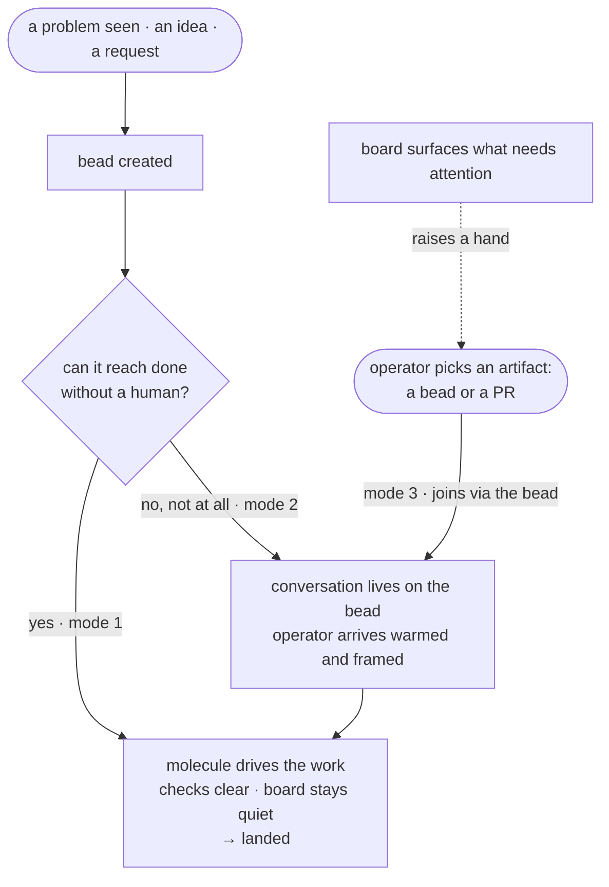

# Architecture

gc-toolkit is an implementation of the beliefs in
[foundation.md](foundation.md). Those beliefs say *why* the pack exists; this
document says *how* they are made tangible — on **Gas City primitives**, the
concrete things the runtime gives us to build with. Read the two as a spine:
**foundation states the beliefs; architecture operationalizes them on
primitives; the implementation docs are downstream.** The
[work-bead state machine](work-bead-state-machine.md) and its kin detail
machinery this document only names — they take their intent from here, not the
other way around.

## Scope

**Mandate.** How gc-toolkit operationalizes the beliefs of
[foundation.md](foundation.md) on Gas City's primitives: which primitives the
pack builds with, how work moves through them, what is not yet well defined, and
where each delivered capability is defined.

**Boundaries.** It works at altitude — it names primitives, patterns, and
definition-sites; it is not a contributor how-to, a config reference, or a
decision tree for where to put a change. It does not restate the beliefs it
derives from ([foundation.md](foundation.md)), the conventions for filing what
it produces ([file-structure.md](file-structure.md)), or any implementation it
names — above all the work-bead lifecycle, which remains canonical for the state
machine it owns ([work-bead-state-machine.md](work-bead-state-machine.md)).

## What we operationalize with

The pack builds with a small set of Gas City primitives. Each carries a belief
from foundation into something concrete. They are the vocabulary; naming them
first lets the rest of this document describe motion in terms already
established.

- **Bead — the unit of work and the locus of its truth.** *(foundation:
  Decisions have a home.)* One kind of object owns everything: a unit of work, a
  PR, a branch, a multi-step initiative — and the conversation about each.
  Because the bead owns the artifact, its truth is queryable in one place
  without a tree-walk, and its state carries a single meaning: open = unlanded,
  closed = landed, nothing between. That ownership is canonical and fully
  specified in the work-bead state machine ("everything is owned … locality of
  truth"); this document names it and links, it does not restate the machine.
  One consequence belongs here because it draws the rule's edge: an artifact
  with **no owning bead is a defined exception**, never a silent state (how that
  exception is surfaced is machinery — see the map). The bead also owns the
  *conversation* about it — discussion is durable and resumable because it has a
  home, which is how *Human attention is the budget* becomes structural rather
  than aspirational: a conversation that has a bead is identifiable and never
  restarted from cold.

- **Molecule — a series of steps that need to be completed.** *(foundation:
  Agents earn every interaction.)* A molecule is a defined procedure the runtime
  pours into a session for an agent to work through — data an agent advances,
  not a script it is handed. It is how the pack encodes a repeatable path once
  and runs it many times without re-deciding it: the patrol loops, the doc
  audits, and the first-reaction pass are all molecules. It is the shape of
  "plan ahead, do the cheap work" made concrete.

- **Check — a series of steps we assert must have been completed.**
  *(foundation: Agents make their edges visible.)* Where a molecule is steps
  that need doing, a check is steps we assert are already done before work may
  come to rest. Two things are architectural here and nothing more: that such
  gates **exist**, and that certain things can be **asserted true through the
  workflow**. The state machine makes this concrete as a *check-set* — "one
  class of gate," a set of conditions that must all hold before landing, with no
  member privileged over another. Any individual check — an automated review,
  CI, a still-current title, a step only a human can currently resolve — is a
  *replaceable member* of that set; a human approval is architecturally just a
  check nothing non-human can yet satisfy, not a special kind of step. Molecules
  and checks are meant to interlock: a molecule step can sign off a check, and a
  check that has not run should run itself rather than block silently.

- **Skill — an agent capability.** *(foundation: The pack borrows before it
  invents.)* A skill is a packaged capability an agent invokes on demand — a
  procedure, a checklist, a tool-driven workflow — rather than prose baked into
  a prompt. Skills are how gc-toolkit embraces the wider agent ecosystem: it
  leans on capabilities that already exist and adds its own where it holds a
  specific opinion. It is the primitive foundation already anticipates when it
  lists "pack-local … skills" among what the pack contributes.

- **Board — where work surfaces for attention.** *(foundation: Human attention
  is the budget.)* The board is where open work presents itself to a human,
  ranked so the most important sits highest. Two properties make it
  architectural rather than a mere queue: a bead can raise **itself** onto the
  board, so the system brings work to attention instead of attention hunting for
  work; and the board is where the one defined exception to bead-ownership — an
  artifact no bead owns — is caught and surfaced rather than dropped.

Not every belief maps to a single primitive. *Agents improve* is carried across
the map — by reusable molecules and skills, and by the doc-and-knowledge layer
that folds each lesson back into the pack — rather than by one primitive of its
own.

## How work moves

The primitives compose to move work. The axis that matters is not which
machinery runs but **how much human conversation a bead needs** to reach done.
Three modes, all expressed in the primitives above:

1. **Automated to resolution — no human in the loop.** A bead is filed and runs
   all the way to landed on its own: something notices a problem, files a bead, a
   molecule drives the work, its checks clear, and a final signoff that needs no
   human closes the last gate. This is a first-class, fully-supported path, not
   an aspiration — and most such beads create code. The attention budget is
   spent only where a check genuinely requires a human.

2. **Needs conversation to move at all.** Some beads cannot advance without human
   judgment. Here the bead is the locus of the conversation: a durable,
   resumable discussion lives on it, and the operator arrives to cheap work
   already done and the choice already framed, not to a cold prompt.

3. **A human joins an existing artifact.** The operator chooses to engage a
   specific artifact — a bead or a PR — and connects the conversation to that
   point. Because every artifact is owned by a bead (and one is created if it is
   not), the bead is always the handle the conversation attaches to.

## What is not well defined today

Some of the architecture is settled and running; some is temporary-but-workable;
one part is a deliberate open question. Naming them keeps the rest of this
document honest about aspiration versus fact.

- **Intake — the surfaces for starting work and conversation.** What we *do* is
  clear: have a conversation about something, start a new conversation, push a
  specific piece of work toward done, or create a new unit of work to track or
  discuss. Creating a bead works today — the mayor can, and in practice any
  conversation can. What is thin is the *front door* for starting a brand-new
  conversation: the pack ships no native intake agent, and every native role is
  a post-bead role (a host is only ever spawned at an existing bead and
  explicitly refuses to be a sling target; a first reaction is dispatched *at* a
  bead). This is workable today and named here as an area to sharpen — a
  present-tense fact, not a shortfall to apologize for, and not a front door this
  document will invent.

- **The molecule/check interlock is mostly unrealized.** The primitives exist
  and the merge machinery already enforces a check-set, but the richer loop — a
  molecule step that signs off a check, and an unrun check that runs itself
  automatically — is a target the pack is built toward, not what the operational
  city does today. Today most work is still a single polecat doing a single
  task, which uses far less of the molecule primitive than the design intends.

- **The composition boundary is in transition.** gc-toolkit currently stands up
  much of its agent roster by importing the gastown example pack and patching
  it. That mechanism is transitional; the direction is to depend on *less* of
  gastown and *more* on Gas City's own primitives (see the map's composition
  note). It is deliberately not encoded here as the architecture.

## The map

The primitives are realized by concrete components. This is the inventory — what
the pack ships and the single place each is defined — grouped by what it serves.
For each: **what it delivers · the pattern that implements it · how it plays with
the rest · where it is defined.** The map is also the surface a new capability is
checked against.

### Delivery — a filed bead becomes a landed change

- **Delivers.** A filed bead becomes a merged, live change with the fewest human
  steps; the only human step is a check that currently needs a human.
- **Pattern.** *Owned-convoy, close-on-land state machine* — a bead stays open
  until its PR merges (a pack delta over stock gastown, which closes at
  PR-creation) — plus *integration-branch graduation* for multi-bead
  initiatives, and a *composable, head-bound check-set* in which every gate is a
  marker pinned to the live head, so a new commit re-gates and a stale approval
  can't carry a drifted PR. A single-writer merge skill lands the work once every
  gate is green; live rig checkouts then fast-forward to the merged tip.
- **Plays with.** It consumes what the attention side surfaces; the
  engine-health layer keeps its agents alive and the doctor suite fences it
  against regression.
- **Defined in.** [work-bead-state-machine.md](work-bead-state-machine.md)
  (canonical); `template-fragments/convoy-integration-branch` (+ the polecat-side
  `polecat-convoys`); `formulas/mol-refinery-patrol.toml` with
  `assets/scripts/merge-skill.sh`, `pre-open-resolve.sh`, and
  `reconcile-graduated-convoys.sh`; `orders/reconcile-rig-checkouts.toml` +
  [rig-checkout-reconciler.md](rig-checkout-reconciler.md);
  `doctor/check-merge-gate-drop`. The review check is executed by replaceable
  review-executor polecats (`agents/polecat-codex`, `agents/_polecat-gemini`) —
  instances of the check, not architectural in themselves.

### Attention — surfacing work and hosting its conversation

*The Bead-Universe Operating Model; epic `tk-q4xaj`.*

- **Delivers.** Instead of a cold queue, the operator gets a ranked board and,
  on any bead, a warmed conversation with the cheap work done and the choice
  framed.
- **Pattern.** *Board hand-raise + resident single-bead host + cheap
  first-reaction pass.* A bead raises itself onto the board; a resident host owns
  one bead's durable, resumable conversation; a first-reaction molecule reads a
  bead's universe and leaves a fixed-shape card before the operator ever looks.
- **Plays with.** It feeds Delivery: a host (or a first reaction) files a
  sub-bead and slings it to a worker pool — most such beads create code — and
  never merges or closes an implementation bead itself.
- **Defined in.** `agents/proactive` running
  `formulas/mol-first-reaction.toml`; the Helm board
  (`assets/scripts/gc-helm.sh` today, with the `services/helm/` Go service as its
  emerging successor); `agents/bead-host`.

### Engine health — keep the flows running unbabysat

- **Delivers.** The long-running agents stay live, resume in-flight work after a
  restart instead of orphaning it, and recycle before context degrades.
- **Pattern.** *Resident self-recycling patrol loops* (each pours its next
  iteration before burning the current one) + *layered, idempotent
  startup-discovery* (ordered fallback tiers that adopt in-flight work and
  converge to one patrol wisp) + a *deterministic cycle-recycle hook* (fired at
  every turn boundary, so recycling happens regardless of how full context is) +
  an *anti-regression check-suite* (each doctor check locks a hard-won fix into
  the pack).
- **Plays with.** This is where gc-toolkit leans most directly on gastown: the
  patrols keep the imported roster — deacon, witness, refinery — alive and
  resumable. The doctor suite fences both the delivery machinery and the patrol
  loops themselves.
- **Defined in.** `formulas/mol-{deacon,refinery,witness}-patrol.toml`;
  `template-fragments/layered-startup-discovery`; `overlays/cycle-recycle`;
  `doctor/check-*`.

### Fork & upstream — live alongside Gas City without forking it

- **Delivers.** Local patches to the Gas City source live on a fork without a
  hand-managed patch queue, and flow back upstream as reviewable PRs.
- **Pattern.** *Git-native candidate-set model* — every commit on `origin/main`
  that diverges from upstream *is* a candidate, so the git log is the queue (no
  held branches, no labels) — plus *commit-body-as-review-packet*, run by a
  keeper-fronted, polecat-executed, refinery-landed division of labor: the keeper
  converses and dispatches, a polecat does the rebase, the refinery performs the
  one authorized force-push to land, and upstream submission stays operator-gated.
- **Plays with.** An opt-in sub-pack layered over core that reuses the same
  polecat → refinery delivery substrate.
- **Defined in.** `packs/gascity-keeper` (the `keeper` agent, the
  `mol-upstream-gc-*` formula family, the `refinery-rebase-handling` fragment);
  `template-fragments/upstream-engagement`;
  [gascity-local-patching.md](gascity-local-patching.md).

### Doc & knowledge cohesion — keep what's written true

- **Delivers.** The pack's agent-brief docs stay both true and complete without
  hand edits.
- **Pattern.** *Two-tier filing* (`docs/` = what's true now, authoritative;
  `specs/<bead-id>/` = what was thought, historical) + a pair of *complementary
  automated audits*: a drift audit catches a brief claim made *false* by
  movement, and a memory audit catches an in-scope learning *missing* from a
  brief. Each runs on a cooldown and routes corrections through the normal
  bead → polecat → refinery pipeline; there is no standing agent — it is a
  formula-role on the polecat pool.
- **Plays with.** Every fix rides Delivery. This map itself is kept honest by
  the consistency test below, not by the audits.
- **Defined in.** [file-structure.md](file-structure.md);
  `formulas/mol-doc-keeper-{drift,memory}-audit.toml`;
  `orders/doc-keeper-{drift,memory}-audit.toml`.

### Composition — how it's wired onto Gas City

- **Delivers.** Everything above runs on a live Gas City by configuration, and
  every piece has exactly one definition-site.
- **Position.** gc-toolkit is built **on Gas City** as its substrate and leans
  on Gas City's primitives directly; it does **not** depend on a *fork* of Gas
  City, and works to remove such dependencies where they exist. It is **not** an
  augmentation of gastown. Gastown is an example pack, not an upstream — its
  operating model (notably the attention/helm model) diverges enough that
  gc-toolkit is best understood as an *independent implementation of its own
  approach on top of Gas City*. The pack takes what is genuinely reusable from
  gastown — reusable molecules above all — and stays independent otherwise,
  avoiding copying. The roster is still stood up partly by importing gastown
  today; that mechanism is transitional and being reduced, and is deliberately
  not the architecture.
- **Defined in.** `pack.toml` (the gastown import, the agent-patch lists, and
  overlay dirs); `template-fragments/*`; `packs/*`; [install.md](install.md). Native agents ship under `agents/` (`mechanik`,
  `bead-host`, `proactive`, the review-executor polecats, the `*-thread`
  variants); the imported gastown roster is patched in place where gc-toolkit's
  opinions differ (`deacon`, `mayor`, `polecat`, `refinery`, `witness`); `dog` is
  intentionally not vendored (`agents/DOG-NOTE.md`).

**The pack is self-hosting.** It evolves the way it delivers everything else:
changes to versioned content flow through beads to the worker pool and the
delivery machinery — `mechanik` dispatches, it does not hand-edit. The
architecture applies to itself, which is why the map above can be measured by the
test below.

## The consistency map

This document is the lever that keeps growth coherent, and the test is the
**model**, not the map. A new capability should trace to a belief in
[foundation.md](foundation.md) made tangible through one of these primitives,
and it should reuse a pattern already on the map. If it fits none cleanly, that
is the signal: either the capability is miscast, or the model needs a deliberate
extension — and since architecture derives from foundation, sometimes the belief
upstream is what actually has to move. Keeping new work consistent this way is
how *what gets built next* stays coherent with *what's built* — the pack
included.
