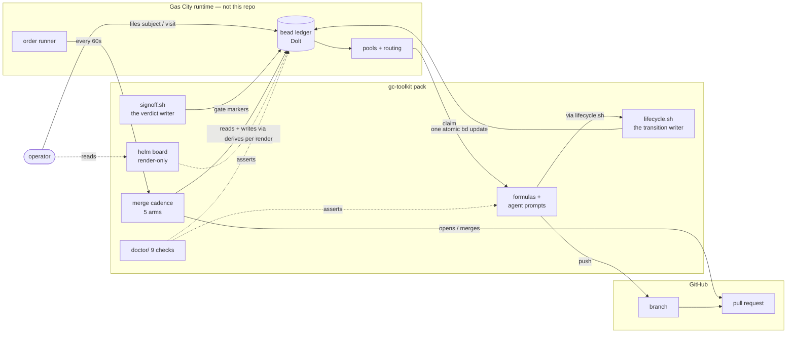

# Architecture

gc-toolkit delivers the beliefs in [foundation.md](foundation.md) by *composing
Gas City* — the multi-agent runtime it runs on — rather than by growing bespoke
machinery beside it. The pack is its workflows: **work, review, merge, visit,
feedback, patrol**. Every component belongs to one of them or is a declared
shared primitive; nothing exists because an incident once happened.

## Scope

**Mandate.** How gc-toolkit composes Gas City's primitives to deliver
foundation: the system boundary, how work moves end to end, how humans engage,
how lessons compound, and the test that keeps new work grounded.

**Boundaries.** It works at altitude. The anchor lifecycle's states, writers,
and gate mechanics are owned by [state-machine.md](state-machine.md); the merge
cadence's runtime semantics by
[refinery-merge-cadence.md](refinery-merge-cadence.md); the primitive list and
the invariant→check binding by [component-model.md](component-model.md); the
filing conventions by [file-structure.md](file-structure.md).

## The boundary

Four parties, one data plane. Every durable fact is a bead; the pack owns no
storage of its own.

**Legend.** Solid = writes state. Dashed = reads without writing. Three write
paths matter: `lifecycle.sh` is the only writer of lifecycle transitions,
`signoff.sh` is the only writer of gate verdicts, and the merge cadence is the
only thing that opens or merges a PR. Everything else reads.

## How work moves

One pipeline, from a filed bead to a landed change. Each step names its
performer; the full transition table with writers is
[state-machine.md](state-machine.md).

1. **File.** Something — a formula step, an event, the operator — files a bead.
2. **Route.** `gc sling` (or `deferred-dispatch.sh` when blockers must close
   first) routes it to a pool. Routed, unclaimed work is *demand*: the runtime
   spawns a session to meet it, with no operator keystroke.
3. **Claim.** A polecat claims via `gc hook --claim`; the runtime writes
   assignee and claim in one step.
4. **Implement.** The polecat works in a per-bead worktree on a
   `polecat/<bead>` branch, driven by `mol-polecat-work`.
5. **Hand off.** Push, verify the push landed, then one atomic `lifecycle.sh`
   write carries every field of the handoff — branch, target, assignee to the
   refinery. All-or-nothing: a dead session mid-handoff leaves either the
   pre-handoff state (witness orphan recovery re-routes it) or the complete
   post-handoff state, never a half.
6. **Gate.** The merge cadence's gate-ensure arm makes every declared gate
   raisable; a review bead is routed to the polecat-codex pool; the reviewer's
   single call to `signoff.sh` writes the verdict marker or files one rework
   child.
7. **PR.** With the gate green at the live head, `pr-open.sh` opens (or adopts)
   the pull request.
8. **Merge.** `merge.sh` validates the full authorization set, merges pinned to
   the validated commit, then closes the anchor and records `merged_sha` in one
   `lifecycle.sh` call.
9. **Close propagates.** `closed` means *landed and verified* — the one signal
   waiting parties key on ([lifecycle-composition.md](lifecycle-composition.md)).

External facts the pack does not write — GitHub closing or retargeting a PR, a
session dying — are handled by exactly two reactive paths: `pr-facts.sh` (an
arm of the cadence) records PR events and files a visit, and the witness patrol
recovers work orphaned by dead sessions. There is no healer category: writers
complete their own transitions, so nothing reconstructs pack-written state
after the fact.

## How humans engage

The human surface is subject / visit / takeaway on native primitives
([gascity-human-engagement.md](gascity-human-engagement.md) is the reference).

- **A subject bead is the conversation.** Its id is the conversation's
  identity; turns are small child beads routed to the converse role. Warm, the
  next turn vacuums onto the live session through the continuation group;
  cold, a fresh session reconstitutes from the record. The record is the
  durable thing; sessions are disposable.
- **A visit is a filed turn** — `mol-visit` and `gc-visit-open.sh` are the
  canonical entry point. Escalation is unified behind one door:
  `escalate.sh` files or refreshes **exactly one open visit per situation
  key**. There is no escalation mail and no mayor; a situation that needs a
  human is a visit, same as any other.
- **A takeaway records what a sitting concluded**, and its `--waiting-on` edge
  is what makes the wait machine-answerable
  ([lifecycle-composition.md](lifecycle-composition.md)).
- **The board is render-only.** `services/helm` (helm-svc) derives every row
  per render from the ledger; `gc-helm.sh` keeps only the write verbs —
  takeaway, open, react. Everything works without the board: it spends no
  state, so it can never be wrong for longer than one render.

The discipline throughout is *agents earn every interaction*: prep done before
the operator arrives, the choice framed, every surface branded so the operator
lands on the question rather than re-orienting.

## How lessons compound

The feedback workflow ([feedback-learning.md](feedback-learning.md)) turns
corrective feedback into standing behavior, so attention is never spent twice:

1. **Capture.** Working agents self-report observation beads when a turn
   brings corrective feedback; the `feedback-miner` order sweeps merged PRs'
   review comments for what self-report missed; "learn this: …" is the
   operator fast path.
2. **Distill.** The `feedback-distiller` order clusters observations into
   patterns and promotes recurring ones as ordinary PRs against the pack —
   prompt edits, lint rules under `tools/lint-learned.d/`, doc changes.
3. **Land.** Promotions ride the same work→review→merge pipeline as
   everything else. A lesson is real when it is merged pack content, not when
   it is remembered.

Doctor is the same idea applied to structure: each of its nine checks asserts
an invariant from [component-model.md](component-model.md) §3 against the live
ledger, so a property that stops holding fails a named check instead of
waiting to be rediscovered.

## The consistency test

This document earns its keep as a test. A proposed capability must trace a
straight line — a belief in [foundation.md](foundation.md), made concrete
through a primitive in [component-model.md](component-model.md) §1, placed in
one of the six workflows above. Concretely
([component-model.md](component-model.md) §4):

- **Adding a component** — it must answer §1's "cost of not having it" column.
  If it cannot, it is a repair pass for a writer that should be fixed instead.
- **Adding a state** — declare it in `lifecycle/lifecycle.toml` and name its
  writer, or it does not exist.
- **Adding a metadata key** — it is state; register it in `lifecycle.toml`.
- **Adding an invariant** — name its doctor check in the same PR.

If a capability fits none of the workflows, that is the signal, and it points
one of two ways: the capability is miscast and should be recast onto the
primitives, or the model must move deliberately — and because architecture
derives from foundation, sometimes the belief upstream is what has to move
first. Either way the change is a decision on the record, not a drift.
