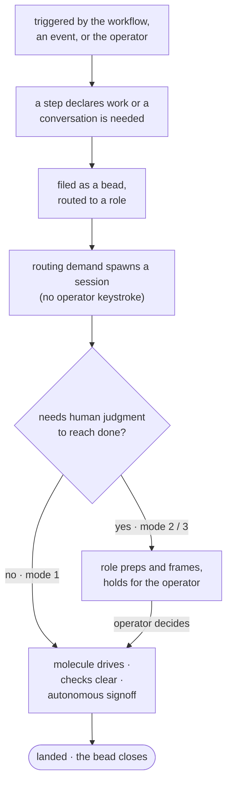

# Architecture

gc-toolkit exists to deliver the beliefs in [foundation.md](foundation.md) by
*composing Gas City* — the multi-agent runtime it runs on — rather than by
growing bespoke machinery beside it. This document is the instrument that keeps
it doing so: it names the Gas City primitives the pack builds on, shows how they
compose to move work, and states the test a new capability must pass to belong.
Where [foundation.md](foundation.md) says *why* the pack exists, this says *how*
those beliefs are made concrete on primitives the runtime already provides; the
implementation docs are downstream and take their intent from here.

## Scope

**Mandate.** How gc-toolkit composes Gas City's primitives to deliver
[foundation.md](foundation.md): which primitives it builds on, how an agent comes
to exist and converse, how work moves, what is still in transition, and the test
that keeps new work grounded.

**Boundaries.** It works at altitude — it names primitives and how they compose;
it is not a contributor how-to, a config reference, or a decision tree for where
a change goes. It does not restate the beliefs it derives from
([foundation.md](foundation.md)) or the conventions for filing what it produces
([file-structure.md](file-structure.md)), and it defers the lifecycle machinery
it only names to its canonical owner,
[the work-bead state machine](work-bead-state-machine.md).

## The Gas City primitives we build on

The pack builds with a small set of primitives Gas City already ships. Each
carries a belief from foundation into something concrete, and naming them first
lets everything below describe motion in an established vocabulary.

- **Bead — the unit of work, the home of its truth, and the identity of a
  conversation.** *(foundation: Decisions have a home.)* One kind of object owns a
  unit of work and everything attached to it — a PR, a branch, a multi-step
  initiative — and, no less, the *conversation* about it. Because the conversation
  has a home, it is durable and resumable instead of trapped inside a session:
  that is *Human attention is the budget* made structural rather than
  aspirational. Because the work has an owner, its state carries a single meaning
  — open is unlanded, closed is landed, nothing ambiguous between. A bead's id can
  also name a **continuation group**, Gas City's mechanism for vacuuming related,
  unclaimed work onto one live session, which is how a single conversation
  persists across the disposable sessions beneath it (see
  [how agents exist and converse](#how-agents-exist-and-converse)). The states a
  bead passes through on the way to landed are machinery, owned once by
  [the work-bead state machine](work-bead-state-machine.md).

- **Molecule — the steps a piece of work still needs.** *(foundation: Agents earn
  every interaction.)* A molecule is a defined procedure the runtime pours into a
  session for an agent to advance — data an agent works through, not a script it
  is handed. It is how the pack encodes a repeatable path once and runs it many
  times without re-deciding it: the patrol loops, the doc audits, and the
  first-reaction pass are all molecules. It is "plan ahead, do the cheap work"
  made concrete.

- **Check — an assertion that must hold before work can land.** *(foundation:
  Agents make their edges visible.)* Where a molecule is steps still to do, a
  check is a condition asserted true before a bead may come to rest. Gas City has
  no dedicated check primitive; a check is *composed* from ones it does have — a
  blocking dependency that holds a bead open until the asserted thing is
  satisfied, carrying a marker pinned to the exact head it was satisfied at, so a
  later commit re-opens the question. Any individual check — an automated review,
  CI, a still-current title, a step only a human can currently clear — is a
  replaceable member of the set that gates landing; a human approval is
  architecturally just a check that nothing non-human can yet satisfy, not a
  special kind of step. How the pack assembles these into one gate is machinery —
  [the work-bead state machine](work-bead-state-machine.md).

- **Skill — a capability an agent invokes on demand.** *(foundation: The pack
  borrows before it invents.)* A skill is a packaged capability — a procedure, a
  checklist, a tool-driven workflow — invoked when needed rather than baked into a
  prompt. Skills are how gc-toolkit joins the wider agent ecosystem: it leans on
  capabilities that already exist and adds its own only where it holds a specific
  opinion.

- **Role — how an agent comes to exist.** *(foundation: The pack borrows before it
  invents.)* A role is a prompt plus a claim contract — a short definition of what
  an agent is for and how it discovers work — not a long-lived service. An agent
  exists when a role is handed something to claim; it does the work and drains.
  gc-toolkit adopts this idiom from Gas City's own role library rather than minting
  bespoke agents, which is what makes agents cheap to create and disposable by
  design.

- **Routing — how work summons a session.** *(foundation: Human attention is the
  budget.)* A unit of work names the role that should run it, and unclaimed work
  routed to a role is *demand*: the runtime spawns a session to meet it, with no
  operator keystroke. Routing is the single spawn primitive in the pack — every
  agent that runs, from a worker to a conversation, runs because routed work
  summoned it. It is what lets work come to attention instead of attention hunting
  for work.

Not every belief maps to one primitive. *Agents improve* is carried across the
whole system — by reusable molecules and skills, and by the doc-and-knowledge
layer that folds each lesson back into the pack — rather than by a primitive of
its own.

## How agents exist and converse

The primitives above already answer a question the pack once solved with bespoke
machinery: *how does a conversation exist over the life of a piece of work?* The
settled direction (design bead `tk-h9pq5`) grounds it entirely in those
primitives, and it is the clearest worked example of the discipline this document
exists to enforce.

**A conversation is not a session — it is a continuation group with a role
attached.** The subject bead's id *is* the conversation's identity; there is no
separate host object and no reverse link to maintain. When the work needs a human
— a decision, a review, "here is what changed while you were away" — a turn is
filed as a small child bead routed to a conversation role and tagged with the
subject's continuation group. That is ordinary routed work: demand spawns a
session, the role rebuilds the subject's state from the record, does the reachable
prep, frames the choice, and holds for the operator.

Continuity then costs almost nothing and degrades gracefully. **Warm**, the
session is still alive and the next turn vacuums onto it through the continuation
group — the literal conversation continues. **Cold**, the session is gone and a
fresh one reconstitutes from the subject bead's record. The role need not know
which case it is in; it re-reads the record either way. So the record is the
durable thing and sessions are disposable — the release valve for the one budget
that is genuinely scarce, provider context, since any turn boundary is a safe
place to let a session die without losing what was written down.

This reframes what "surfacing" means. Nothing raises *itself*: a conversation
surfaces because a routed turn was filed and demand spawned a session for it, and
a conversation is simply a subject bead with a role that holds for the operator at
turn boundaries. A conversation can just as well raise a *different* bead — that
is only filing another routed turn. (Core routing spawns sessions for ordinary
work and never for an epic directly, so a conversation about a large initiative is
always carried by turn-children of it: a constraint core imposes, not a style
choice.)

**Status.** The shipped realization (epic `tk-q4xaj`, closed) is a resident
single-bead host plus an attention board. The continuation-group model above is
the ratified *direction* (`tk-h9pq5`, in design), chosen because it is built from
primitives that already ship rather than from a bespoke session agent. This
document describes the primitive-grounded model as the architecture and marks the
current host-and-board composition as the version in transition; the newer system
is not yet built.

## How work moves

The primitives compose to move work, and the axis that matters is not which
machinery runs but **how much human conversation a bead needs** to reach done.
There is one mechanism underneath — a step declares that work or a conversation is
needed, and routing spawns a session to meet it — reached by three triggers:

- **Formula-driven** — a step in the work's own workflow files the next turn when
  it needs one. This is the primary shape.
- **Event-driven** — an event drives a formula, which decides an engagement is
  warranted. An event alone does not start a conversation: a PR merely opening
  should not, but a posted review may drive a formula that says a discussion is
  needed.
- **Operator-driven** — "I want to talk about this" is a one-step formula: create
  the bead, start the conversation.

They collapse into three modes of motion:

1. **Automated to resolution — no human in the loop.** A bead is filed and runs
   all the way to landed on its own: something files it, a molecule drives the
   work, its checks clear, and a signoff that needs no human closes the last gate.
   This is first-class and fully supported, not an aspiration — and most such
   beads create code. Attention is spent only where a check genuinely requires a
   human.
2. **Needs conversation to move.** Some work cannot advance without judgment. The
   bead is the locus: a durable, resumable conversation lives on it, and the
   operator arrives to cheap work already done and the choice already framed, not
   a cold prompt.
3. **A human joins an existing artifact.** The operator chooses to engage a
   specific bead or PR. Because every artifact is owned by a bead, the bead is
   always the handle the conversation attaches to.

## The molecule-check interlock

The architecture's aim for mode 1 is a tight loop between two primitives: **a
molecule step signs off a check, and a check that has not run runs itself rather
than blocking silently.** Work then advances because its own procedure discharges
its own gates, and the only thing that stops at a human is a check nothing
non-human can satisfy. This is what makes "automated to resolution" a first-class
path rather than a hopeful one.

It is mostly unrealized. The primitives exist and the merge machinery already
enforces a set of checks before landing, but the richer loop — steps that sign off
checks, unrun checks that run themselves — is a target, not what the operational
city does today, where most work is still a single agent doing a single task and
using far less of the molecule primitive than the design intends.

## Standing compositions

The primitives are not abstract; the pack ships a handful of standing systems
built from them. Each is described here as architecture — which primitives it
composes and which belief it serves — not as an inventory.

- **Delivery** turns a filed bead into a landed, live change with the fewest human
  steps. It composes beads (open until landed), checks (a head-pinned set that a
  new commit re-opens, so a stale approval cannot carry a drifted change), and
  routing (a worker claims the work; a single-writer step lands it once every
  check is green). It serves *Human attention is the budget*: the only human step
  is a check that currently needs a human. Everything else in the pack ultimately
  rides this pipeline to land.

- **Attention & conversation** gives the operator warmed judgment instead of a
  cold queue. Its architecture is the continuation-group conversation model above
  — a subject bead, turns routed to a conversation role, prep done before the
  operator arrives. It serves *Agents earn every interaction*, and it feeds
  Delivery: a conversation files sub-beads and routes them to workers, and never
  lands or closes implementation work itself.

- **Engine health** keeps the long-running agents alive, resuming, and recycling
  so the flows run unbabysat. It composes molecules (resident patrol loops that
  pour their own next iteration) and checks (an anti-regression suite that locks
  each hard-won fix into the pack). It serves *Agents improve* — a lesson learned
  once becomes a standing guard — and it is where the pack leans most directly on
  the imported roster.

- **Fork & upstream** lets the pack patch the Gas City source on a fork and flow
  changes back as reviewable PRs, with no hand-managed patch queue. The
  architecture is git-native: every commit that diverges from upstream *is* a
  candidate, so the log is the queue, and it reuses the same worker-to-lander
  division of labor Delivery uses. It serves *The pack borrows before it invents*,
  living alongside Gas City rather than forking it (see
  [gascity-local-patching.md](gascity-local-patching.md)).

- **Doc & knowledge cohesion** keeps what the pack has written both true and
  complete without hand edits. It composes molecules — a drift audit that catches
  a claim made false by movement, a memory audit that catches a learning missing
  from a brief — routed as ordinary work through Delivery. It serves *Decisions
  have a home*. This document is kept honest by the test below, not by those
  audits.

This document names patterns, not paths; for where the pack keeps what it ships,
the repository layout is conventional and [file-structure.md](file-structure.md)
records the filing rules.

**The pack is self-hosting.** It evolves the way it delivers everything else:
changes to its own versioned content are filed as beads and routed to the worker
pool and the delivery pipeline — its steward dispatches, it does not hand-edit.
The architecture applies to itself, which is why the compositions above can be
measured against the test below.

## What is still in transition

Some of the architecture is settled and running; some is workable but temporary.
Naming it keeps the rest honest about fact versus aspiration.

- **Intake.** Creating a bead or a conversation works today — the steward can, and
  in practice any conversation can. What is thin is a general *front door* for
  starting a brand-new conversation: the pack ships no native intake surface, and
  the native conversation roles are all post-bead. A present-tense fact and an
  area to sharpen, not a front door this document will invent.
- **The molecule-check interlock** — mostly unrealized; see above.
- **The conversation model** — the shipped host-and-board composition is being
  regrounded on the continuation-group primitives (`tk-h9pq5`); see
  [how agents exist and converse](#how-agents-exist-and-converse).
- **The composition boundary.** Much of the agent roster is still stood up by
  importing the gastown example pack and patching it. That mechanism is
  transitional; the direction is to lean less on gastown and more on Gas City's
  own evolving primitives — used where they genuinely fit, not adopted for their
  own sake. It is deliberately not encoded here as the architecture.

## The consistency test

This document earns its keep as a test, and the test is why it exists: it keeps
gc-toolkit composing Gas City to deliver foundation rather than drifting into
machinery of its own. A proposed capability must trace a straight line — a belief
in [foundation.md](foundation.md), made concrete through one of the primitives
above, composed the way one of the standing systems already composes them. If it
traces cleanly, it belongs, and it will reuse a pattern already here. If it fits
none, that is the signal, and it points one of two ways: the capability is miscast
and should be recast onto the primitives, or the model must move deliberately —
and because architecture derives from foundation, sometimes the belief upstream is
what has to move first. Either way the change is a decision on the record, not a
drift. That is how *what gets built next* stays coherent with *what is built* —
the pack included.
