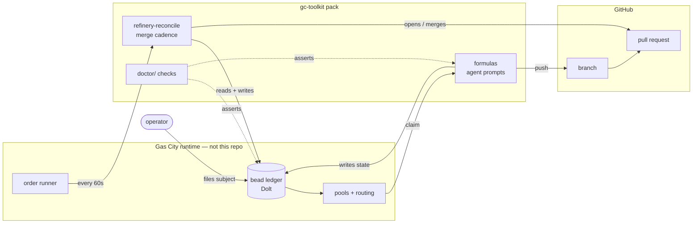
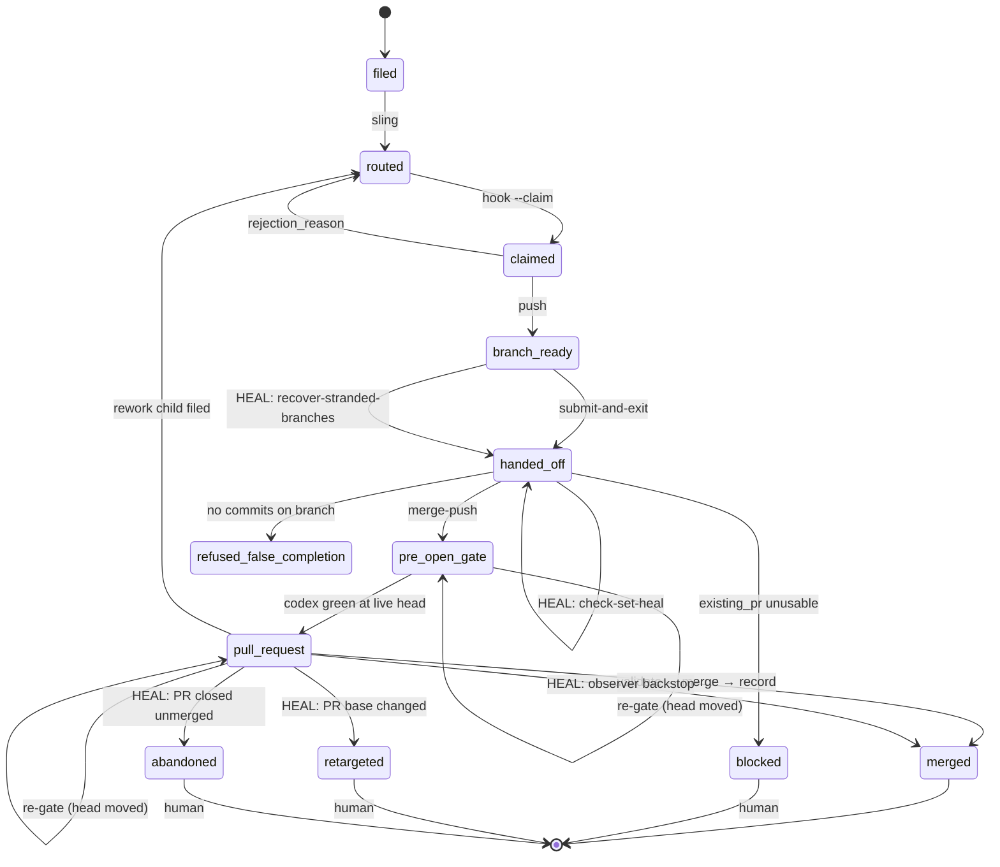
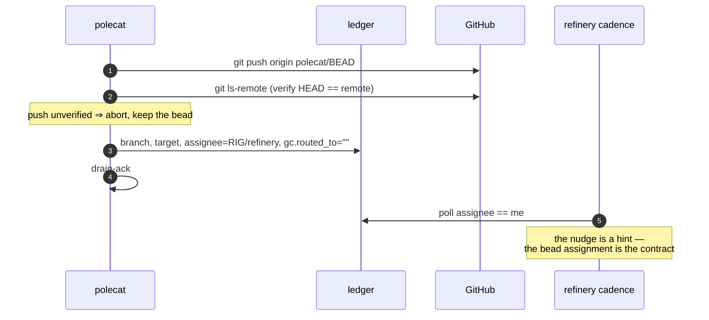
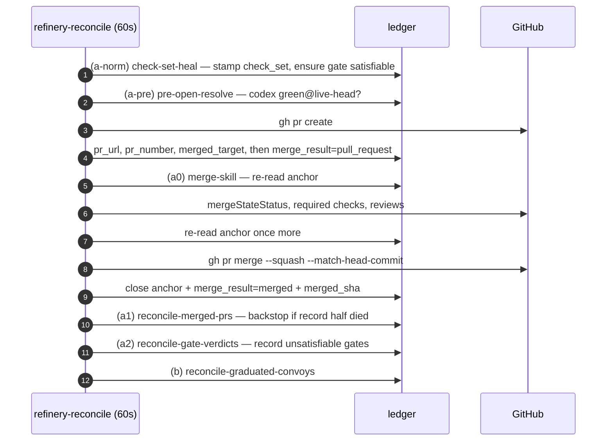

# Component model

If gc-toolkit were written again from scratch, this is what would be carried
across. It is a **target**, not a survey. The running system appears only in
§4, as a delta.

## Scope

**Mandate.** The primitive set, the PR lifecycle as one closed state machine,
and the invariant→check binding. It is the document a new component must
justify itself against.

**Boundaries.** It does not narrate the bead, PR, or visit lifecycles — see
[work-bead-state-machine.md](work-bead-state-machine.md),
[refinery-merge-cadence.md](refinery-merge-cadence.md),
[gascity-human-engagement.md](gascity-human-engagement.md). It does not
compose them — [lifecycle-composition.md](lifecycle-composition.md) owns the
seam. It is not a migration plan — `specs/tk-z9nln/consolidation-plan.md`
owns that.

## The one rule this document is held to

> **Every invariant below names the mechanical check that fails when it stops
> being true.** An invariant with no named checker is marked **UNCHECKED** and
> filed as a bead. Prose is what rots; `docs/roadmap.md` and
> `specs/bead-universe/design-doc.md` were never contradicted, only outlived.

---

## 1. Primitives

Each earns its place by answering the second column. Anything that cannot is
in the discard list below it.

| Primitive | What it is | Cost of not having it |
|---|---|---|
| **Bead** | one durable row: id, status, assignee, metadata, notes | state lives in agent context and dies with the session |
| **Graph edge** | typed relation between two beads (`blocks`, `parent-child`, `tracks`, …) | a wait becomes a sentence, and nothing can re-evaluate a sentence |
| **Anchor** | the single open bead that owns a PR and carries its gates | N claimants on one PR ⇒ the weakest check-set decides the merge |
| **Convoy** | tracked set with one landing target | no unit larger than a bead can land, and integration branches cannot graduate |
| **Formula + step bead** | a workflow materialised as beads | a crashed session resumes by reconstructing intent from prose |
| **Check-set + gate marker** | declared merge preconditions, each bound to a commit | merges depend on whoever remembers to look |
| **Pool + route** | demand addressed to a role, not to a session | dispatch names a mortal process |
| **Order** | controller-owned recurring pass, no LLM | cadence becomes an invisible daemon (measured: 47 min of no merge cadence citywide, 2026-08-19) |
| **Agent session** | one mortal executor with an identity | nothing can be claimed, and nothing can be recycled |
| **Worktree + `polecat/<bead>` branch** | per-bead isolation | concurrent writers stomp one checkout |
| **Visit / subject** | the human's queue | results propagate as a colour change on a board nobody opens |

### Discard list

Named explicitly, because dropping these is as much the design as keeping the
list above.

| Discard | Why it is not a primitive |
|---|---|
| `merge_result` as a second status field | two state fields on one bead, neither declaring the other's legal combinations. §2 shows the machine it should be. |
| `gc.routed_to` as a field distinct from `assignee` | route and owner are one question asked twice. The whole fresh-handoff detector (`refinery-reconcile.sh`, "THE PREDICATE IS NOBODY POLLS IT") exists only because a bead can be assigned to one address, routed to another, and polled by neither. |
| `in_progress` as a status | it means *claimed*, which the assignee already says. `bd update --claim` writes both. |
| free-form metadata as the state space | 107 distinct keys on the open ledger, 104 written by pack code, none enumerated. Not a primitive — an accumulation. |
| the healer passes, **as a category** | each repairs a writer that does not always run. They are the cost of §2's dashed edges, not a component worth rebuilding. |
| prose-carried design | one `[vars.check_set]` `description` in `formulas/mol-refinery-patrol.toml:307` is ~4,000 characters of load-bearing rules. A rule a reader must extract from a paragraph is not enforced. |

---

## 2. The PR lifecycle

### 2.1 Boundaries

**Legend.** Solid = writes state. Dashed = asserts a property without writing.
The pack owns no data plane: every durable fact is a bead.

### 2.2 The anchor state machine

A unit of work has exactly one anchor bead; its state is
`status` × `merge_result`. Unmarked edges are performed by the **writer** that
caused the change. Edges marked **`HEAL:`** are performed by a later repair
pass reconstructing a fact the writer failed to record — those are the
brittleness, and they are named on the edge on purpose.

### 2.3 Transitions, and the code that performs them

`W` = the writer that caused the change. `H` = a repair pass that performs a
transition someone else should have.

| From → To | By | Performed by |
|---|---|---|
| filed → routed | W | `gc sling` (runtime); `assets/scripts/deferred-dispatch.sh:305` |
| routed → claimed | W | `gc hook --claim` (runtime) |
| claimed → branch_ready | W | `mol-polecat-work.workspace-setup`, `.implement` |
| branch_ready → handed_off | W | `formulas/mol-polecat-work.toml:632` |
| branch_ready → handed_off | **H** | `assets/scripts/recover-stranded-branches.sh` |
| handed_off → pre_open_gate | W | `formulas/mol-refinery-patrol.toml:2616` |
| handed_off → handed_off (arm gates) | **H** | `assets/scripts/check-set-heal.sh:2290` |
| pre_open_gate → pull_request | W | `assets/scripts/pre-open-resolve.sh:564,584` |
| gate marker `green@<oid>` | W | `template-fragments/polecat-non-impl-done.template.md:465` |
| gate marker `fixable@<oid>` | **H** | `assets/scripts/reconcile-gate-verdicts.sh:805` |
| gate marker `exception@<oid>` | **H** | `assets/scripts/reconcile-gate-verdicts.sh:904` |
| pull_request → merged | W | `assets/scripts/merge-skill.sh:2052,2074` |
| pull_request → merged | **H** | `assets/scripts/reconcile-merged-prs.sh:1171` |
| pull_request → retargeted | **H** | `assets/scripts/reconcile-merged-prs.sh:1043` |
| pull_request → abandoned | **H** | `assets/scripts/reconcile-merged-prs.sh:1254` |
| handed_off → blocked | W | `formulas/mol-refinery-patrol.toml:1255` |
| handed_off → refused_false_completion | W | `formulas/mol-refinery-patrol.toml:1359` |
| \* → routed (rejection) | W | `formulas/mol-refinery-patrol.toml:969` |
| convoy → graduated | W | `assets/scripts/reconcile-graduated-convoys.sh:426` |

**Count: 19 transitions, 7 of them performed by a repair pass.** Every `H`
row is a place where the writer that should have recorded a fact did not, and
a later pass reconstructs it from GitHub. That ratio is the engineering debt,
stated as a number.

### 2.4 The two boundary crossings

Everything above is one component writing its own state. These two are
handoffs, and both historically lost work.

**Why the double re-read.** `--match-head-commit` binds the merge to a commit,
but the anchor-local authorization set — `check.*` markers, `merge_hold`,
`signoff_dismissed`, `merged_target` — does not move the head. A mid-pass
write to any of them would otherwise sail through. Any mismatch holds.
(`assets/scripts/merge-skill.sh`, header.)

---

## 3. Invariants

Propositions, each true or false, each with the check that catches it going
false. **UNCHECKED** means the check does not exist and is filed as a bead.

| # | Proposition | Today | Check |
|---|---|---|---|
| **I1** | Every dependency is recorded in the bead graph — no wait lives only in prose or in a metadata string. | **PARTIAL** | Takeaway waits *are* edges (`gc-helm.sh takeaway --waiting-on`). Gate waits (`check.<g>=green@<oid>`), route waits (`gc.routed_to`) and push waits (`metadata.branch`) are strings. **UNCHECKED** → `check-wait-is-an-edge` (tk-wz4igt) |
| **I2** | The set of states is closed, and every state has exactly one handler. | **FALSE** | Pack code writes 7 `merge_result` literals across 5 files. Two readers each keep their own hand-maintained list, and the lists disagree: `refinery-reconcile.sh:344` excludes 5 values and treats anything else as *not yet anchored*; `mol-refinery-patrol.toml:486` allows 3 and treats anything else as *terminal, leave it alone*. Neither knows `blocked` or `refused_false_completion`. Opposite defaults for the same unknown value — the formula's own comment concedes "a marker no pass here has heard of". **UNCHECKED** → `check-state-space-declared` (tk-jozah0) |
| **I3** | Every routed bead is claimable by the agent it is routed to. | **TRUE** | `doctor/check-routed-work-claimable` — exact-equality on `gc.routed_to` vs live pool names. The one seed invariant with a real structural check. Scope hole: skips *assigned* beads, which is the near-miss-address case §2.4 leaves to a report-only detector. |
| **I4** | Every PR has exactly one owning anchor, and every gating anchor is open. | **PARTIAL** | First half CHECKED: `doctor/check-one-anchor-per-pr` pools every rig store and flags a PR claimed by more than one open `merge_result=pull_request` bead — plus the dual, one such bead naming several PRs — on `merge-skill.sh`'s own anchor predicate, compared within a single repository. It replaces nothing: the *runtime hold* (tk-ynz4b) still decides merges, and since tk-3sdfq that hold **coalesces** a duplicate pair into a union gate and lands it, so the pair survives a clean merge and nothing else ever looks. Second half still **UNCHECKED** → `check-closed-implies-landed` (tk-39tv12, I5) is the nearer owner: separating a live strand from stale post-merge metadata needs the PR's state rather than the ledger — 288 closed beads across 5 stores carried a handoff marker on 2026-08-24, nearly all long since merged — and `reconcile-merged-prs.sh` already walks PR → BEAD every refinery pass to report it ANCHORLESS, with `check-set-heal.sh` owning the repair. |
| **I5** | No bead is closed while the work it represents is unlanded. | **FALSE** | `merge-skill.sh` closes only after a verified merge, and the observer re-verifies — but nothing stops a *different* writer. Violated live on 2026-08-23: eight gc-toolkit anchors closed in a 19-second span carrying `merge_result=pull_request` and a green `check.codex` at the live head; all eight PRs were approved, CLEAN and MERGEABLE; none landed, because `merge-skill` cannot enumerate a closed anchor (`mol-refinery-patrol.toml:490`). `bd close --force` also bypasses open children and live blockers by design. **UNCHECKED** → `check-closed-implies-landed` (tk-39tv12) |
| **I6** | Every gating anchor declares a non-empty check-set. | **TRUE** | `doctor/check-merge-gate-drop` detects; `check-set-heal.sh` repairs at the refinery boundary before `merge-skill.sh` can read empty as *ungated*. The strongest binding in the system — and note it needs a healer to hold. |
| **I7** | A `green` gate marker was written by something that actually ran the check. | **FALSE** | The marker is stamped by a shell block inside an **agent prompt fragment** an LLM elects to run (`polecat-non-impl-done.template.md:465`), whose own code warns the write may not stick. Nothing binds the marker to evidence. This is the most load-bearing token in the merge path. **UNCHECKED** → `check-gate-marker-provenance` (tk-iljtmq) |
| **I8** | Every graph.v2 step bead reaches a terminal state. | **NEWLY TRUE** | `doctor/check-finalized-molecule-step-reoffer`; the writer half landed 2026-08-23 (`step-close.sh` wired into `mol-polecat-work`, PR #443). The violation it closed: 490 of 746 open beads were husks. |
| **I9** | A molecule executes the formula text that is current when it runs. | **FALSE** | Step descriptions are frozen at pour, and `rigs/<rig>/` — the checkout the runtime executes — advances on a 15-minute cooldown (`orders/reconcile-rig-checkouts.toml`). Measured during this bead: the molecule poured 16:06:31Z from pre-#443 text; the checkout advanced to #443 at 16:14:32Z. The molecule ran the old text for its whole life. **UNCHECKED** → `check-pour-text-current` (tk-5w3boh) |

**Six UNCHECKED invariants — I1, I2, I4, I5, I7, I9 — are the output of this
document.** Each is filed as its own bead, named in the table above, proposing
the concrete check. They are what stops this file being another
`docs/roadmap.md`: when one lands, edit the row to name the check instead of
the bead.

### Why the existing checks do not already cover these

Measured across `doctor/` (25 checks): **22 read only pack source**, greping
that a fix is still present. Only 3 —
`check-finalized-molecule-step-reoffer`, `check-merge-gate-drop`,
`check-routed-work-claimable` — query the live ledger. A source grep proves
the pack still *contains* a
remedy; it cannot observe whether the running system holds a property. Every
check is named for the defect that produced it. None asserts a structural
property. That is the tactical/structural split, present in the enforcement
layer itself.

---

## 4. Where the running system diverges from this target

| Target | Running system | Evidence |
|---|---|---|
| State space is declared and closed | 4 statuses × 107 undeclared metadata keys | `gc bd list --status open --limit 0 --json` over 778 open beads |
| One state field per bead | `status` and `merge_result`, independently written | §2.3 |
| Writers complete their own transitions | 7 of 19 transitions performed by repair passes | §2.3 |
| Gates are evidence-bound | the green marker is prompt-authored | I7 |
| Design carried by diagrams | `docs/` = 10,151 lines, **1** mermaid diagram (in `architecture.md`) before this file | `git ls-tree -r origin/main -- docs` |
| A state machine is drawn | `docs/work-bead-state-machine.md` is 2,070 lines, 0 diagrams | same |
| Checks assert properties | 22 of 25 assert only that a past fix is still in the source | §3 |
| Live pack == landed pack | up to 15 min of lag; a molecule poured inside it runs stale text for life | I9 |

Remediation sequencing is not this document's; see
`specs/tk-z9nln/consolidation-plan.md`.

## 5. How to use this

- **Adding a component** — it must answer column 3 of §1. If it cannot, it is
  a repair pass for a writer that should be fixed instead.
- **Adding a state** — add it to §2.2 and name its handler, or it does not
  exist.
- **Adding a metadata key** — it is state. Declare it, or accept that nothing
  downstream can be proven exhaustive over it.
- **Adding an invariant** — name its check in the same PR.
