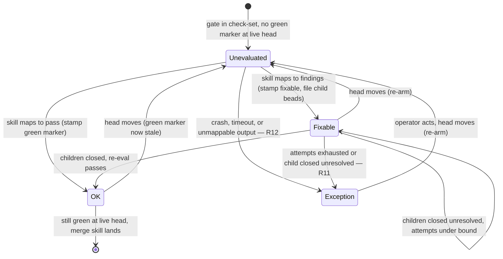

# Merge-gate exception/verdict lifecycle on the convergence primitive (WS4)

## What this is

A **design, not an implementation.** This document is the WS4 "convergence
pilot" for the merge-gate check-set v2 (epic `tk-6d0vb`, follow-up `tk-zgse0`).
It resolves the two "Deferred to planning" questions the v2 requirements doc
(`tk-6d0vb.1.6`) left open for the exception arm:

- **the exact output-contract shape** by which a check-skill signals OK /
  fixable / exception, and how findings map to work-bead fields (R20); and
- **how the idle-cadence re-evaluation is wired** to drive the verdict
  lifecycle, and where the exception transition physically runs (R4, R6).

It plans; it does not change any live refinery code. Implementation follows in
separate beads filed against `tk-zgse0` once this plan is reviewed. This doc
**extends** the authoritative spec `work-bead-state-machine.md` (the check-set,
the observer/merge-skill split, the stale-base convergent arm); it does not
supersede it.

It is a **pilot** in a precise sense: the OK/fixable/exception verdict contract
below is shared by *every* gate, so designing the exception arm — the one arm
`tk-6d0vb.1.6` deliberately left out — also fixes the shape of the verdict
record for the other workstreams (WS1 pre-submission review, WS2 pre-merge
agent, WS3 composed Codex→Claude). WS4 is simply the first arm to need all
three verdicts, so it is where the contract is pinned down.

## Summary

The v2 check-set core (`tk-6d0vb.1.6`, shipped) gave a gate two outcomes made
concrete as bead metadata: **OK** (a `check.<name>=green@<sha>` marker on the
gating anchor) and **fixable** (no green marker; findings become child
work-beads that hold the merge). WS4 adds the **third** outcome, **exception**,
and pins the full verdict lifecycle.

The design rests on one observation and one reuse:

- **Observation.** `merge-skill.sh` merges a PR only while every gate named in
  the anchor's `check_set` equals `green@<live-head>`. Therefore *any* marker
  value that is not `green@<live-head>` already holds the merge — a stale
  `green@<old-head>`, an absent marker, or a **new non-green verb**. So a new
  verdict can be recorded as a new marker verb without touching the merge
  condition. The verdict enum becomes the marker's verb:
  `check.<name>=green@<sha>` (OK), `check.<name>=fixable@<sha>` (remediation
  in flight), `check.<name>=exception@<sha>` (held). **The merge skill is
  unchanged; the three verdicts are three marker verbs, only one of which
  (`green` at the live head) permits merge.**

- **Reuse.** The exception arm is not a new driver. It is a new instance of the
  **convergence primitive** already in the codebase — the observer's
  idempotent, head-bound, idle-cadence reconcile arm, whose canonical instance
  is the stale-base rebase arm (`work-bead-state-machine.md` §"Stale base").
  That arm proves the primitive already hosts a "hold the anchor OPEN, file
  remediation as a new child, re-arm only on head-move, converge" pattern. The
  exception arm is structurally identical, with "escalate to the operator"
  where the stale-base arm has "file a rebase child."

Net: WS4 ships as a **verdict output contract** plus **one more reconcile arm**,
introducing no new writer of merged-truth, no blocking in-process driver, and
no change to the merge condition.

## The core convergence primitive (what we host on)

"Convergence primitive" names a pattern already load-bearing in the refinery,
not a new component. Its definition, assembled from the authoritative spec and
the v2 requirements:

1. **Async, idle-cadence, no blocking driver (R6).** A gate is realized as
   *dispatch a gate bead → a worker runs the skill and records the outcome →
   the gate is re-evaluated on the refinery's idle cadence.* "Run to OK"
   describes the convergent end state, not an in-process loop. The refinery's
   reconcile passes (`reconcile-*.sh`, the `mol-refinery-patrol` idle wake) are
   where re-evaluation lives.

2. **The observer reads state, liveness, and time; it routes, it does not
   write merged-truth.** Per `work-bead-state-machine.md`, the merge skill is
   the *single writer of merged-truth*; the observer is a backstop that detects
   discrepancy and files work. "Stuck is detectable only from outside — by an
   observer reading state, liveness, and time." The exception arm is an
   observer arm: it reads and records a verdict and escalates; it never merges.

3. **Two properties make an arm converge** (from the stale-base arm,
   `work-bead-state-machine.md` §"Stale base"):
   - **The gating marker stays intact.** The anchor keeps
     `merge_result=pull_request` (still gating), so the merge skill remains the
     single lander; flipping it off would strand a later-green PR with nothing
     to land it.
   - **One action per head** (`stale_base_head=<head at detection>`). The arm
     re-arms only when the head moves. An unchanged head is never re-acted-on;
     a moved head is a genuinely new subject. This head-binding is what turns a
     repeating idle pass into a *convergent* one rather than a thrashing one.

4. **Remediation is always a new child, never the anchor reopened.** A check
   that needs work files a new child against the convoy; the anchor is never
   cycled open→closed→open and no flag is toggled back on it. An anchor lands
   only when all its children are closed, so an open child holds the merge.

Hosting the verdict lifecycle here means: **express OK / fixable / exception as
head-bound markers, express remediation as new children, and drive every
transition from the idle-cadence reconcile pass — inheriting single-writer
safety and head-bound idempotency for free.**

## The verdict output contract (R5, R9, R20)

A gate is **a reference to a skill plus a thin output contract** (R20). The
contract is the only gas-city-specific glue; the skill is used unmodified where
possible (R21). The contract is a **total function** from the skill's
observable result to exactly one verdict:

| Verdict | Meaning | Recorded as (on the gating anchor) | Merge effect |
|---|---|---|---|
| **OK** | the skill passed at this head | `check.<name>=green@<sha>` | permits merge iff `<sha>` is the live head |
| **fixable** | the skill found addressable problems | `check.<name>=fixable@<sha>` + one child work-bead per finding | holds merge (marker verb ≠ `green`) |
| **exception** | the skill's result cannot be turned into pass-or-fixable | `check.<name>=exception@<sha>` + a reason + one operator escalation | holds merge; **not** auto-remediated |

Three invariants keep this honest and align it with the shipped core:

- **A verdict is a record; work is a bead; gates never reclassify (R9).** The
  `check.<name>` marker *is* the verdict record. fixable findings spawn child
  work-beads (R7); those beads are the *consequence* of the verdict, not a
  second kind of gate. exception records a verdict too — it does not become a
  work-bead, because there is nothing a worker can mechanically do (that is
  precisely what makes it an exception).

- **Findings map to child work-beads, deduped by finding identity (R7, R10,
  R23).** Each finding the contract accepts becomes one child of the convoy
  carrying `metadata.pr_number=<convoy PR>` (so it actually holds the merge,
  matching how the merge path finds blocking children) and a stable
  `finding_key` (skill name + normalized locus/message). Re-evaluating a gate
  that already has a work-bead (open or closed) for a `finding_key` creates no
  duplicate — idempotency is by `finding_key`, not by evaluation count.

- **The marker verb generalizes `green`, so the merge skill is untouched.** The
  shipped merge condition ("every gate is `green@<live-head>`") already rejects
  `fixable@…` and `exception@…` as "not green." Recording the two non-OK
  verdicts explicitly (rather than as mere absence of a green marker) buys the
  observer a **pure read**: the current verdict of a gate is a total function
  of its last marker, with no need to cross-reference open children to infer
  "fixable vs. never-run."

### Attempt and timeout accounting (head-bound)

Two counters live beside the marker, both head-bound so they reset when the
head moves (a moved head is a new subject — the same rule that makes the
primitive converge):

- `check.<name>.attempts=<n>@<sha>` — remediation rounds spent on this head for
  this gate. Incremented when a fixable gate re-spawns after its child closed
  still-unresolved. Bounded by `<n> ≥ MAX_ATTEMPTS` (R11).
- The gate-bead dispatch carries a **deadline**; the observer reads liveness +
  time to detect a worker that crashed or ran past it (R12), needing no counter
  of its own — "stuck is detectable only from outside."

Escalation is also head-bound and one-shot: `check.<name>.exception_escalated=<sha>`
records that the operator was already notified for this gate at this head, so a
held exception does not re-notify on every idle wake (the escalation analogue
of `stale_base_head`, one-per-head).

## The exception arm (R8, R11, R12)

The arm runs on the observer's idle cadence, once per gate that is not already
resolved OK. It converts two distinct situations into the same terminal verdict:

- **R11 — bounded remediation exhaustion.** A gate that is still `fixable` after
  its remediation child closed *unresolved*, or after `attempts ≥ MAX_ATTEMPTS`,
  **converts to exception rather than re-spawning.** Re-spawning forever is the
  non-convergent failure this rule rules out; the bounded count is what forces
  convergence to a terminal state.

- **R12 — infrastructure failure.** A check-skill that **crashes, times out
  under a bounded deadline, or emits output the contract cannot map** is an
  exception directly (no remediation child — there is no finding to fix). This
  is the "unknown residual, caught out-of-band" case: the contract is a total
  function only over *mappable* outputs; everything else is, by definition, an
  exception.

On either trigger the arm does exactly three things, mirroring the stale-base
arm's shape (`hold + file-child` → here `hold + escalate`):

1. **Record** `check.<name>=exception@<sha>` with a `reason` (which trigger, and
   the skill's diagnostic if any). This is the verdict; it holds the merge
   because the verb is not `green`.
2. **Hold the convoy OPEN.** Leave `merge_result` / the gating marker intact —
   the anchor stays the single gating locus (property 3a). No auto-fix, because
   an exception has no mechanical remedy and, post-approval, altering the head
   would dismiss the human approval (R16 is the Phase-2 specialization of this
   same "don't auto-change the approved commit" rule).
3. **Escalate once per head.** Notify the operator and route the anchor to a
   human decision, guarded by `check.<name>.exception_escalated=<sha>` so a
   persistent exception escalates exactly once per head, not every idle wake.

**Exception is terminal-until-operator.** It clears only when the input
genuinely changes, which the primitive already detects as a **head move**: the
operator fixes the branch (or the underlying skill/infra), the head advances,
and every head-bound datum — the marker, the attempt counter, the escalation
guard — is stale for the new head and re-arms. The gate re-evaluates fresh
against the new head with a clean slate. No reopen dance, no manual flag reset;
convergence is re-entered by the same head-binding that governs OK and fixable.

## Verdict lifecycle

Only `OK` at the **live** head is a mergeable state; `Fixable` and `Exception`
both hold, and any head move drops the gate back to `Unevaluated` for a fresh,
head-bound evaluation.

## Requirements traceability

| Req | Where satisfied |
|---|---|
| R5 — gate yields OK / fixable-failure / exception | The verdict output-contract table; the marker verbs `green` / `fixable` / `exception`. |
| R7 — fixable spawns child work-beads; re-eval after they close | Findings → `pr_number`-tagged children; `Fixable → OK/Fixable/Exception` transitions. |
| R8 — exception holds the convoy OPEN and notifies the operator | Exception arm steps 2–3; the convoy stays gating; escalate-once-per-head. |
| R9 — a gate is always a check (record); work is transient remediation | Verdict is the `check.<name>` marker; remediation is child beads; exception is a marker value, never a work-bead. |
| R10 — re-evaluation is idempotent, dedup by finding identity | `finding_key` dedup; head-bound markers/counters make re-evaluation a pure read. |
| R11 — bounded remediation converts to exception, not re-spawn | `check.<name>.attempts` bound → exception trigger. |
| R12 — crash / timeout / unmappable output → exception, bounded timeout | Infrastructure-failure trigger; the contract is total only over mappable output; dispatch deadline. |
| R20 — gate = skill ref + thin output contract mapping to pass / findings-to-beads / exception | The output contract is exactly this total function; the marker + child-bead + escalation are its three ranges. |

## Acceptance examples

- **AE-WS4-1 (fixable → OK).** A gate maps to one finding; a `pr_number`-tagged
  child is filed; a worker fixes and closes it; the next idle re-evaluation maps
  to pass and stamps `check.<name>=green@<head>`; the merge skill (unchanged)
  lands the PR. Re-evaluating before the fix creates no duplicate child
  (`finding_key`).

- **AE-WS4-2 (bounded exhaustion → exception, R11).** A gate is still fixable
  after `MAX_ATTEMPTS` remediation rounds on the same head. The arm stamps
  `check.<name>=exception@<head>` with `reason=attempts-exhausted`, holds the
  convoy OPEN, and escalates once. The operator changes the branch; the head
  moves; the gate re-arms to `Unevaluated` and re-evaluates fresh.

- **AE-WS4-3 (crash/timeout → exception, R12).** The check-skill exits non-zero
  / exceeds its deadline / emits output the contract cannot map. The arm records
  `check.<name>=exception@<head>` with the diagnostic `reason` and escalates —
  no remediation child, because there is no mappable finding. The next idle wake
  re-reads the same held state and does **not** re-escalate (guard), until the
  head moves.

- **AE-WS4-4 (no re-escalation spam).** A held exception persists across many
  idle wakes at an unchanged head. Exactly one operator notification exists,
  because `check.<name>.exception_escalated=<head>` matches the live head.

## Scope boundaries

**In scope (this pilot):** the OK/fixable/exception verdict output contract; the
marker-verb representation; head-bound attempt/timeout/escalation accounting;
the exception reconcile arm hosted on the convergence primitive.

**Deferred to implementation beads (filed against `tk-zgse0`):**

- The concrete metadata key spellings (`check.<name>` verb vocabulary,
  `.attempts`, `.exception_escalated`) — bikeshed to settle when the first arm
  is coded; the doctor check `check-merge-gate-drop` should learn the new verbs.
- `MAX_ATTEMPTS` default and per-gate override; the per-skill dispatch deadline
  default for R12.
- **Where the arm physically lives** (R4/R6 open question): recommend the same
  home as the stale-base arm — a convergent `reconcile-*.sh` pass invoked on the
  refinery idle wake — so the exception arm shares the observer's existing
  state/liveness/time read rather than adding a new driver.
- The operator notification channel (mail vs `gc.routed_to=human` vs both) and
  the exception `reason` taxonomy.

**Out of this change's identity (owned elsewhere):**

- The composed Codex→Claude agreement computation (WS3, R18/R19) — a gate may
  compose evaluators, but *that* wiring is WS3; WS4 only fixes the verdict the
  composed gate ultimately emits.
- Phase-1 pre-submission and Phase-2 pre-merge sequencing (WS1/WS2, R13/R14) —
  they consume this verdict contract but own their own phase mechanics.
- The close-on-merge convoy model and the merge condition itself (settled in
  `tk-6d0vb.1` / `tk-6d0vb.1.6`) — unchanged here by design.

## Dependencies and references

- **Builds on** `tk-6d0vb.1.6` (shipped check-set core: per-gate
  `check.<name>=green@<sha>` markers, `check_set` membership, merge-skill holds
  until every gate is green at the live head) and `tk-6d0vb.1.5` (codex review
  is COMMENT-only; the city never approves — approval is external/human).
- **Extends** `work-bead-state-machine.md` — the check-set (§"The check-set"),
  the observer/merge-skill single-writer split (§"Merge: one writer of
  merged-truth"), rework-is-a-new-child (§"Rework is a new child"), and the
  stale-base convergent arm (§"Stale base") that this design generalizes.
- **Relates to** the sibling `tk-zgse0.1` (WS4 GAP1: a stale gating anchor after
  a head move sitting in silent indefinite hold → a self-heal arm that
  re-dispatches review at the live head). That is a concrete *instance* of the
  convergence arm this design generalizes: same idle-cadence detection, same
  head-bound re-arm. The exception arm and the GAP1 self-heal arm should share
  the reconcile-pass scaffolding.
- **Requirements source:** the v2 requirements doc embedded on `tk-6d0vb.1.6`
  (R1–R23); WS4 is R5, R8, R11, R12, R20 with supporting R7, R9, R10.
