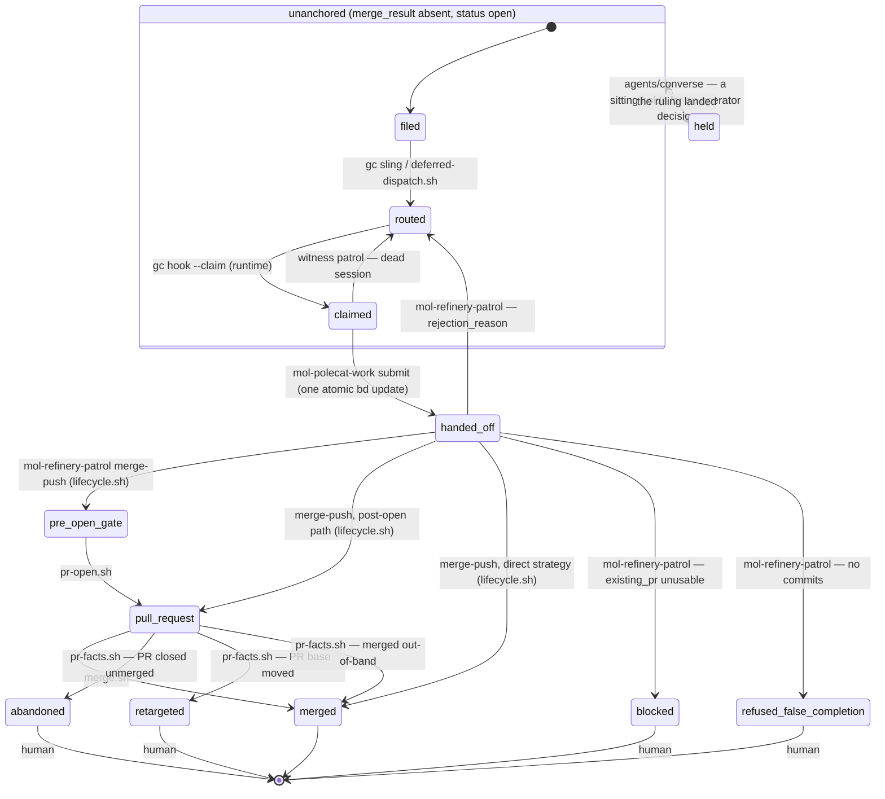
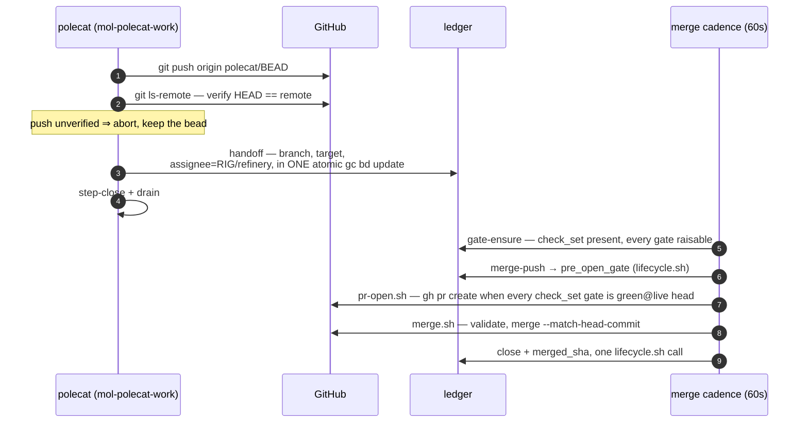

# The anchor state machine

A unit of work has exactly one **anchor** bead. Its state is
`status` × `merge_result`, and the state space is **declared, closed, and
single-writer**: `lifecycle/lifecycle.toml` enumerates every state, every legal
transition, and every pack-written metadata key, and
`assets/scripts/lifecycle.sh` is the only thing that writes a transition —
validate, one atomic `bd update` carrying every field of the transition, read
back. An unknown `merge_result` value is an error: every reader surfaces it via
`escalate.sh`, and `doctor/check-state-space` catches it. A bead closed while
`merge_result` is a non-closed state is repaired by `lifecycle.sh reopen`
(human-invoked; `merge_result` untouched).

## Scope

**Mandate.** The anchor lifecycle: states, transitions, writers, the gate
vocabulary, and the merge condition.

**Boundaries.** The cadence that drives the merge-side writers is
[refinery-merge-cadence.md](refinery-merge-cadence.md). The invariants over
this machine and their doctor checks are
[component-model.md](component-model.md) §3. How completion propagates to a
waiting conversation is [lifecycle-composition.md](lifecycle-composition.md).

## The machine

No transition here is performed by a repair pass. Writers complete their own
transitions in one atomic write; the only reactive edges respond to facts the
pack does not write — GitHub closing or retargeting a PR (`pr-facts.sh`), a
session dying (witness orphan recovery).

`handed_off` is the unanchored bead after the polecat's single handoff write
(branch recorded, assignee = refinery, `merge_result` still absent); the
anchored states are the `merge_result` values. `merged` is the only state with
`status = closed`; the human states stay open, routed to human.

`held` is the one human state a sitting writes rather than the refinery, and it
is entered only from `unanchored`. `merge.sh`, `gate-ensure.sh` and `pr-facts.sh`
each enumerate anchors by their gating state, so moving a live anchor to `held`
to record a conversation would drop it from all three for as long as the hold
lasts. An anchor already carries a state and a reader; an unanchored subject
carried neither, which is what the state exists to fix.

`pre_open_gate` and `pull_request` are the declared *detached* states
(`detached_states`). The merge cadence drives them and no queue offers them, so
the anchor rests unheld and unrouted: `lifecycle.sh` clears `gc.routed_to` on
entry to one. The exception is `park_route` (`human`), which `signoff.sh` writes
when the review round cap is spent. No pool claims that value, so a transition
that finds it leaves it in place. Any other route on a detached anchor is pool
demand for work that is already in the merge queue. A worker claims it, the
claim moves the bead out of `--status=open`, and `merge.sh` and `pr-facts.sh`
both enumerate from there. `doctor/check-state-space` reports the violation.

## Transition table

| From → To | Writer | Trigger |
|---|---|---|
| filed → routed | `gc sling` (runtime); `deferred-dispatch.sh` when blockers must close first | dispatch |
| routed → claimed | `gc hook --claim` (runtime) | pool demand spawns a session |
| claimed → routed | witness patrol (`mol-witness-patrol`) | session died with the claim held |
| claimed → handed_off | `mol-polecat-work` submit step (ONE atomic `gc bd update`) | push verified on the remote |
| handed_off → pre_open_gate | `mol-refinery-patrol` merge-push, via `lifecycle.sh` | gates armed, branch accepted |
| handed_off → pull_request | `mol-refinery-patrol` merge-push (post-open path), via `lifecycle.sh` | a usable PR already exists |
| handed_off → merged | `mol-refinery-patrol` merge-push (direct strategy), via `lifecycle.sh` | FF merge pushed and verified on the target; record + close in one call |
| pre_open_gate → pull_request | `pr-open.sh` (cadence arm 2) | every marker-bearing gate in `check_set` is `green@<live head>` |
| pull_request → merged | `merge.sh` (cadence arm 4) | full authorization set validated; close + record in one call |
| pull_request → merged | `pr-facts.sh` (cadence arm 5) | GitHub merged the PR out-of-band; record only |
| pull_request → abandoned | `pr-facts.sh` | PR closed unmerged externally; files a visit |
| pull_request → retargeted | `pr-facts.sh` | PR base moved externally; files a visit |
| handed_off → blocked | `mol-refinery-patrol` | recorded `existing_pr` unusable |
| handed_off → refused_false_completion | `mol-refinery-patrol` | no commits on the handed-off branch |
| handed_off / pull_request → routed | `mol-refinery-patrol` (rejection) | `rejection_reason` written, re-routed to the pool |
| unanchored → held | `agents/converse` hold, via `lifecycle.sh` | a sitting is waiting on an operator decision; state + route in one write |
| held → unanchored | `agents/converse` sign-off, via `lifecycle.sh`; or human | the ruling landed |

A request-changes verdict does NOT transition the anchor: `signoff.sh` clears
the gate marker and files one routed rework child that blocks the anchor — the
anchor stays `pull_request` (or `pre_open_gate`) and the cleared marker holds
the merge until the child lands and the gate re-evaluates.

Convoy graduation is a separate transition on the convoy bead:
`convoy-graduate.sh` (cadence arm 6) moves a convoy to refinery-assigned with
`branch=integration/<id>` when all members are closed, at least one merge is
recorded onto the integration branch, and no hold or branch vetoes.

## Gates

**Vocabulary.** The anchor declares its gates in `check_set`, a comma list of
gate names. Three of those names are not review gates, and every reader of
`check_set` knows them by name. `none` and `off` are sentinels that declare no
gate at all. `none` is the spelling the rest of this pack uses. `approval` is
satisfied by GitHub's own review state. `gate-ensure.sh` and `pr-facts.sh`
skip all three instead of dispatching a review, and `merge.sh` drops them
before it looks for markers.

Every other name is opaque to the machinery: gate-ensure dispatches whatever
it finds there, `signoff.sh` writes `check.<name>`, and `merge.sh` requires
every such name green at the live head. Which names an anchor starts with is
configuration, not doctrine. Two writers put them there and neither reads the
diff: `mol-refinery-patrol` stamps its `check_set` var on every transition
into a gating state, and `gate-ensure.sh --default` normalizes an anchor whose
set is absent or empty, taking its value from `REFINERY_RECONCILE_CHECK_SET`.
The registry records the same value at `lifecycle/lifecycle.toml`
`[gates] check_set_default`. Who may depart from it is
[authority-map.md](authority-map.md).

`codex` is one such review gate, opaque like the rest. Both transitions read
the same declared list: `pr-open.sh` publishes once every marker-bearing gate
in `check_set` is `green@<live head>`, and `merge.sh` merges under the same
condition. `none`/`off` and `approval` are dropped from both — the first is
the gateless-by-choice sentinel, and the second is evidenced by an external
GitHub review, which cannot exist before the PR does and which `merge.sh`
enforces at the merge. An empty `check_set` is not the opt-out at either
transition: it means never normalized, and gate-ensure stamps the default
earlier in the same pass.

Each gate's verdict is a head-bound marker:

| Marker | Meaning | Merge effect |
|---|---|---|
| `check.<g>=green@<oid>` | gate passed at `<oid>` | merges iff `<oid>` is the live head; re-gated once the head moves past it |
| `check.<g>=fixable@<oid>` | addressable problems; a rework child is in flight | holds |
| `check.<g>=exception@<oid>` | round cap spent or unmappable result; routed to human | holds; re-gated once the head moves past `<oid>`, or when new operator feedback resets the cap |

`approval` takes no marker of its own. `merge.sh` satisfies it from an
external APPROVED review at the live head, never from the city's own account
and never from a `check.approval` marker. `lifecycle/lifecycle.toml` records
that rule. What the *reviewer* did short of a verdict is posture, not a gate:
see [Posture](#posture) below. **`signoff.sh` is the single writer of gate
verdicts** (component-model I7). It refuses any oid that is not 40 lowercase
hex: the marker earns its authority from `merge.sh` comparing it to the live
head, and an abbreviated sha compares equal to nothing. A head move stales
every verb at once, so a fixed branch re-evaluates fresh with no manual reset
— gate-ensure re-arms the gate by dispatching a fresh review, whose verdict
overwrites the stale marker.

One shape cannot be re-armed that way. `merge.sh` and gate-ensure both read
only the gates named in `check_set`, so a `check.<g>` outside it is dispatched
against by nothing and overwritten by nothing. When such a marker also fails
the grammar, it is evidence of nothing that nothing could retire, and
gate-ensure clears it. A well-formed one stays as history, and an undeclared
`exception@` is the operator's to retire — the re-gate above reaches only the
gates `check_set` names.

At the head it names, an `exception@` gate is held, not decided. `signoff.sh`'s
approve path stamps `green@<reviewed oid>` and returns before it counts rounds
against the cap, so one further approving review releases the gate at that very
head. No cadence pass will start that review, because gate-ensure and
`pr-facts.sh` both read an exception bound to the live head as settled. The
human the anchor is routed to has three moves: dispatch a review by hand,
change the anchor's `check_set`, or move the head and take the one re-gate the
table above describes. Reviewing the PR is a fourth: new review comments
release the cap, and the exception with it.

### The round cap counts from the last operator feedback

`GC_MAX_REVIEW_ROUNDS` (default 3) bounds one thing — the city failing to
converge against its own reviewer — and a round is an attempted rework child,
never a review dispatch. Feedback from a person is not that loop. It is review
the branch has never been answered against, so counting it against the budget
lets an operator's own review exhaust the allowance for reviewing the response
to it.

`pr-facts.sh` records each batch it routes as `signoff_rounds_reset=<highest
review id>.<highest comment id>`, which is one stamp per distinct piece of
feedback: a reconcile pass every two minutes sees the same comments until they
are answered, and a policy resetting on their mere presence would be no cap at
all. What makes a batch operator feedback is the author: the posture derivation
counts only ids written by a login other than the city's own, so `signoff.sh`'s
verdicts (posted under that login), re-reviews, and rework hand-backs (which
post nothing) leave the counter alone.

`signoff.sh` subtracts a floor rather than resetting a counter, since the
rework children stay on the anchor: at the first verdict after a new batch it
writes `signoff_round_floor=<children then>@<batch>`, and counts what follows.
The floor is written, not re-derived, because that verdict files a child of its
own, and a floor recomputed each pass would swallow every new round and the cap
would never trip.

A cap that resets while its own park stands has not reset, so the same write
retires that park: the `exception@` marker, `blocked_reason`, the human route,
and the `gc.takeaway` the cap wrote for the board. `signoff.sh` stamps
`signoff_cap=<gate>@<oid>` alongside them, and the reset acts only while that
stamp and the standing marker still agree — an anchor a person parked by hand,
or one whose exception they already retired, is theirs and stays. A sitting
still waiting on a person outranks the reset the same way, and what says so is
the demand bead `gc-helm.sh demand` filed (`gc.demand_for=<anchor>`), never
`gc.takeaway`. That field is stamped when a sitting begins and replaced by its
outcome at sign-off, so it dates the last sitting rather than naming a live
wait; read as a hold it parks an anchor from its first conversation onward,
whatever the PR goes on to say. Which takeaway the retire clears follows from
the same fact. `gc.takeaway_by` names the writer, so the cap's own sentence
goes with the park it describes, and a sitting's stays. The dispatch tally
(`dispatch_count` and any `dispatch_backstop.<g>`) goes with the park, since
rounds nobody may dispatch are no release.

That release reaches only an anchor with a PR. One capped before its PR was
opened has no conversation to be commented on, so no batch is ever recorded,
and clearing the exception by hand only lets the next pass recompute the same
rounds and cap again. The cap says which case it is: `blocked_reason` names the
rounds as spent pre-open and names the verb that ends them. That verb is
`signoff.sh reset <anchor> --reason <why>`. It writes the floor itself —
`signoff_round_floor=<children now>@<a minted batch>` with
`signoff_rounds_reset` carrying the same batch, so the next verdict does not
re-derive it — and retires the park in the same call, under the same
`signoff_cap` agreement and live-demand guard the feedback reset uses. It reads
no PR and touches no review bead, records the ruling on the anchor, and
verifies every key it wrote, the retired tally keys included: `gate-ensure.sh`
holds dispatches while `dispatch_count` stands, so an unset that was denied or
lost leaves an anchor nobody may dispatch under a release that reported
success. Because the floor comes from the rework ledger rather than from a batch
someone else recorded, the count is read strictly — a walk that does not parse,
or one naming no round at all, refuses the whole verb before it writes. Reading
such a walk as zero rounds would write a floor of 0 and let the next pass count
the real children from it and cap again, which is the deadlock the verb exists
to end.

The verb is the only way back for an anchor whose batch was already recorded,
too. The feedback reset fires once per batch, and its arm is reached only while
a comment stands unanswered, so a batch that stamped itself and left the park
standing is never re-read: the watermark written in that same pass answers those
comments, and the posture stops being `commented`.

A standing `CHANGES_REQUESTED` review resets nothing. It is the strongest
posture there is, `merge.sh` vetoes on the review itself, and the arm that
records it deliberately keeps no watermark over its comments, so there is
nothing there to tell a new remark from one already answered. Such an anchor is
held by the reviewer directly rather than by the cap.

The review bead carries the `mol-review` formula (attached at dispatch via
`gc sling --on`); the reviewing polecat follows its steps. The dispatch pins
`reviewed_oid=<live head>` on the review bead, and
`signoff.sh` binds its verdict to that pinned commit (an explicit
`--reviewed-oid` outranks it; the live head is only a last-resort fallback) —
so a push between dispatch and verdict stamps green at the *reviewed* commit
and correctly fails the merge's live-head condition instead of green-lighting
an unreviewed head. That is the branch growing. A rebase, amend or squash
takes the pinned commit off the branch instead, and `signoff.sh` refuses both
verdicts and writes nothing: findings about a diff the branch no longer
carries mint a rework child with nothing to implement. The reviewer re-pins at
the live head and reviews that commit. Clearing that dead pin is the whole of
the recovery path, so `signoff.sh` reads it back and exits 2 naming the manual
repair rather than reporting a clear that did not happen.

`signoff.sh` closes the review bead itself, last. A bead that is already
closed therefore had its verdict recorded, or was retired unjudged by
`review-sweep.sh`, and either verdict against it is refused on the same terms:
nothing written, no round spent.

**Merge condition** (validated by `merge.sh`, every field re-read immediately
before merging): `check_set` is non-empty (empty is never the `none` opt-out —
an unnormalized anchor holds); every gate named in `check_set` is
`green@<live head>`; no
unclosed rework or review child; PR base equals `merged_target`; GitHub reports
CLEAN; no holds (`merge_hold`, `rebase_hold`, `tracking_only`). The merge is
pinned with `--match-head-commit <validated oid>`, so a mid-pass head move
fails closed. One anchor per PR is asserted structurally by
`doctor/check-one-anchor-per-pr`; `merge.sh` still refuses a second anchor on
sight as fail-closed defense.

## Posture

Gates record what the machine decided. **Posture** records what the pull request
is doing, head-pinned the same way, written by `pr-facts.sh` on every open
non-draft anchor and read off the bead by everything downstream. Declared in
`lifecycle/lifecycle.toml` `[posture]`.

| Key | Value | Meaning |
|---|---|---|
| `pr_posture` | `<posture>@<oid>@<since>` | the review posture at `<oid>`, and when it was first read there |
| `pr_merge_state` | `<mergeStateStatus>@<oid>` | GitHub's own value, verbatim and uppercase |
| `pr_comment_watermark` | `<id>` | highest routed `pulls/N/comments` id |
| `pr_review_watermark` | `<id>` | highest routed COMMENTED `pulls/N/reviews` id |
| `pr_comment_disposition` | `rework:<id>` / `visit:<id>` | what the last outstanding batch was routed to |

The postures, in the precedence the derivation applies:

| Posture | When | Merge effect |
|---|---|---|
| `changes_requested` | GitHub reports a standing `CHANGES_REQUESTED` | holds (`merge.sh` vetoes on the review itself) |
| `commented` | a review comment sits above its watermark | holds |
| `approved` | GitHub reports `APPROVED` | none |
| `review_required` | GitHub reports `REVIEW_REQUIRED` | none; the anchor is waiting on a human approval and now says so |
| `none` | no `reviewDecision` applies | none |

A comment outranks an approval on purpose: one reviewer's approval does not
answer another reviewer's question. `merge.sh` holds on a recorded `commented`
whatever head it is pinned to, because a comment survives a head move. An
**absent** posture never holds there, since that is a fact not yet recorded
rather than a fact recorded as bad. What refuses the absence is the cadence:
`pr-facts.sh --posture-only` runs immediately before the merge arm and exits
non-zero when it could not make an anchor's posture current, which holds the
merge arm for that pass. Only the arm that did the reading can tell "no comment"
from "could not read", so the hold lives there rather than in the reader. A
posture recorded a pass earlier could not see a comment that arrived since, and
no consumer asks GitHub to find out, merge.sh's own terminal re-read included. A
read that fails records nothing rather than something weaker, so a standing
`commented` keeps holding through an unreadable pass, and an anchor already held
that way is not one the arm holds the pass over.

**The watermarks** separate a comment already routed from a new one. Each is the
highest id routed in its own id space, and each advances only after the routing
reads back, so a comment nothing answered cannot fall below the mark. For a
rework child that is two stamps: the `prepare_mode` it must resume in, and the
route that makes it claimable. The two spaces are never merged: a reply can land
on an old review, so review ids cannot stand in for comment ids. They rest on
one assumption — that ids rise with visibility.

Both spaces are review spaces: the inline comments on `pulls/N/comments`, and the
bodies of COMMENTED reviews on `pulls/N/reviews`. A plain conversation comment on
the PR is an issue comment, carries no review, and raises no posture.

Under `changes_requested` the comment ids are neither read nor watermarked,
because `signoff.sh`'s rework loop owns the comments underneath a veto. Once the
veto clears, a batch that loop already answered can therefore be routed a second
time. Marking those ids answered here would be worse: a comment added after the
review would fall below the mark, and silence is the one outcome this section
rules out.

**An outstanding comment routes to something.** It becomes a fix-pool rework
child, or, when a human already holds the anchor (`merge_hold`, `rebase_hold`,
`gc.routed_to=human`, or a live demand bead stamped `gc.demand_for=<anchor>`)
or there is nowhere to route work, one `escalate.sh` visit per batch. A
`gc.takeaway` is not one of those conditions: it records a sitting rather than
naming a live wait, so on its own it forces no visit. Either way the filed bead
holds the merge until it closes — the rework child through a `blocks` edge, the
visit through the `pr_number` stamp that `merge.sh`'s in-flight-holder probe
reads. A visit takes no `blocks` edge: `escalate.sh` files it *depending on*
its subject, so an edge back would be a cycle. `pr_comment_disposition` records
which was chosen. Silence is not one of the options.

## The machine axis

Gates say whether one review passed. **`pr.machine`** says what the merge cadence
can do with the anchor as a whole on its next pass, so a reader learns whether an
anchor is moving without re-implementing two scripts' predicates. Declared in
`lifecycle/lifecycle.toml` `[machine_axis]`, written by `gate-ensure.sh` and
`merge.sh` through `lifecycle.sh` at the points where each already reaches the
verdict, from `pre_open_gate` onward — most wedged anchors have no PR number yet,
so a key written only for open pull requests would miss the majority of them.

| Value | Meaning |
|---|---|
| `progressing` | some automated actor will act: a pool-routed blocker is open, or a gate marker is not bound to the live head |
| `settled` | every declared gate reads `green@<live head>`; the cadence is done, and the PR waits on approval, on the merge pass, or on nothing |
| `wedged-exception` | a gate reads `exception@<live head>`: the convergence cap stamped it and routed the anchor to a person, and every actor that could move the head has been told not to |
| `wedged-veto` | a non-city `CHANGES_REQUESTED` stands with the signoff round cap spent, so nothing will file further rework |

The two wedge shapes are separate values because they are released by different
things, and a reader that has to act on one must not re-derive which it is.

**Dated keys.** `pr.machine` and `pr_posture` carry a third component,
`<value>@<oid>@<since>`, under one write rule that `lifecycle.sh --set-dated`
owns: keep the existing instant while the value and the oid both hold, stamp the
current one when either differs. The reconcile cadence re-derives the same
verdict at the same head every few minutes, so a naive clock would restart a
three-day wait on every pass. The instant lives inside the value rather than in a
key beside it, because a timestamp that can be written when the value is not ends
up dating a state that no longer holds, with nothing in either key saying so.

## The handoff

The one boundary crossing between the work and merge workflows is a single
atomic write. There is nothing to reconstruct afterward: a session that dies
before the write leaves a claimed bead the witness patrol re-routes; one that
dies after it leaves a complete handoff the cadence picks up.

## Rejection and rework loops

- **Rejection** (refinery judgment): the anchor's branch is not accepted —
  `mol-refinery-patrol` writes `rejection_reason` and re-routes the bead to
  the polecat pool. Back to `routed`; the next claimant starts from the
  recorded reason.
- **Rework** (review verdict): `signoff.sh --verdict request-changes` files
  and slings exactly one rework child per head and clears the gate marker, so
  gate-ensure re-arms the dispatch when the child lands. The round cap
  (default 3) is enforced by `signoff.sh` itself: cap spent ⇒
  `check.<g>=exception@<head>` and the anchor routes to human. A round is one
  attempted rework child, counted off the anchor's own children — a review
  dispatch is not a round, however many read the same commit. One writer,
  one terminal verdict: no second component writes a verdict. `pr-facts.sh`
  and `gate-ensure.sh` also clear a marker, each under a condition
  [authority-map.md](authority-map.md) states, but a clear withdraws evidence
  and cannot assert it. gate-ensure bounds nothing per round: a dispatch-side
  refusal there fires the cap early and withholds the very review whose
  verdict settles the gate, so its `dispatch_count` is a separate number. A
  head move past that exception therefore re-arms one dispatch, and a branch
  someone fixed by hand gets a look. It cannot self-feed: the cap arm files no
  rework child, so nothing inside the cadence can move that head again.
- **Dispatch backstop** (`gate-ensure.sh`): `dispatch_count` bounds
  DISPATCHES at `GC_MAX_REVIEW_DISPATCHES` (default 5). It is not the round
  cap and counts a different thing; it exists for the reviews the round cap
  never sees. A review that ends writing no marker and leaving no open rework
  child returns the anchor to exactly the state that triggered the dispatch,
  so the next reconcile pass dispatches again at the same head, without end —
  a polecat standing down without a verdict, a rework child filed with its
  dependency edge reversed and so invisible to the walk, or a death after
  claim. At the ceiling the gate holds, the anchor is stamped
  `dispatch_backstop.<g>=<count>@<head>` with a note, and one visit is filed
  under the `dispatch-runaway` key; a moved head restates the situation and
  files again. Only an operator clears it, by fixing the cause and clearing
  `dispatch_count`.
- **External rework** (`pr-facts.sh`): a CONFLICTING PR gets one rework child
  per head; a gate `green@` or `exception@` at a stale head gets one re-review
  child per head. Idempotent per head — re-runs never duplicate children.
- **Disposal** (`review-sweep.sh`, cadence arm 7): a review outlives its own
  subject when the anchor closes and the branch is deleted before any verdict
  lands. There is no commit left for a marker to bind to, so the arm closes
  the review with `gc.outcome=moot` and records the reason on it, and writes
  nothing to the anchor. It requires both the closed anchor and the absent
  branch, so an unfetched branch and a still-gating anchor each hold.
- **Duplicate disposal** (`duplicate-sweep.sh`, cadence arm 8): a duplicate
  dispatch a polecat diagnosed and parked has no other way out, since polecats
  never close work beads. The arm closes it through `bead-rehome.sh --kind
  duplicate` only when the named successor resolves and is closed or shipped
  AND the duplicate is proved to have recorded no work, by `work_outcome=no-op`
  or by carrying no work-product key at all. It writes nothing to the
  successor's branch or PR, and holds on anything it cannot establish.
- **Re-gate on head move**: any new commit stales every head-bound marker;
  gate-ensure sees a declared gate that is neither settled at the live head
  (`green@` or `exception@` at that head) nor in flight and dispatches one
  review bead (stamp first, then attach `mol-review` via `gc sling --on`,
  read the pour back). A head a closed request-changes verdict already judged
  is not re-gated while the rework it filed is still open: the same commit
  returns the same findings. This binds the stranded-review repair too —
  re-slinging an inert review buys the same answer a fresh dispatch is
  refused for.

## Disposition

A close that is not a landing must say so from the store the bead lived in:
`assets/scripts/bead-rehome.sh` closes the bead with `gc.superseded_by` +
`gc.superseded_by_store` (and stamps the inverse `gc.supersedes*` on the
successor), so a sound disposition and a careless false close are
distinguishable on read. Four kinds — `re-homed`, `folded`, `fixed-upstream`,
`duplicate` — say the work relocated, and the pointer names the bead that
carries it now. The fifth, `not-needed`, says nothing carries it: the bead
was not needed, and the pointer names the evidence that concluded so,
typically the visit bead from the sitting that ruled. The pointer is required
under every kind, because it is the whole of that distinction. The read side
searches every store before concluding a close was false. Consumers: the
mechanik/converse close paths
(`template-fragments/bead-disposition.template.md`), `duplicate-sweep.sh` (the
cadence's reader for `duplicate_of`), and any patrol judging a closed bead.
