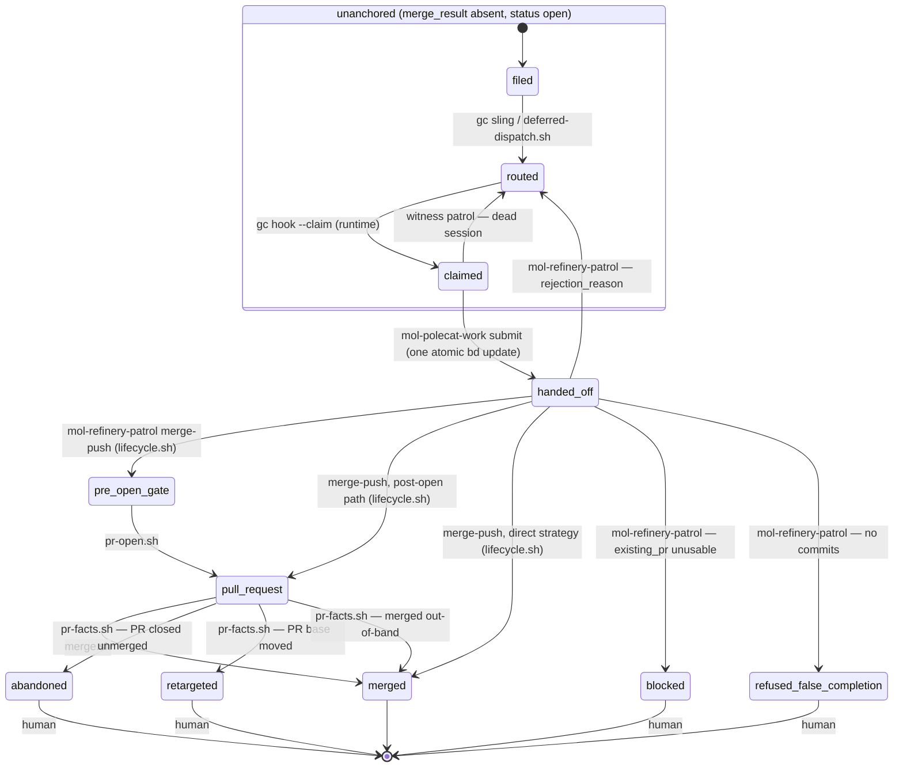
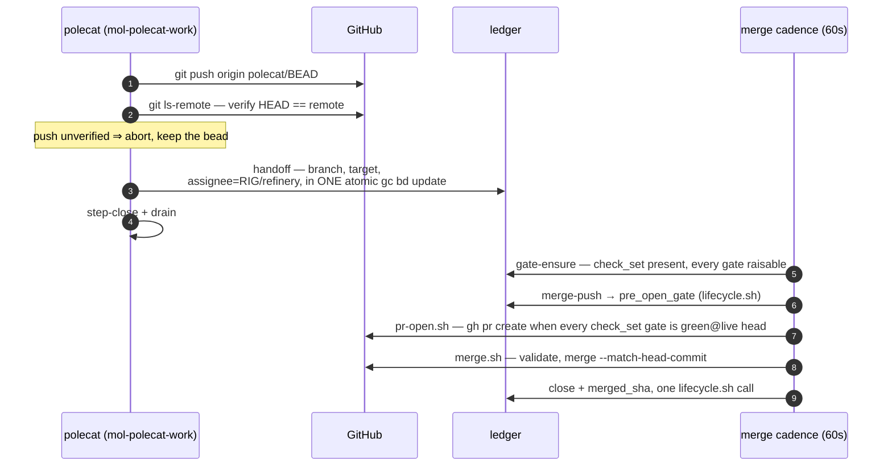

# The anchor state machine

A unit of work has exactly one **anchor** bead. Its state is
`status` × `merge_result`, and the state space is **declared, closed, and
single-writer**: `lifecycle/lifecycle.toml` enumerates every state, every legal
transition, and every pack-written metadata key, and
`assets/scripts/lifecycle.sh` is the only thing that writes a transition —
validate, one atomic `bd update` carrying every field of the transition, read
back. An unknown `merge_result` value is an error: every reader surfaces it via
`escalate.sh`, and `doctor/check-state-space` catches it. A bead closed while
`merge_result` is a non-closed state is repaired by `lifecycle.sh reopen`
(human-invoked; `merge_result` untouched).

## Scope

**Mandate.** The anchor lifecycle: states, transitions, writers, the gate
vocabulary, and the merge condition.

**Boundaries.** The cadence that drives the merge-side writers is
[refinery-merge-cadence.md](refinery-merge-cadence.md). The invariants over
this machine and their doctor checks are
[component-model.md](component-model.md) §3. How completion propagates to a
waiting conversation is [lifecycle-composition.md](lifecycle-composition.md).

## The machine

No transition here is performed by a repair pass. Writers complete their own
transitions in one atomic write; the only reactive edges respond to facts the
pack does not write — GitHub closing or retargeting a PR (`pr-facts.sh`), a
session dying (witness orphan recovery).

`handed_off` is the unanchored bead after the polecat's single handoff write
(branch recorded, assignee = refinery, `merge_result` still absent); the
anchored states are the `merge_result` values. `merged` is the only state with
`status = closed`; the four human-terminal states stay open, routed to human.

`pre_open_gate` and `pull_request` are the declared *detached* states
(`detached_states`). The merge cadence drives them and no queue offers them, so
the anchor rests unheld and unrouted: `lifecycle.sh` clears `gc.routed_to` on
entry to one. The exception is `park_route` (`human`), which `signoff.sh` writes
when the review round cap is spent. No pool claims that value, so a transition
that finds it leaves it in place. Any other route on a detached anchor is pool
demand for work that is already in the merge queue. A worker claims it, the
claim moves the bead out of `--status=open`, and `merge.sh` and `pr-facts.sh`
both enumerate from there. `doctor/check-state-space` reports the violation.

## Transition table

| From → To | Writer | Trigger |
|---|---|---|
| filed → routed | `gc sling` (runtime); `deferred-dispatch.sh` when blockers must close first | dispatch |
| routed → claimed | `gc hook --claim` (runtime) | pool demand spawns a session |
| claimed → routed | witness patrol (`mol-witness-patrol`) | session died with the claim held |
| claimed → handed_off | `mol-polecat-work` submit step (ONE atomic `gc bd update`) | push verified on the remote |
| handed_off → pre_open_gate | `mol-refinery-patrol` merge-push, via `lifecycle.sh` | gates armed, branch accepted |
| handed_off → pull_request | `mol-refinery-patrol` merge-push (post-open path), via `lifecycle.sh` | a usable PR already exists |
| handed_off → merged | `mol-refinery-patrol` merge-push (direct strategy), via `lifecycle.sh` | FF merge pushed and verified on the target; record + close in one call |
| pre_open_gate → pull_request | `pr-open.sh` (cadence arm 2) | every marker-bearing gate in `check_set` is `green@<live head>` |
| pull_request → merged | `merge.sh` (cadence arm 3) | full authorization set validated; close + record in one call |
| pull_request → merged | `pr-facts.sh` (cadence arm 4) | GitHub merged the PR out-of-band; record only |
| pull_request → abandoned | `pr-facts.sh` | PR closed unmerged externally; files a visit |
| pull_request → retargeted | `pr-facts.sh` | PR base moved externally; files a visit |
| handed_off → blocked | `mol-refinery-patrol` | recorded `existing_pr` unusable |
| handed_off → refused_false_completion | `mol-refinery-patrol` | no commits on the handed-off branch |
| handed_off / pull_request → routed | `mol-refinery-patrol` (rejection) | `rejection_reason` written, re-routed to the pool |

A request-changes verdict does NOT transition the anchor: `signoff.sh` clears
the gate marker and files one routed rework child that blocks the anchor — the
anchor stays `pull_request` (or `pre_open_gate`) and the cleared marker holds
the merge until the child lands and the gate re-evaluates.

Convoy graduation is a separate transition on the convoy bead:
`convoy-graduate.sh` (cadence arm 5) moves a convoy to refinery-assigned with
`branch=integration/<id>` when all members are closed, at least one merge is
recorded onto the integration branch, and no hold or branch vetoes.

## Gates

**Vocabulary.** The anchor declares its gates in `check_set`, a comma list of
gate names. Three of those names are not review gates, and every reader of
`check_set` knows them by name. `none` and `off` are sentinels that declare no
gate at all. `none` is the spelling the rest of this pack uses. `approval` is
satisfied by GitHub's own review state. `gate-ensure.sh` and `pr-facts.sh`
skip all three instead of dispatching a review, and `merge.sh` drops them
before it looks for markers.

Every other name is opaque to the machinery: gate-ensure dispatches whatever
it finds there, `signoff.sh` writes `check.<name>`, and `merge.sh` requires
every such name green at the live head. Which names an anchor starts with is
configuration, not doctrine. Two writers put them there and neither reads the
diff: `mol-refinery-patrol` stamps its `check_set` var on every transition
into a gating state, and `gate-ensure.sh --default` normalizes an anchor whose
set is absent or empty, taking its value from `REFINERY_RECONCILE_CHECK_SET`.
The registry records the same value at `lifecycle/lifecycle.toml`
`[gates] check_set_default`. Who may depart from it is
[authority-map.md](authority-map.md).

`codex` is one such review gate, opaque like the rest. Both transitions read
the same declared list: `pr-open.sh` publishes once every marker-bearing gate
in `check_set` is `green@<live head>`, and `merge.sh` merges under the same
condition. `none`/`off` and `approval` are dropped from both — the first is
the gateless-by-choice sentinel, and the second is evidenced by an external
GitHub review, which cannot exist before the PR does and which `merge.sh`
enforces at the merge. An empty `check_set` is not the opt-out at either
transition: it means never normalized, and gate-ensure stamps the default
earlier in the same pass.

Each gate's verdict is a head-bound marker:

| Marker | Meaning | Merge effect |
|---|---|---|
| `check.<g>=green@<oid>` | gate passed at `<oid>` | merges iff `<oid>` is the live head; re-gated once the head moves past it |
| `check.<g>=fixable@<oid>` | addressable problems; a rework child is in flight | holds |
| `check.<g>=exception@<oid>` | round cap spent or unmappable result; routed to human | holds; re-gated once the head moves past `<oid>` |

`approval` takes no marker of its own. `merge.sh` satisfies it from an
external APPROVED review at the live head, never from the city's own account
and never from a `check.approval` marker. `lifecycle/lifecycle.toml` records
that rule. **`signoff.sh` is the single writer of gate verdicts**
(component-model I7). It refuses any oid that is not 40 lowercase hex: the
marker earns its authority from `merge.sh` comparing it to the live head, and
an abbreviated sha compares equal to nothing. A head move stales every verb at
once, so a fixed branch re-evaluates fresh with no manual reset — gate-ensure
re-arms the gate by dispatching a fresh review, whose verdict overwrites the
stale marker.

One shape cannot be re-armed that way. `merge.sh` and gate-ensure both read
only the gates named in `check_set`, so a `check.<g>` outside it is dispatched
against by nothing and overwritten by nothing. When such a marker also fails
the grammar, it is evidence of nothing that nothing could retire, and
gate-ensure clears it. A well-formed one stays as history, and an undeclared
`exception@` is the operator's to retire — the re-gate above reaches only the
gates `check_set` names.

At the head it names, an `exception@` gate is held, not decided. `signoff.sh`'s
approve path stamps `green@<reviewed oid>` and returns before it counts rounds
against the cap, so one further approving review releases the gate at that very
head. No cadence pass will start that review, because gate-ensure and
`pr-facts.sh` both read an exception bound to the live head as settled. The
human the anchor is routed to has three moves: dispatch a review by hand,
change the anchor's `check_set`, or move the head and take the one re-gate the
table above describes.

The review bead carries the `mol-review` formula (attached at dispatch via
`gc sling --on`); the reviewing polecat follows its steps. The dispatch pins
`reviewed_oid=<live head>` on the review bead, and
`signoff.sh` binds its verdict to that pinned commit (an explicit
`--reviewed-oid` outranks it; the live head is only a last-resort fallback) —
so a push between dispatch and verdict stamps green at the *reviewed* commit
and correctly fails the merge's live-head condition instead of green-lighting
an unreviewed head. That is the branch growing. A rebase, amend or squash
takes the pinned commit off the branch instead, and `signoff.sh` refuses both
verdicts and writes nothing: findings about a diff the branch no longer
carries mint a rework child with nothing to implement. The reviewer re-pins at
the live head and reviews that commit.

**Merge condition** (validated by `merge.sh`, every field re-read immediately
before merging): `check_set` is non-empty (empty is never the `none` opt-out —
an unnormalized anchor holds); every gate named in `check_set` is
`green@<live head>`; no
unclosed rework or review child; PR base equals `merged_target`; GitHub reports
CLEAN; no holds (`merge_hold`, `rebase_hold`, `tracking_only`). The merge is
pinned with `--match-head-commit <validated oid>`, so a mid-pass head move
fails closed. One anchor per PR is asserted structurally by
`doctor/check-one-anchor-per-pr`; `merge.sh` still refuses a second anchor on
sight as fail-closed defense.

## The handoff

The one boundary crossing between the work and merge workflows is a single
atomic write. There is nothing to reconstruct afterward: a session that dies
before the write leaves a claimed bead the witness patrol re-routes; one that
dies after it leaves a complete handoff the cadence picks up.

## Rejection and rework loops

- **Rejection** (refinery judgment): the anchor's branch is not accepted —
  `mol-refinery-patrol` writes `rejection_reason` and re-routes the bead to
  the polecat pool. Back to `routed`; the next claimant starts from the
  recorded reason.
- **Rework** (review verdict): `signoff.sh --verdict request-changes` files
  and slings exactly one rework child per head and clears the gate marker, so
  gate-ensure re-arms the dispatch when the child lands. The round cap
  (default 3) is enforced by `signoff.sh` itself: cap spent ⇒
  `check.<g>=exception@<head>` and the anchor routes to human. A round is one
  attempted rework child, counted off the anchor's own children — a review
  dispatch is not a round, however many read the same commit. One writer,
  one terminal verdict: no second component writes a verdict. `pr-facts.sh`
  and `gate-ensure.sh` also clear a marker, each under a condition
  [authority-map.md](authority-map.md) states, but a clear withdraws evidence
  and cannot assert it. gate-ensure bounds nothing per round: a dispatch-side
  refusal there fires the cap early and withholds the very review whose
  verdict settles the gate, so its `dispatch_count` is a separate number. A
  head move past that exception therefore re-arms one dispatch, and a branch
  someone fixed by hand gets a look. It cannot self-feed: the cap arm files no
  rework child, so nothing inside the cadence can move that head again.
- **Dispatch backstop** (`gate-ensure.sh`): `dispatch_count` bounds
  DISPATCHES at `GC_MAX_REVIEW_DISPATCHES` (default 5). It is not the round
  cap and counts a different thing; it exists for the reviews the round cap
  never sees. A review that ends writing no marker and leaving no open rework
  child returns the anchor to exactly the state that triggered the dispatch,
  so the next reconcile pass dispatches again at the same head, without end —
  a polecat standing down without a verdict, a rework child filed with its
  dependency edge reversed and so invisible to the walk, or a death after
  claim. At the ceiling the gate holds, the anchor is stamped
  `dispatch_backstop.<g>=<count>@<head>` with a note, and one visit is filed
  under the `dispatch-runaway` key; a moved head restates the situation and
  files again. Only an operator clears it, by fixing the cause and clearing
  `dispatch_count`.
- **External rework** (`pr-facts.sh`): a CONFLICTING PR gets one rework child
  per head; a gate `green@` or `exception@` at a stale head gets one re-review
  child per head. Idempotent per head — re-runs never duplicate children.
- **Re-gate on head move**: any new commit stales every head-bound marker;
  gate-ensure sees a declared gate that is neither settled at the live head
  (`green@` or `exception@` at that head) nor in flight and dispatches one
  review bead (stamp first, then attach `mol-review` via `gc sling --on`,
  read the pour back). A head a closed request-changes verdict already judged
  is not re-gated while the rework it filed is still open: the same commit
  returns the same findings. This binds the stranded-review repair too —
  re-slinging an inert review buys the same answer a fresh dispatch is
  refused for.

## Disposition

A close that hands the work to a successor must say so from the store the
bead lived in: `assets/scripts/bead-rehome.sh` closes the bead with
`gc.superseded_by` + `gc.superseded_by_store` (and stamps the inverse
`gc.supersedes*` on the successor), so a sound re-home and a careless false
close are distinguishable on read. The read side searches every store before
concluding a close was false. Consumers: the mechanik/converse close paths
(`template-fragments/bead-disposition.template.md`) and any patrol judging a
closed bead.
