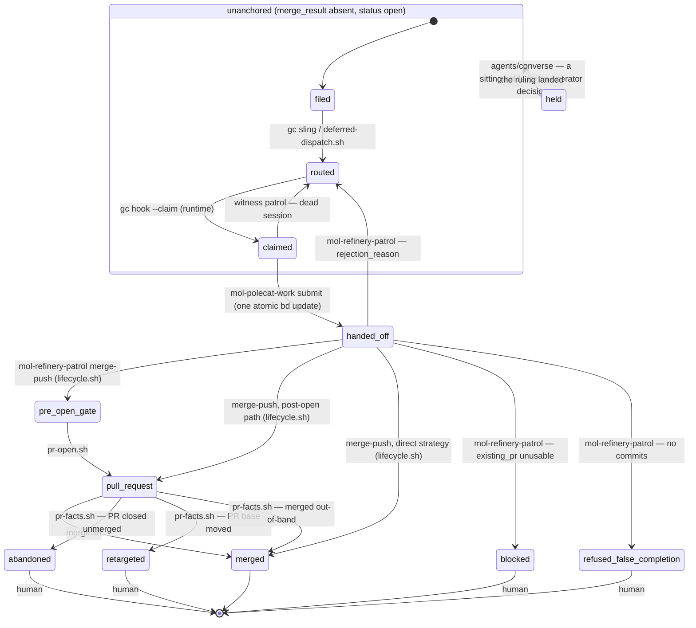
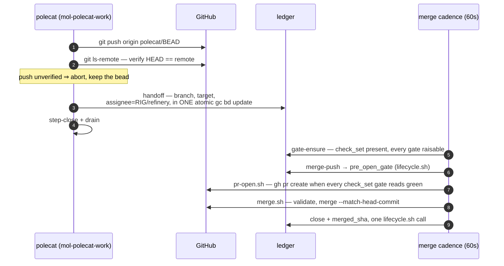

# The anchor state machine

A unit of work has exactly one **anchor** bead. Its state is
`status` × `merge_result`, and the state space is **declared, closed, and
single-writer**: `lifecycle/lifecycle.toml` enumerates every state, every legal
transition, and every pack-written metadata key, and
`assets/scripts/lifecycle.sh` is the only thing that writes a transition —
validate, one atomic `bd update` carrying every field of the transition, read
back. An unknown `merge_result` value is an error: every reader surfaces it via
`escalate.sh`, and `doctor/check-state-space` catches it. A bead closed while
`merge_result` is a non-closed state is repaired by `lifecycle.sh reopen`
(human-invoked; `merge_result` untouched).

## Scope

**Mandate.** The anchor lifecycle: states, transitions, writers, the gate
vocabulary, and the merge condition.

**Boundaries.** The cadence that drives the merge-side writers is
[refinery-merge-cadence.md](refinery-merge-cadence.md). The invariants over
this machine and their doctor checks are
[component-model.md](component-model.md) §3. How completion propagates to a
waiting conversation is [lifecycle-composition.md](lifecycle-composition.md).

## The machine

No transition here is performed by a repair pass. Writers complete their own
transitions in one atomic write; the only reactive edges respond to facts the
pack does not write — GitHub closing or retargeting a PR (`pr-facts.sh`), a
session dying (witness orphan recovery).

`handed_off` is the unanchored bead after the polecat's single handoff write
(branch recorded, assignee = refinery, `merge_result` still absent); the
anchored states are the `merge_result` values. `merged` is the only state with
`status = closed`; the human states stay open, routed to human.

`held` is the one human state a sitting writes rather than the refinery, and it
is entered only from `unanchored`. `merge.sh`, `gate-ensure.sh` and `pr-facts.sh`
each enumerate anchors by their gating state, so moving a live anchor to `held`
to record a conversation would drop it from all three for as long as the hold
lasts. An anchor already carries a state and a reader; an unanchored subject
carried neither, which is what the state exists to fix.

`pre_open_gate` and `pull_request` are the declared *detached* states
(`detached_states`). The merge cadence drives them and no queue offers them, so
the anchor rests unrouted and unheld, and `lifecycle.sh` writes both halves on
entry to one: it clears `gc.routed_to`, and it clears the assignee of a bead
still at `status=open`.

The route exception is `park_route` (`human`), which `signoff.sh` writes when
the review round cap is spent. No pool claims that value, so a transition that
finds it leaves it in place. Any other route on a detached anchor is pool demand
for work that is already in the merge queue. A worker claims it, the claim moves
the bead out of `--status=open`, and `merge.sh` and `pr-facts.sh` both enumerate
from there.

An assignee is the same anchor still sitting in the refinery's own find-work
queue, which is assignee-keyed and flags a `merge_result`-bearing bead it finds
there rather than taking it. There is no park sentinel on this side: no
component holds an anchor by assignee, and the polecat handoff pointer that put
one there is spent the moment the anchor is gated. The clear stops at
`status=open` for two reasons that agree. A live claim is a hold to escalate,
not to overwrite; and bd refuses an assignee edit on a bead another actor holds
`in_progress`, dropping the whole atomic update with it
([gascity-routing-model.md](gascity-routing-model.md) row 46). No cadence pass
reaches such a bead in any case, because every anchor enumeration is
`--status=open`. `doctor/check-state-space` reports either violation.

## Transition table

| From → To | Writer | Trigger |
|---|---|---|
| filed → routed | `gc sling` (runtime); `deferred-dispatch.sh` when blockers must close first | dispatch |
| routed → claimed | `gc hook --claim` (runtime) | pool demand spawns a session |
| claimed → routed | witness patrol (`mol-witness-patrol`) | session died with the claim held |
| claimed → handed_off | `mol-polecat-work` submit step (ONE atomic `gc bd update`) | push verified on the remote |
| handed_off → pre_open_gate | `mol-refinery-patrol` merge-push, via `lifecycle.sh` | gates armed, branch accepted |
| handed_off → pull_request | `mol-refinery-patrol` merge-push (post-open path), via `lifecycle.sh` | a usable PR already exists |
| handed_off → merged | `mol-refinery-patrol` merge-push (direct strategy), via `lifecycle.sh` | FF merge pushed and verified on the target; record + close in one call |
| pre_open_gate → pull_request | `pr-open.sh` (cadence arm 2) | every marker-bearing gate in `check_set` reads `green`, and the diff is not a bead-local planning artifact aimed at the default branch |
| pull_request → merged | `merge.sh` (cadence arm 4) | full authorization set validated; close + record in one call |
| pull_request → merged | `pr-facts.sh` (cadence arm 5) | GitHub merged the PR out-of-band; record only |
| pull_request → abandoned | `pr-facts.sh` | PR closed unmerged externally; files a visit |
| pull_request → retargeted | `pr-facts.sh` | PR base moved externally; files a visit |
| handed_off → blocked | `mol-refinery-patrol` | recorded `existing_pr` unusable |
| handed_off → refused_false_completion | `mol-refinery-patrol` | no commits on the handed-off branch |
| handed_off / pull_request → routed | `mol-refinery-patrol` (rejection) | `rejection_reason` written, re-routed to the pool |
| unanchored → held | `agents/converse` hold, via `lifecycle.sh` | a sitting is waiting on an operator decision; state + route in one write |
| held → unanchored | `agents/converse` sign-off, via `lifecycle.sh`; or human | the ruling landed |

A request-changes verdict does NOT transition the anchor: `signoff.sh` clears
the gate marker and files one routed rework child that blocks the anchor — the
anchor stays `pull_request` (or `pre_open_gate`) and the cleared marker holds
the merge until the child lands and the gate re-evaluates.

Convoy graduation is a separate transition on the convoy bead:
`convoy-graduate.sh` (cadence arm 6) moves a convoy to refinery-assigned with
`branch=integration/<id>` when all members are closed, at least one merge is
recorded onto the integration branch, and no hold or branch vetoes.

## Gates

**Vocabulary.** The anchor declares its gates in `check_set`, a comma list of
gate names. Three of those names are not review gates, and every reader of
`check_set` knows them by name. `none` and `off` are sentinels that declare no
gate at all. `none` is the spelling the rest of this pack uses. `approval` is
satisfied by GitHub's own review state. `gate-ensure.sh` and `pr-facts.sh`
skip all three instead of dispatching a review, and `merge.sh` drops them
before it looks for markers.

Every other name is opaque to the machinery: gate-ensure dispatches whatever
it finds there, `signoff.sh` writes `check.<name>`, and `merge.sh` requires
every such name green at the live head. Which names an anchor starts with is
configuration, not doctrine. Two writers put them there and neither reads the
diff: `mol-refinery-patrol` stamps its `check_set` var on every transition
into a gating state, and `gate-ensure.sh --default` normalizes an anchor whose
set is absent or empty, taking its value from `REFINERY_RECONCILE_CHECK_SET`.
The registry records the same value at `lifecycle/lifecycle.toml`
`[gates] check_set_default`. Who may depart from it is
[authority-map.md](authority-map.md).

`codex` is one such review gate, opaque like the rest. Both transitions read
the same declared list: `pr-open.sh` publishes once every marker-bearing gate
in `check_set` reads `green`, and `merge.sh` merges under the same
condition. `none`/`off` and `approval` are dropped from both — the first is
the gateless-by-choice sentinel, and the second is evidenced by an external
GitHub review, which cannot exist before the PR does and which `merge.sh`
enforces at the merge. An empty `check_set` is not the opt-out at either
transition: it means never normalized, and gate-ensure stamps the default
earlier in the same pass.

A green gate set is necessary, not sufficient. `pr-open.sh` also refuses to
publish a diff that lies entirely under the planning-artifact prefixes
(`specs/` by default, `PR_OPEN_PLANNING_PATHS`) onto the rig's default branch
when no convoy stands above the anchor: the dispatch doctrine's shared input
artifact belongs on an owned convoy's integration branch, and the refusal
carries that remedy plus one deduped visit. `graduation=true`, an anchor of
type `convoy`, and `planning_artifact_ok=true` are exempt, and an unreadable
compare leaves the create to proceed.

Each gate is a **lane**, and its marker carries one bare state word — a state
of the lane, never a claim about a commit:

| Marker | Meaning | Merge effect |
|---|---|---|
| `check.<g>` absent | the lane is `unreviewed` | holds |
| `check.<g>=unreviewed` | this lane owes a full review | holds |
| `check.<g>=reviewing` | a full review is in flight | holds |
| `check.<g>=validating` | a finding set is in hand and a validation pass is in flight | holds |
| `check.<g>=fixing` | must-fix findings from this lane are open and work is out on them | holds |
| `check.<g>=green` | converged | merges |

**Green survives new commits.** A push does not move a lane out of `green`,
does not stale it, and does not buy a review. Nothing in the cadence compares a
marker to a head, and no pass re-gates a branch for having grown a commit.
Only two of these states are written today: `signoff.sh` records `green` on an
approving verdict and clears the marker on request-changes, returning the lane
to `unreviewed`. `reviewing`, `validating` and `fixing` are the states the
validator writes; `fixing` is also what the retired `reconcile-gate-verdicts.sh`
left behind, migrated. The full lane state machine is
[specs/tk-ztapg/review-cycle-architecture.md](../specs/tk-ztapg/review-cycle-architecture.md).

`approval` takes no marker of its own. `merge.sh` satisfies it from an
external APPROVED review at the live head, never from the city's own account
and never from a `check.approval` marker. `lifecycle/lifecycle.toml` records
that rule. What the *reviewer* did short of a verdict is posture, not a gate:
see [Posture](#posture) below. **`signoff.sh` is the single writer of gate
verdicts** (component-model I7). A verdict binds to no commit: the reviewed oid
is recorded on the review bead and named in the posted artifact, and nothing
compares it to a head.

One shape no cadence pass can rewrite. `merge.sh` and gate-ensure both read
only the gates named in `check_set`, so a `check.<g>` outside it is dispatched
against by nothing and overwritten by nothing. When such a marker also carries
a word outside the lane vocabulary, it is a state no reader knows and nothing
could retire, and gate-ensure clears it. A well-formed one stays as history —
a narrowed `check_set` keeps what its lanes recorded.

### The round cap counts from the last operator feedback

`GC_MAX_REVIEW_ROUNDS` (default 3) bounds one thing — the city failing to
converge against its own reviewer — and a round is an attempted rework child,
never a review dispatch. Feedback from a person is not that loop. It is review
the branch has never been answered against, so counting it against the budget
lets an operator's own review exhaust the allowance for reviewing the response
to it.

`pr-facts.sh` records each batch it routes as `signoff_rounds_reset=<highest
review id>.<highest comment id>`, which is one stamp per distinct piece of
feedback: a reconcile pass every two minutes sees the same comments until they
are answered, and a policy resetting on their mere presence would be no cap at
all. What makes a batch operator feedback is the author: the posture derivation
counts only ids written by a login other than the city's own, so `signoff.sh`'s
verdicts (posted under that login), re-reviews, and rework hand-backs (which
post nothing) leave the counter alone.

`signoff.sh` subtracts a floor rather than resetting a counter, since the
rework children stay on the anchor: at the first verdict after a new batch it
writes `signoff_round_floor=<children then>@<batch>`, and counts what follows.
The floor is written, not re-derived, because that verdict files a child of its
own, and a floor recomputed each pass would swallow every new round and the cap
would never trip.

A cap that resets while its own park stands has not reset, so the same write
retires that park: `merge_hold`, `blocked_reason`, the human route, and the
`gc.takeaway` the cap wrote for the board. `signoff.sh` parks the anchor by
stamping `merge_hold=signoff_cap` — the literal string, not `true` — together
with `signoff_cap=<gate>`, and the reset (here and in `signoff.sh reset`) acts
only while that exact pairing still stands: `merge_hold`'s value reads
`signoff_cap` AND `signoff_cap` is non-empty. That is the one predicate every
reader uses — `merge.sh`'s and gate-ensure's `wedged-exception` machine axis
included — so an anchor a person parked by hand (`merge_hold=true`) is never
mistaken for the cap's, and an operator's later `merge_hold=true` is never
lifted by this reset even if an orphan `signoff_cap` still stands beside it: a
hold that does not read exactly `signoff_cap` is theirs and stays. A sitting
still waiting on a person outranks the reset the same way, and what says so is
the demand bead `gc-helm.sh demand` filed (`gc.demand_for=<anchor>`), never
`gc.takeaway`. That field is stamped when a sitting begins and replaced by its
outcome at sign-off, so it dates the last sitting rather than naming a live
wait; read as a hold it parks an anchor from its first conversation onward,
whatever the PR goes on to say. Which takeaway the retire clears follows from
the same fact. `gc.takeaway_by` names the writer, so the cap's own sentence
goes with the park it describes, and a sitting's stays. The dispatch tally
(`dispatch_count` and any `dispatch_backstop.<g>`) goes with the park, since
rounds nobody may dispatch are no release.

That release reaches only an anchor with a PR. One capped before its PR was
opened has no conversation to be commented on, so no batch is ever recorded,
and clearing the exception by hand only lets the next pass recompute the same
rounds and cap again. The cap says which case it is: `blocked_reason` names the
rounds as spent pre-open and names the verb that ends them. That verb is
`signoff.sh reset <anchor> --reason <why>`. It writes the floor itself —
`signoff_round_floor=<children now>@<a minted batch>` with
`signoff_rounds_reset` carrying the same batch, so the next verdict does not
re-derive it — and retires the park in the same call, under the same
`signoff_cap` agreement and live-demand guard the feedback reset uses. It reads
no PR and touches no review bead, records the ruling on the anchor, and
verifies every key it wrote, the retired tally keys included: `gate-ensure.sh`
holds dispatches while `dispatch_count` stands, so an unset that was denied or
lost leaves an anchor nobody may dispatch under a release that reported
success. Because the floor comes from the rework ledger rather than from a batch
someone else recorded, the count is read strictly — a walk that does not parse,
or one naming no round at all, refuses the whole verb before it writes. Reading
such a walk as zero rounds would write a floor of 0 and let the next pass count
the real children from it and cap again, which is the deadlock the verb exists
to end.

The verb is the only way back for an anchor whose batch was already recorded,
too. The feedback reset fires once per batch, and its arm is reached only while
a comment stands unanswered, so a batch that stamped itself and left the park
standing is never re-read: the watermark written in that same pass answers those
comments, and the posture stops being `commented`.

A standing `CHANGES_REQUESTED` from the city's own reviewer resets nothing:
every id in a batch is authored by a login other than the city's, so a codex
veto raises no batch to reset from. A human's does, on the same terms as any
other feedback — it is the strongest signal an operator has, and the one the cap
least deserves to outlive. Such an anchor is held by the reviewer directly as
well as by the cap.

The review bead carries the `mol-review` formula (attached at dispatch via
`gc sling --on`); the reviewing polecat follows its steps. The dispatch pins
`reviewed_oid=<live head>` on the review bead, naming the commit the reviewer
read — it binds no marker, and a push that only adds commits on top (the
branch growing) leaves the pin `on` the branch and is not this check's
business. What the pin still guards against is a rewrite: `signoff.sh` asks
whether `reviewed_oid` is still an ancestor of the live head
(`git merge-base --is-ancestor`, with a GitHub compare consulted first when a
PR is open); a rebase, amend, or force-push that takes the pinned commit off
the branch answers `gone`, and **both verdicts are refused** — findings about
a diff the branch no longer carries would mint a rework child with nothing to
implement. The refusal is not a dead end an operator must clear by hand: it
clears the dead `reviewed_oid` pin itself, then closes the review bead
`gc.outcome=superseded`, so gate-ensure's in-flight probe stops seeing it and
pours a fresh review at the live head on its next pass. No marker is touched
and no round is spent either way.

Whichever source wins, `signoff.sh` writes that commit back to the review bead
as `reviewed_oid` before it stamps anything, on both verdicts and whether or
not the PR is open. The lane state itself names no commit, so that record is
the whole of what a city verdict leaves behind: the city posts no APPROVED
GitHub review, and `doctor/check-gate-marker-provenance` resolves a
city-written marker only against a review bead carrying it. A store that will
not take the record costs a re-run: signoff exits 2 with nothing posted and no
marker stamped.

Pre-open, the verdict body is read back off the same bead on the same terms.
Its notes are the only copy: `pr-open.sh` replays them as the PR's first
comment when it opens one, and a request-changes child names the bead it came
from in `source_review_bead` and has nowhere else to read its findings. So an
append that did not land also costs a re-run, rather than a marker or a rework
child standing on findings nobody can read.

`signoff.sh` closes the review bead itself, last, stamping
`signoff_verdict=<approve|request-changes>` in the same write as the close —
`doctor/check-gate-marker-provenance` reads it to tell an approving review
bead from one that recorded request-changes, now that `(anchor, lane)` alone
carries no oid to key on. A bead that is already closed therefore had its
verdict recorded, was retired unjudged by `review-sweep.sh`, or was closed
`superseded` by the ancestry refusal above, and either verdict against it is
refused on the same terms: nothing written, no round spent.

A legacy `exception@<oid>` marker — the pre-migration cap park — is not lane
vocabulary an approve verdict may read or overwrite: `signoff.sh` refuses to
stamp `green` over one, naming `migrate-lane-states.sh` as the remedy, rather
than silently releasing a park a human is relying on.

**Merge condition** (validated by `merge.sh`, every field re-read immediately
before merging): `check_set` is non-empty (empty is never the `none` opt-out —
an unnormalized anchor holds); every gate named in `check_set` reads `green`; no
unclosed rework or review child; PR base equals `merged_target`; GitHub reports
CLEAN; no holds (`merge_hold`, `rebase_hold`, `tracking_only`). The merge is
pinned with `--match-head-commit <validated oid>`, so a mid-pass head move
fails closed. One anchor per PR is asserted structurally by
`doctor/check-one-anchor-per-pr`; `merge.sh` still refuses a second anchor on
sight as fail-closed defense.

## Posture

Gates record what the machine decided. **Posture** records what the pull request
is doing, head-pinned the same way, written by `pr-facts.sh` on every open
non-draft anchor and read off the bead by everything downstream. Declared in
`lifecycle/lifecycle.toml` `[posture]`.

| Key | Value | Meaning |
|---|---|---|
| `pr_posture` | `<posture>@<oid>@<since>` | the review posture at `<oid>`, and when it was first read there |
| `pr_merge_state` | `<mergeStateStatus>@<oid>` | GitHub's own value, verbatim and uppercase |
| `pr_comment_watermark` | `<id>` | highest routed `pulls/N/comments` id |
| `pr_review_watermark` | `<id>` | highest routed `pulls/N/reviews` id |
| `pr_comment_disposition` | `rework:<id>` / `visit:<id>` | what the last outstanding batch was routed to |

The postures, in the precedence the derivation applies:

| Posture | When | Merge effect |
|---|---|---|
| `changes_requested` | GitHub reports a standing `CHANGES_REQUESTED` | holds (`merge.sh` vetoes on the review itself) |
| `commented` | a review comment sits above its watermark, and no veto stands | holds |
| `approved` | GitHub reports `APPROVED` | none |
| `review_required` | GitHub reports `REVIEW_REQUIRED` | none; the anchor is waiting on a human approval and now says so |
| `none` | no `reviewDecision` applies | none |

A comment outranks an approval on purpose: one reviewer's approval does not
answer another reviewer's question. `merge.sh` holds on a recorded `commented`
whatever head it is pinned to, because a comment survives a head move. An
**absent** posture never holds there, since that is a fact not yet recorded
rather than a fact recorded as bad. What refuses the absence is the cadence:
`pr-facts.sh --posture-only` runs immediately before the merge arm and exits
non-zero when it could not make an anchor's posture current, which holds the
merge arm for that pass. Only the arm that did the reading can tell "no comment"
from "could not read", so the hold lives there rather than in the reader. A
posture recorded a pass earlier could not see a comment that arrived since, and
no consumer asks GitHub to find out, merge.sh's own terminal re-read included. A
read that fails records nothing rather than something weaker, so a standing
`commented` keeps holding through an unreadable pass, and an anchor already held
that way is not one the arm holds the pass over.

**The watermarks** separate a comment already routed from a new one. Each is the
highest id routed in its own id space, and each advances only after the routing
reads back, so a comment nothing answered cannot fall below the mark. For a
rework child that is two stamps: the `prepare_mode` it must resume in, and the
route that makes it claimable. The two spaces are never merged: a reply can land
on an old review, so review ids cannot stand in for comment ids. They rest on
one assumption — that ids rise with visibility.

Both spaces are review spaces: the inline comments on `pulls/N/comments`, and
the bodies of COMMENTED and CHANGES_REQUESTED reviews on `pulls/N/reviews`. An
empty body raises nothing in the review space — the inline comments underneath
it are what the comment space already sees, and counting the review would leave
a posture no comment id can answer. A plain conversation comment on the PR is an
issue comment, carries no review, and raises no posture.

A `changes_requested` posture reads and watermarks the same ids a `commented`
one does. The veto holds the merge; it answers nothing, and the objections
under it are exactly the feedback that most needs routing. A human's
`CHANGES_REQUESTED` body therefore joins the review id space beside a
COMMENTED one, and the inline comments underneath join the comment space. The
city's own veto raises no batch, because both spaces count only ids authored by
some other login — `signoff.sh`'s rework loop owns those, and reaches them
through the review bead rather than through this arm. A review that is later
dismissed leaves both `COMMENTED` and `CHANGES_REQUESTED`, so the same read
that would have counted it drops it. The comment space asks a narrower question
of each inline comment's parent review: whether that review was dismissed. A
dismissal therefore retires the comments it carried along with the body, and an
approving review's inline comments stay in the batch, because an approval
retires nothing it carried. A comment behind no review, or behind one the review
list does not carry, stands on its own and is counted.

**Outstanding feedback routes to something.** It becomes a fix-pool rework
child carrying the review bodies and inline comments verbatim in its
description, or, when a human already holds the anchor (`merge_hold`,
`rebase_hold`, `gc.routed_to=human`, or a live demand bead stamped
`gc.demand_for=<anchor>`) or there is nowhere to route work, one `escalate.sh`
visit per batch. A `gc.takeaway` is not one of those conditions: it records a
sitting rather than naming a live wait, so on its own it forces no visit. Either
way the filed bead holds the merge until it closes — the rework child through a
`blocks` edge, the visit through the `pr_number` stamp that `merge.sh`'s
in-flight-holder probe reads. A visit takes no `blocks` edge: `escalate.sh`
files it *depending on* its subject, so an edge back would be a cycle.
`pr_comment_disposition` records which was chosen. Silence is not one of the
options.

## The machine axis

Gates say whether one review passed. **`pr.machine`** says what the merge cadence
can do with the anchor as a whole on its next pass, so a reader learns whether an
anchor is moving without re-implementing two scripts' predicates. Declared in
`lifecycle/lifecycle.toml` `[machine_axis]`, written by `gate-ensure.sh` and
`merge.sh` through `lifecycle.sh` at the points where each already reaches the
verdict, from `pre_open_gate` onward — most wedged anchors have no PR number yet,
so a key written only for open pull requests would miss the majority of them.

| Value | Meaning |
|---|---|
| `progressing` | some automated actor will act: a pool-routed blocker is open, or a declared lane is short of green |
| `settled` | every declared gate reads `green`; the cadence is done, and the PR waits on approval, on the merge pass, or on nothing |
| `wedged-exception` | `merge_hold` stands with `signoff_cap` beside it: the convergence cap parked the anchor and routed it to a person, and no automated actor will lift it |
| `wedged-veto` | a non-city `CHANGES_REQUESTED` stands with the signoff round cap spent, so nothing will file further rework |

The two wedge shapes are separate values because they are released by different
things, and a reader that has to act on one must not re-derive which it is.

**Dated keys.** `pr.machine` and `pr_posture` carry a third component,
`<value>@<oid>@<since>`, under one write rule that `lifecycle.sh --set-dated`
owns: keep the existing instant while the value and the oid both hold, stamp the
current one when either differs. The reconcile cadence re-derives the same
verdict at the same head every few minutes, so a naive clock would restart a
three-day wait on every pass. The instant lives inside the value rather than in a
key beside it, because a timestamp that can be written when the value is not ends
up dating a state that no longer holds, with nothing in either key saying so.

## The handoff

The one boundary crossing between the work and merge workflows is a single
atomic write. There is nothing to reconstruct afterward: a session that dies
before the write leaves a claimed bead the witness patrol re-routes; one that
dies after it leaves a complete handoff the cadence picks up.

## Rejection and rework loops

- **Rejection** (refinery judgment): the anchor's branch is not accepted —
  `mol-refinery-patrol` writes `rejection_reason` and re-routes the bead to
  the polecat pool. Back to `routed`; the next claimant starts from the
  recorded reason.
- **Rework** (review verdict): `signoff.sh --verdict request-changes` files
  and slings exactly one rework child and clears the gate marker, returning the
  lane to `unreviewed`, so gate-ensure re-arms the dispatch when the child
  lands. The round cap (default 3) is enforced by `signoff.sh` itself: cap
  spent ⇒ the anchor is parked under `merge_hold`, stamped `signoff_cap`, and
  routed to human. A round is one attempted rework child, counted off the
  anchor's own children — a review dispatch is not a round, however many read
  the same commit. One writer, one terminal verdict: no second component writes
  a verdict. `pr-facts.sh` and `gate-ensure.sh` also clear a marker, each under
  a condition [authority-map.md](authority-map.md) states, but a clear
  withdraws evidence and cannot assert it. gate-ensure bounds nothing per
  round: a dispatch-side refusal there fires the cap early and withholds the
  very review whose verdict settles the gate, so its `dispatch_count` is a
  separate number. The park cannot self-feed: the cap arm files no rework
  child, and nothing inside the cadence lifts a `merge_hold`.
- **Dispatch backstop** (`gate-ensure.sh`): `dispatch_count` bounds
  DISPATCHES at `GC_MAX_REVIEW_DISPATCHES` (default 5). It is not the round
  cap and counts a different thing; it exists for the reviews the round cap
  never sees. A review that ends writing no marker and leaving no open rework
  child returns the anchor to exactly the state that triggered the dispatch,
  so the next reconcile pass dispatches again at the same head, without end —
  a polecat standing down without a verdict, a rework child filed with its
  dependency edge reversed and so invisible to the walk, or a death after
  claim. At the ceiling the gate holds, the anchor is stamped
  `dispatch_backstop.<g>=<count>@<head>` with a note, and one visit is filed
  under the `dispatch-runaway` key; a moved head restates the situation and
  files again. Only an operator clears it, by fixing the cause and clearing
  `dispatch_count`.
- **External rework** (`pr-facts.sh`): a CONFLICTING PR gets one rework child
  per head. Idempotent per head — re-runs never duplicate children. A
  hold (`merge_hold`, `rebase_hold`) or a live demand bead
  (`gc.demand_for=<anchor>`) dispatches no rework child at all: bringing the
  branch current is routinely one horn of what such a demand asks, so a child
  filed under one answers the question by performing it. Closing the demand is
  what releases the dispatch.
- **Disposal** (`review-sweep.sh`, cadence arm 7): a review outlives its own
  subject when the anchor closes and the branch is deleted before any verdict
  lands. There is no commit left for a marker to bind to, so the arm closes
  the review with `gc.outcome=moot` and records the reason on it, and writes
  nothing to the anchor. It requires both the closed anchor and the absent
  branch, so an unfetched branch and a still-gating anchor each hold.
- **Duplicate disposal** (`duplicate-sweep.sh`, cadence arm 8): a duplicate
  dispatch a polecat diagnosed and parked has no other way out, since polecats
  never close work beads. The arm closes it through `bead-rehome.sh --kind
  duplicate` only when the named successor resolves and is closed or shipped
  AND the duplicate is proved to have recorded no work, by `work_outcome=no-op`
  or by carrying no work-product key at all. It writes nothing to the
  successor's branch or PR, and holds on anything it cannot establish.
- **No re-gate on head move**: a new commit stales nothing. gate-ensure
  dispatches on the lane — a declared gate that is neither `green` nor in
  flight gets one review bead (stamp first, then attach `mol-review` via `gc
  sling --on`, read the pour back) — and a lane that already reads `green`
  keeps reading it however far the branch advances. Re-review is a judgement
  the validator makes, not a trigger a push pulls. gate-ensure holds dispatch
  rather than pouring a second review while an open rework child is already in
  flight for the lane — a `blocks`-dep bead on the anchor carrying a non-empty
  `source_review_bead` (the review bead the rework answers) — and reads a
  legacy `exception@<oid>` marker as a park — wedged, no dispatch — until
  `migrate-lane-states.sh` rewrites it to `merge_hold=signoff_cap`; its stray-
  marker sweep leaves that shape alone rather than clearing it, for the same
  reason.

## Disposition

A close that is not a landing must say so from the store the bead lived in:
`assets/scripts/bead-rehome.sh` closes the bead with `gc.superseded_by` +
`gc.superseded_by_store` (and stamps the inverse `gc.supersedes*` on the
successor), so a sound disposition and a careless false close are
distinguishable on read. Four kinds — `re-homed`, `folded`, `fixed-upstream`,
`duplicate` — say the work relocated, and the pointer names the bead that
carries it now. The fifth, `not-needed`, says nothing carries it: the bead
was not needed, and the pointer names the evidence that concluded so,
typically the visit bead from the sitting that ruled. The pointer is required
under every kind, because it is the whole of that distinction. The read side
searches every store before concluding a close was false. Consumers: the
mechanik/converse close paths
(`template-fragments/bead-disposition.template.md`), `duplicate-sweep.sh` (the
cadence's reader for `duplicate_of`), and any patrol judging a closed bead.
