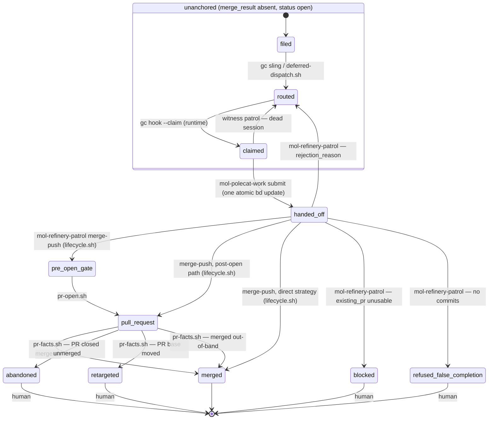
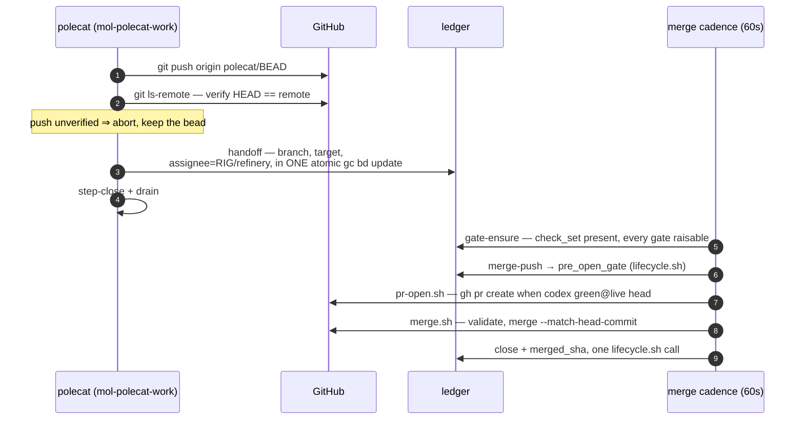

# The anchor state machine

A unit of work has exactly one **anchor** bead. Its state is
`status` × `merge_result`, and the state space is **declared, closed, and
single-writer**: `lifecycle/lifecycle.toml` enumerates every state, every legal
transition, and every pack-written metadata key, and
`assets/scripts/lifecycle.sh` is the only thing that writes a transition —
validate, one atomic `bd update` carrying every field of the transition, read
back. An unknown `merge_result` value is an error: every reader surfaces it via
`escalate.sh`, and `doctor/check-state-space` catches it. A bead closed while
`merge_result` is a non-closed state is repaired by `lifecycle.sh reopen`
(human-invoked; `merge_result` untouched).

## Scope

**Mandate.** The anchor lifecycle: states, transitions, writers, the gate
vocabulary, and the merge condition.

**Boundaries.** The cadence that drives the merge-side writers is
[refinery-merge-cadence.md](refinery-merge-cadence.md). Which gates an anchor
should declare, and who may change that, is
[gate-calibration.md](gate-calibration.md). The invariants over
this machine and their doctor checks are
[component-model.md](component-model.md) §3. How completion propagates to a
waiting conversation is [lifecycle-composition.md](lifecycle-composition.md).

## The machine

No transition here is performed by a repair pass. Writers complete their own
transitions in one atomic write; the only reactive edges respond to facts the
pack does not write — GitHub closing or retargeting a PR (`pr-facts.sh`), a
session dying (witness orphan recovery).

`handed_off` is the unanchored bead after the polecat's single handoff write
(branch recorded, assignee = refinery, `merge_result` still absent); the
anchored states are the `merge_result` values. `merged` is the only state with
`status = closed`; the four human-terminal states stay open, routed to human.

## Transition table

| From → To | Writer | Trigger |
|---|---|---|
| filed → routed | `gc sling` (runtime); `deferred-dispatch.sh` when blockers must close first | dispatch |
| routed → claimed | `gc hook --claim` (runtime) | pool demand spawns a session |
| claimed → routed | witness patrol (`mol-witness-patrol`) | session died with the claim held |
| claimed → handed_off | `mol-polecat-work` submit step (ONE atomic `gc bd update`) | push verified on the remote |
| handed_off → pre_open_gate | `mol-refinery-patrol` merge-push, via `lifecycle.sh` | gates armed, branch accepted |
| handed_off → pull_request | `mol-refinery-patrol` merge-push (post-open path), via `lifecycle.sh` | a usable PR already exists |
| handed_off → merged | `mol-refinery-patrol` merge-push (direct strategy), via `lifecycle.sh` | FF merge pushed and verified on the target; record + close in one call |
| pre_open_gate → pull_request | `pr-open.sh` (cadence arm 2) | `check.codex == green@<live head>` |
| pull_request → merged | `merge.sh` (cadence arm 3) | full authorization set validated; close + record in one call |
| pull_request → merged | `pr-facts.sh` (cadence arm 4) | GitHub merged the PR out-of-band; record only |
| pull_request → abandoned | `pr-facts.sh` | PR closed unmerged externally; files a visit |
| pull_request → retargeted | `pr-facts.sh` | PR base moved externally; files a visit |
| handed_off → blocked | `mol-refinery-patrol` | recorded `existing_pr` unusable |
| handed_off → refused_false_completion | `mol-refinery-patrol` | no commits on the handed-off branch |
| handed_off / pull_request → routed | `mol-refinery-patrol` (rejection) | `rejection_reason` written, re-routed to the pool |

A request-changes verdict does NOT transition the anchor: `signoff.sh` clears
the gate marker and files one routed rework child that blocks the anchor — the
anchor stays `pull_request` (or `pre_open_gate`) and the cleared marker holds
the merge until the child lands and the gate re-evaluates.

Convoy graduation is a separate transition on the convoy bead:
`convoy-graduate.sh` (cadence arm 5) moves a convoy to refinery-assigned with
`branch=integration/<id>` when all members are closed, at least one merge is
recorded onto the integration branch, and no hold or branch vetoes.

## Gates

**Vocabulary.** The anchor declares its gates in `check_set` — a comma list of
gate names, default `codex`; the sentinel `none` is an explicit opt-out. Which
gates an anchor should declare, and who may change them, is
[gate-calibration.md](gate-calibration.md). Each gate's verdict is a
head-bound marker:

| Marker | Meaning | Merge effect |
|---|---|---|
| `check.<g>=green@<oid>` | gate passed at `<oid>` | merges iff `<oid>` is the live head |
| `check.<g>=fixable@<oid>` | addressable problems; a rework child is in flight | holds |
| `check.<g>=exception@<oid>` | round cap spent or unmappable result; routed to human | holds until a human acts |

`approval` is satisfied only by an external APPROVED review — never by the
city's own account. **`signoff.sh` is the single writer of gate verdicts**
(component-model I7); the merge cadence's gate-ensure arm only clears and
re-arms markers staled by a head move. A head move stales `green` and
`fixable` at once, so a fixed branch re-evaluates fresh with no manual reset.
`exception` does not stale: gate-ensure skips it at any head, so a new commit
does not re-arm the gate and the anchor waits for its human.

The review bead carries the `mol-review` formula (attached at dispatch via
`gc sling --on`); the reviewing polecat follows its steps. The dispatch pins
`reviewed_oid=<live head>` on the review bead, and
`signoff.sh` binds its verdict to that pinned commit (an explicit
`--reviewed-oid` outranks it; the live head is only a last-resort fallback) —
so a push between dispatch and verdict stamps green at the *reviewed* commit
and correctly fails the merge's live-head condition instead of green-lighting
an unreviewed head.

**Merge condition** (validated by `merge.sh`, every field re-read immediately
before merging): `check_set` is non-empty (empty is never the `none` opt-out —
an unnormalized anchor holds); every gate named in `check_set` is
`green@<live head>`; no
unclosed rework or review child; PR base equals `merged_target`; GitHub reports
CLEAN; no holds (`merge_hold`, `rebase_hold`, `tracking_only`). The merge is
pinned with `--match-head-commit <validated oid>`, so a mid-pass head move
fails closed. One anchor per PR is asserted structurally by
`doctor/check-one-anchor-per-pr`; `merge.sh` still refuses a second anchor on
sight as fail-closed defense.

## The handoff

The one boundary crossing between the work and merge workflows is a single
atomic write. There is nothing to reconstruct afterward: a session that dies
before the write leaves a claimed bead the witness patrol re-routes; one that
dies after it leaves a complete handoff the cadence picks up.

## Rejection and rework loops

- **Rejection** (refinery judgment): the anchor's branch is not accepted —
  `mol-refinery-patrol` writes `rejection_reason` and re-routes the bead to
  the polecat pool. Back to `routed`; the next claimant starts from the
  recorded reason.
- **Rework** (review verdict): `signoff.sh --verdict request-changes` files
  and slings exactly one rework child per head and clears the gate marker, so
  gate-ensure re-arms the dispatch when the child lands. The round cap
  (default 3) is enforced at both ends: `signoff.sh` at verdict time, where
  cap spent ⇒ `check.<g>=exception@<head>` and the anchor routes to human;
  and gate-ensure before dispatch, where a spent `dispatch_count` simply
  declines the next round and the merge stays held. Only the verdict path
  writes a marker — one writer, one terminal verdict, and no second
  component may touch `check.*`.
- **External rework** (`pr-facts.sh`): a CONFLICTING PR gets one rework child
  per head; a gate green at a stale head gets one re-review child per head.
  Idempotent per head — re-runs never duplicate children.
- **Re-gate on head move**: any new commit stales every head-bound marker;
  gate-ensure sees a declared gate that is neither green at the live head nor
  in flight and dispatches one review bead (stamp first, then attach
  `mol-review` via `gc sling --on`, read the pour back).

## Disposition

A close that hands the work to a successor must say so from the store the
bead lived in: `assets/scripts/bead-rehome.sh` closes the bead with
`gc.superseded_by` + `gc.superseded_by_store` (and stamps the inverse
`gc.supersedes*` on the successor), so a sound re-home and a careless false
close are distinguishable on read. The read side searches every store before
concluding a close was false. Consumers: the mechanik/converse close paths
(`template-fragments/bead-disposition.template.md`) and any patrol judging a
closed bead.
