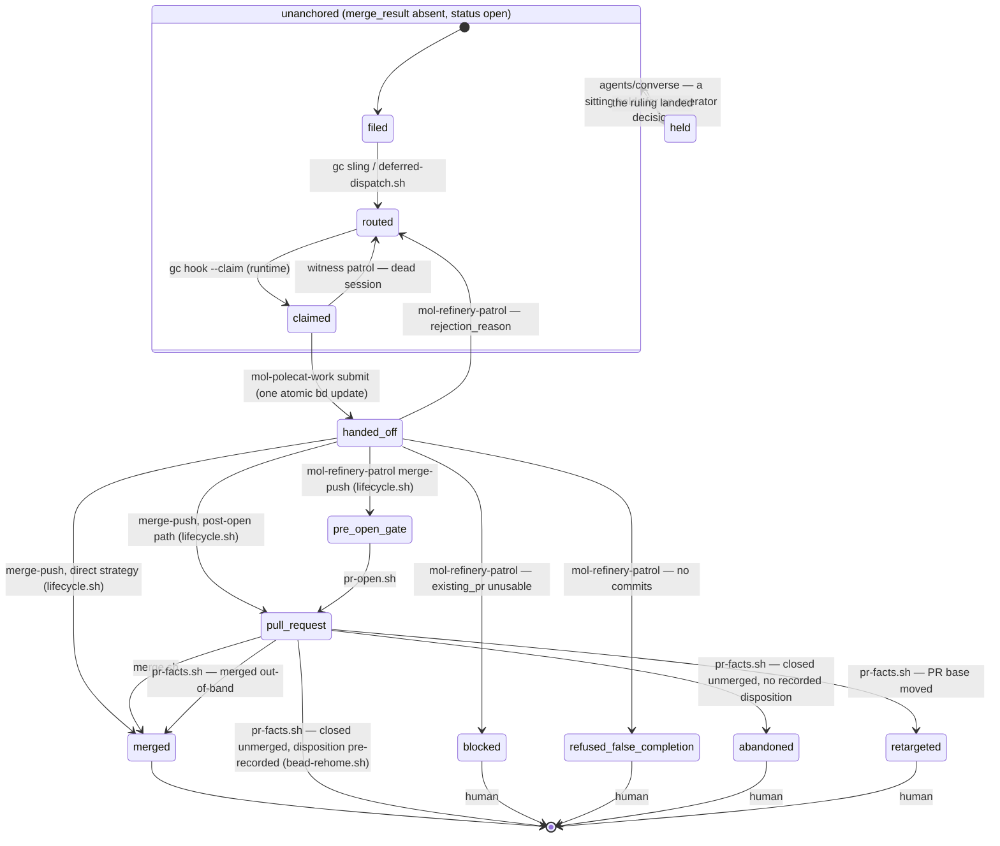
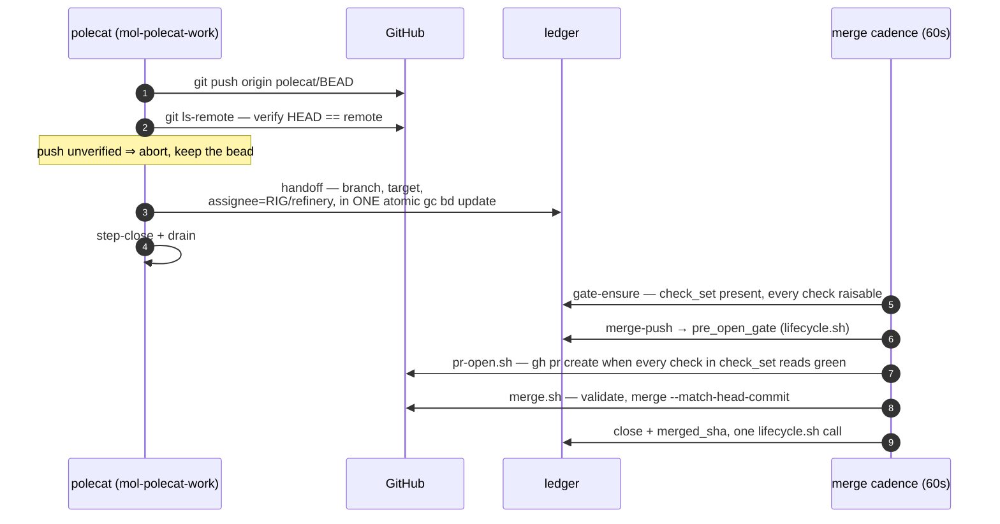

# The anchor state machine

A unit of work has exactly one **anchor** bead. Its state is
`status` × `merge_result`, and the state space is **declared, closed, and
single-writer**: `lifecycle/lifecycle.toml` enumerates every state, every legal
transition, and every pack-written metadata key, and
`assets/scripts/lifecycle.sh` is the only thing that writes a transition —
validate, one atomic `bd update` carrying every field of the transition, read
back. An unknown `merge_result` value is an error: every reader surfaces it via
`escalate.sh`, and `doctor/check-state-space` catches it. A bead closed while
`merge_result` is a non-closed state is repaired by `lifecycle.sh reopen`
(human-invoked; `merge_result` untouched).

`lifecycle.sh` remains the command every caller invokes, and the transition
semantics below are unchanged, but the implementation behind it is being ported
to `gctk lifecycle` (`services/gctk`): the script `exec`s the compiled binary
when a build order has published one, and runs its own shell otherwise. The two
carry separate mirrors of the table declared here, and
`assets/scripts/lifecycle.test.sh` holds both against `lifecycle/lifecycle.toml`
and runs its whole assertion body against each. The shell mirror goes when the
fallback does.

## Scope

**Mandate.** The anchor lifecycle: states, transitions, writers, the check
vocabulary, and the merge condition.

**Boundaries.** The cadence that drives the merge-side writers is
[refinery-merge-cadence.md](refinery-merge-cadence.md). The invariants over
this machine and their doctor checks are
[component-model.md](component-model.md) §3. How completion propagates to a
waiting conversation is [lifecycle-composition.md](lifecycle-composition.md).

## The machine

No transition here is performed by a repair pass. Writers complete their own
transitions in one atomic write; the only reactive edges respond to facts the
pack does not write — GitHub closing or retargeting a PR (`pr-facts.sh`), a
session dying (witness orphan recovery).


```mermaid
stateDiagram-v2
  direction TB

  state "unanchored (merge_result absent, status open)" as UN {
    [*] --> filed
    filed --> routed: gc sling / deferred-dispatch.sh
    routed --> claimed: gc hook --claim (runtime)
    claimed --> routed: witness patrol — dead session
  }

  claimed --> handed_off: mol-polecat-work submit (one atomic bd update)
  handed_off --> pre_open_gate: mol-refinery-patrol merge-push (lifecycle.sh)
  handed_off --> pull_request: merge-push, post-open path (lifecycle.sh)
  handed_off --> merged: merge-push, direct strategy (lifecycle.sh)
  pre_open_gate --> pull_request: pr-open.sh
  pull_request --> merged: merge.sh
  merged --> [*]

  handed_off --> routed: mol-refinery-patrol — rejection_reason

  handed_off --> blocked: mol-refinery-patrol — existing_pr unusable
  handed_off --> refused_false_completion: mol-refinery-patrol — no commits
  pull_request --> abandoned: pr-facts.sh — closed unmerged, no recorded disposition
  pull_request --> [*]: pr-facts.sh — closed unmerged, disposition pre-recorded (bead-rehome.sh)
  pull_request --> retargeted: pr-facts.sh — PR base moved
  pull_request --> merged: pr-facts.sh — merged out-of-band

  blocked --> [*]: human
  refused_false_completion --> [*]: human
  abandoned --> [*]: human
  retargeted --> [*]: human

  UN --> held: agents/converse — a sitting holds for an operator decision
  held --> UN: the ruling landed
```

`handed_off` is the unanchored bead after the polecat's single handoff write
(branch recorded, assignee = refinery, `merge_result` still absent); the
anchored states are the `merge_result` values. `merged` is the only state with
`status = closed`; the human states stay open, routed to human.

`held` is the one human state a sitting writes rather than the refinery, and it
is entered only from `unanchored`. `merge.sh`, `gate-ensure.sh` and `pr-facts.sh`
each enumerate anchors by their gating state, so moving a live anchor to `held`
to record a conversation would drop it from all three for as long as the hold
lasts. An anchor already carries a state and a reader; an unanchored subject
carried neither, which is what the state exists to fix.

`pre_open_gate` and `pull_request` are the declared *detached* states
(`detached_states`). The merge cadence drives them and no queue offers them, so
the anchor rests unrouted and unheld, and `lifecycle.sh` writes both halves on
entry to one: it clears `gc.routed_to`, and it clears the assignee of a bead
still at `status=open`.

The route exception is `park_route` (`human`), the sentinel a visit or an
operator hold leaves for a person. No pool claims that value, so a transition
that finds it leaves it in place. Any other route on a detached anchor is pool demand
for work that is already in the merge queue. A worker claims it, the claim moves
the bead out of `--status=open`, and `merge.sh` and `pr-facts.sh` both enumerate
from there.

An assignee is the same anchor still sitting in the refinery's own find-work
queue, which is assignee-keyed and flags a `merge_result`-bearing bead it finds
there rather than taking it. There is no park sentinel on this side: no
component holds an anchor by assignee, and the polecat handoff pointer that put
one there is spent the moment the anchor is gated. The clear stops at
`status=open` for two reasons that agree. A live claim is a hold to escalate,
not to overwrite; and bd refuses an assignee edit on a bead another actor holds
`in_progress`, dropping the whole atomic update with it
([gascity-routing-model.md](gascity-routing-model.md) row 46).

A detached anchor that is nonetheless claimed or held into a non-open status —
by a route stamped on it out of band, or a direct claim — is the residual this
leaves open. Every anchor enumeration is `--status=open`, so it drops out of
`pr-open`, `merge`, `pr-facts` and `gate-ensure` at once and stalls unseen until
the claim resolves. `doctor/check-state-space` also reads the non-open live
statuses, so it reports all three violations: a detached anchor carrying a
route, one carrying an assignee, and one that has left `status=open`.

## Transition table

| From → To | Writer | Trigger |
|---|---|---|
| filed → routed | `gc sling` (runtime); `deferred-dispatch.sh` when blockers must close first | dispatch |
| routed → claimed | `gc hook --claim` (runtime) | pool demand spawns a session |
| claimed → routed | witness patrol (`mol-witness-patrol`) | session died with the claim held |
| claimed → handed_off | `mol-polecat-work` submit step (ONE atomic `gc bd update`) | push verified on the remote |
| handed_off → pre_open_gate | `mol-refinery-patrol` merge-push, via `lifecycle.sh` | checks armed, branch accepted |
| handed_off → pull_request | `mol-refinery-patrol` merge-push (post-open path), via `lifecycle.sh` | a usable PR already exists |
| handed_off → merged | `mol-refinery-patrol` merge-push (direct strategy), via `lifecycle.sh` | FF merge pushed and verified on the target; record + close in one call |
| pre_open_gate → pull_request | `pr-open.sh` (cadence arm 3) | every `pre-open` check in `check_set` reads `green`; the PR opens as a draft when `check_set` names an `open-as-draft` check, else ready |
| pull_request draft → ready | `pr-open.sh` (cadence arm 3, draft-to-ready) | every `pre-open` and `open-as-draft` check reads `green`; `gh pr ready` surfaces it. GitHub `isDraft` flips; `merge_result` stays `pull_request` |
| pull_request → merged | `merge.sh` (cadence arm 2) | full authorization set validated (incl. the universal approval rule; a draft PR is skipped); close + record in one call |
| pull_request → merged | `pr-facts.sh` (cadence arm 7) | GitHub merged the PR out-of-band; record only |
| pull_request → abandoned | `pr-facts.sh` | PR closed unmerged externally with no recorded disposition; files a rework-or-close visit |
| pull_request → closed (disposed) | `pr-facts.sh` → `bead-rehome.sh` | PR closed unmerged carrying a pre-recorded disposition (`pr-dispose.sh`); auto-disposed through the sanctioned terminal close, no visit |
| pull_request → retargeted | `pr-facts.sh` | PR base moved externally; files a visit |
| handed_off → blocked | `mol-refinery-patrol` | recorded `existing_pr` unusable |
| handed_off → refused_false_completion | `mol-refinery-patrol` | no commits on the handed-off branch |
| handed_off / pull_request → routed | `mol-refinery-patrol` (rejection) | `rejection_reason` written, re-routed to the pool |
| unanchored → held | `agents/converse` hold, via `lifecycle.sh` | a sitting is waiting on an operator decision; state + route in one write |
| held → unanchored | `agents/converse` sign-off, via `lifecycle.sh`; or human | the ruling landed |

A request-changes verdict does NOT transition the anchor: `signoff.sh` clears
the check marker and files one routed rework child that blocks the anchor — the
anchor stays `pull_request` (or `pre_open_gate`) and the cleared marker holds
the merge until the child lands and the check re-evaluates.

Convoy graduation is a separate transition on the convoy bead:
`convoy-graduate.sh` (cadence arm 8) moves a convoy to refinery-assigned with
`branch=integration/<id>` when all members are closed, at least one merge is
recorded onto the integration branch, and no hold or branch vetoes.

## Checks

**Vocabulary.** The anchor declares its checks in `check_set`, a comma list of
check names. `none` and `off` are sentinels that declare no check at all (`none`
is the spelling the rest of this pack uses). `approval` is a third name a
check_set may carry, but it is a universal merge rule, not a check (below). The
one resolver, `review-checks.sh --resolve --check-set <cs> --through <phase>`,
drops all three and returns the checks whose phase gates `<phase>`, so no reader
re-derives that drop: `gate-ensure.sh`, `pr-open.sh`, `merge.sh`, `pr-facts.sh`,
`review-outcome.sh` and `liveness-sweep.sh` all ask it rather than tokenizing
`check_set` themselves.

Every other name is opaque to the machinery: gate-ensure dispatches whatever
it finds there, `signoff.sh` writes `check.<name>`, and `merge.sh` requires
every such name green at the live head. Which names an anchor starts with is
configuration, not doctrine. Two writers put them there and neither reads the
diff: `mol-refinery-patrol` stamps its `check_set` var on every transition
into a gating state, and `gate-ensure.sh --default` normalizes an anchor whose
set is absent or empty, taking its value from `REFINERY_RECONCILE_CHECK_SET`.
The registry records the same value at `lifecycle/lifecycle.toml`
`[gates] check_set_default`. Who may depart from it is
[authority-map.md](authority-map.md).

`correctness` is one such review check, opaque like the rest, and it declares a
**phase** in the index: the stage transition by which it must read green. The
four phases are ordered `pre-open < open-as-draft < ready-for-review < merge`,
each fixed by what the check consumes — a check that reads only the diff is
`pre-open`, one that needs the deployed preview is `open-as-draft`. The stage
transitions gate on the checks their phase reaches, not one shared list:
`pr-open.sh` publishes once every `pre-open` check reads green; the
draft-to-ready flip waits on the `open-as-draft` checks too; and `merge.sh`
merges once every check, of every phase, reads green. An empty `check_set` is
not the opt-out at any transition: it means never normalized, and gate-ensure
stamps the default earlier in the same pass. A `check_set` whose checks are all
`pre-open` (gc-toolkit today) opens its PR ready at once — the draft stage
appears only when a check names a later phase. A name the index does not
declare takes `pre-open`, and so does every name in a repo that keeps no index,
so it gates every transition. A declared phase outside the four is an index
error: every transition whose check_set names that check holds until the index
is fixed.

Each check is a **lane**, and its marker carries one bare state word — a state
of the lane, never a claim about a commit:

| Marker | Meaning | Merge effect |
|---|---|---|
| `check.<g>` absent | the lane is `unreviewed` | holds |
| `check.<g>=unreviewed` | this lane owes a full review | holds |
| `check.<g>=reviewing` | a full review is in flight | holds |
| `check.<g>=validating` | a finding set is in hand and a validation pass is in flight | holds |
| `check.<g>=fixing` | must-fix findings from this lane are open and work is out on them | holds |
| `check.<g>=green` | converged | merges |

**Green survives new commits.** A push does not move a lane out of `green`,
does not stale it, and does not buy a review. Nothing in the cadence compares a
marker to a head, and no pass re-gates a branch for having grown a commit.
Only two of these states are written today: `signoff.sh` records `green` on an
approving verdict and clears the marker on request-changes, returning the lane
to `unreviewed`. `reviewing`, `validating` and `fixing` are the states the
validator writes; `fixing` is also what the retired `reconcile-gate-verdicts.sh`
left behind, migrated. The full lane state machine is
[specs/tk-ztapg/review-cycle-architecture.md](../specs/tk-ztapg/review-cycle-architecture.md).

`approval` takes no marker of its own and is not a check: it is a **universal
merge rule**. `merge.sh` requires every PR to carry a latest APPROVED review at
the live head by an account other than the city's, with a standing
CHANGES_REQUESTED from any other account a veto — no `check.approval` marker and
no `check_set` token arms it or opts out, and GitHub branch protection is an
extra layer, not the authority. `lifecycle/lifecycle.toml` records the rule.
What the *reviewer* did short of a verdict is posture, not a check:
see [Posture](#posture) below. **`signoff.sh` is the single writer of check
verdicts** (component-model I7). A verdict binds to no commit: the reviewed oid
is recorded on the review bead and named in the posted artifact, and nothing
compares it to a head.

One shape no cadence pass can rewrite. `merge.sh` and gate-ensure both read
only the checks named in `check_set`, so a `check.<g>` outside it is dispatched
against by nothing and overwritten by nothing. When such a marker also carries
a word outside the lane vocabulary, it is a state no reader knows and nothing
could retire, and gate-ensure clears it. A well-formed one stays as history —
a narrowed `check_set` keeps what its lanes recorded.

### Operator feedback

Feedback from a person is review the branch has never been answered against.
`pr-facts.sh` enters it into the finding/validation graph by opening a
validation pass on the batch (see "Review cycle",
`specs/tk-ztapg/review-cycle-architecture.md`): `gate-ensure.sh`'s quiescence
holds a fresh whole-diff review off the anchor while the validator rules the
batch. What makes a batch operator feedback is the author — the posture
derivation counts only ids written by a login other than the city's own, so
`signoff.sh`'s verdicts (posted under that login), re-reviews, and rework
hand-backs (which post nothing) are not it.

`pr-facts.sh` records each batch once: it opens the validation pass, routes the
batch, and advances the watermark, which stops the batch being re-read once its
comments are answered and the posture stops being `commented`.

A standing `CHANGES_REQUESTED` from the city's own reviewer raises no batch:
every id in a batch is authored by a login other than the city's, so a codex
veto is not operator feedback. A human's is, on the same terms as any other
feedback — it routes to a rework child or a visit and opens a validation pass.

The validator rules each finding in that batch, and every ruling ends the
finding closed or converts it to a visit: a `must-fix` holds the merge until its
fix lands, a `deferred` files a claimable follow-up and closes, a `declined`
closes with an answer posted to the raiser, and a `needs-you` — a comment only
the operator can judge — files a visit and stays open. A human
`CHANGES_REQUESTED` is auto-dismissed once every finding it raised has closed,
so a `needs-you` finding holds that review open until the operator rules its
visit while the others let it clear. The review the operator reads on the PR
therefore always matches what is still owed.

The review bead carries the `mol-review` formula (attached at dispatch via
`gc sling --on`); the reviewing polecat follows its steps. The dispatch pins
`reviewed_oid=<live head>` on the review bead, naming the commit the reviewer
read — it binds no marker, and a push that only adds commits on top (the
branch growing) leaves the pin `on` the branch and is not this check's
business. What the pin still guards against is a rewrite: `signoff.sh` asks
whether `reviewed_oid` is still an ancestor of the live head
(`git merge-base --is-ancestor`, with a GitHub compare consulted first when a
PR is open); a rebase, amend, or force-push that takes the pinned commit off
the branch answers `gone`, and **both verdicts are refused** — findings about
a diff the branch no longer carries would mint a rework child with nothing to
implement. The refusal is not a dead end an operator must clear by hand: it
clears the dead `reviewed_oid` pin itself, then closes the review bead
`gc.outcome=superseded`, so gate-ensure's in-flight probe stops seeing it and
pours a fresh review at the live head on its next pass. No marker is touched
and no round is spent either way.

Whichever source wins, `signoff.sh` writes that commit back to the review bead
as `reviewed_oid` before it stamps anything, on both verdicts and whether or
not the PR is open. The lane state itself names no commit, so that record is
the whole of what a city verdict leaves behind: the city posts no APPROVED
GitHub review, and `lane-state.sh` derives a lane's green only against a
review bead carrying it. A store that will
not take the record costs a re-run: signoff exits 2 with nothing posted and no
marker stamped.

Pre-open, the verdict body is read back off the same bead on the same terms.
Its notes are the only copy: `pr-open.sh` replays them as the PR's first
comment when it opens one, and a request-changes child names the bead it came
from in `source_review_bead` and has nowhere else to read its findings. So an
append that did not land also costs a re-run, rather than a marker or a rework
child standing on findings nobody can read.

`signoff.sh` closes the review bead itself, last, stamping
`signoff_verdict=<approve|request-changes>` in the same write as the close —
`doctor/check-gate-marker-provenance` reads it to tell an approving review
bead from one that recorded request-changes, now that `(anchor, lane)` alone
carries no oid to key on. A bead that is already closed therefore had its
verdict recorded, was retired unjudged by `review-sweep.sh`, or was closed
`superseded` by the ancestry refusal above, and either verdict against it is
refused on the same terms: nothing written, no round spent.

A legacy `exception@<oid>` marker — the pre-migration cap park — is not lane
vocabulary an approve verdict may read or overwrite: `signoff.sh` refuses to
stamp `green` over one, naming `migrate-lane-states.sh` as the remedy, rather
than silently releasing a park a human is relying on.

**Merge condition** (validated by `merge.sh`, every field re-read immediately
before merging): `check_set` is non-empty (empty is never the `none` opt-out —
an unnormalized anchor holds); every check named in `check_set` reads `green`; a
latest APPROVED review at the live head from a non-city account, with no standing
CHANGES_REQUESTED (the universal approval rule); no unclosed rework or review
child; PR base equals `merged_target`; GitHub reports CLEAN; no holds
(`merge_hold`, `rebase_hold`, `tracking_only`). The merge is
pinned with `--match-head-commit <validated oid>`, so a mid-pass head move
fails closed. One anchor per PR is asserted structurally by
`doctor/check-one-anchor-per-pr`; `merge.sh` still refuses a second anchor on
sight as fail-closed defense.

## Posture

Checks record what the machine decided. **Posture** records what the pull request
is doing, head-pinned the same way, written by `pr-facts.sh` on every open
non-draft anchor and read off the bead by everything downstream. Declared in
`lifecycle/lifecycle.toml` `[posture]`.

| Key | Value | Meaning |
|---|---|---|
| `pr_posture` | `<posture>@<oid>@<since>` | the review posture at `<oid>`, and when it was first read there |
| `pr_merge_state` | `<mergeStateStatus>@<oid>` | GitHub's own value, verbatim and uppercase |
| `pr_comment_watermark` | `<id>` | highest routed `pulls/N/comments` id |
| `pr_review_watermark` | `<id>` | highest routed `pulls/N/reviews` id |
| `pr_comment_disposition` | `rework:<id>` / `visit:<id>` | what the last outstanding batch was routed to |

The postures, in the precedence the derivation applies:

| Posture | When | Merge effect |
|---|---|---|
| `changes_requested` | GitHub reports a standing `CHANGES_REQUESTED` | holds (`merge.sh` vetoes on the review itself) |
| `commented` | a review comment sits above its watermark, and no veto stands | holds |
| `approved` | GitHub reports `APPROVED` | none |
| `review_required` | GitHub reports `REVIEW_REQUIRED` | none; the anchor is waiting on a human approval and now says so |
| `none` | no `reviewDecision` applies | none |

A comment outranks an approval on purpose: one reviewer's approval does not
answer another reviewer's question. `merge.sh` holds on a recorded `commented`
whatever head it is pinned to, because a comment survives a head move. An
**absent** posture never holds there, since that is a fact not yet recorded
rather than a fact recorded as bad. What refuses the absence is the cadence:
`pr-facts.sh --posture-only` runs immediately before the merge arm and exits
non-zero when it could not make an anchor's posture current, which holds the
merge arm for that pass. Only the arm that did the reading can tell "no comment"
from "could not read", so the hold lives there rather than in the reader. A
posture recorded a pass earlier could not see a comment that arrived since, and
no consumer asks GitHub to find out, merge.sh's own terminal re-read included. A
read that fails records nothing rather than something weaker, so a standing
`commented` keeps holding through an unreadable pass, and an anchor already held
that way is not one the arm holds the pass over.

**The watermarks** separate a comment already routed from a new one. Each is the
highest id routed in its own id space, and each advances only after the routing
reads back, so a comment nothing answered cannot fall below the mark. For a
rework child that is three stamps: the `prepare_mode` it must resume in, the
`task_kind` and `anchor_bead` role marker that tells the child from its anchor,
and the route that makes it claimable. The two spaces are never merged: a reply
can land on an old review, so review ids cannot stand in for comment ids. They
rest on one assumption — that ids rise with visibility.

Both spaces are review spaces: the inline comments on `pulls/N/comments`, and
the bodies of COMMENTED and CHANGES_REQUESTED reviews on `pulls/N/reviews`. An
empty body raises nothing in the review space — the inline comments underneath
it are what the comment space already sees, and counting the review would leave
a posture no comment id can answer. A plain conversation comment on the PR is an
issue comment, carries no review, and raises no posture.

A `changes_requested` posture reads and watermarks the same ids a `commented`
one does. The veto holds the merge; it answers nothing, and the objections
under it are exactly the feedback that most needs routing. A human's
`CHANGES_REQUESTED` body therefore joins the review id space beside a
COMMENTED one, and the inline comments underneath join the comment space. The
city's own veto raises no batch, because both spaces count only ids authored by
some other login — `signoff.sh`'s rework loop owns those, and reaches them
through the review bead rather than through this arm. A review that is later
dismissed leaves both `COMMENTED` and `CHANGES_REQUESTED`, so the same read
that would have counted it drops it. The comment space asks a narrower question
of each inline comment's parent review: whether that review was dismissed. A
dismissal therefore retires the comments it carried along with the body, and an
approving review's inline comments stay in the batch, because an approval
retires nothing it carried. A comment behind no review, or behind one the review
list does not carry, stands on its own and is counted.

**Outstanding feedback routes to something.** It becomes a fix-pool rework
child carrying the review bodies and inline comments verbatim in its
description, or, when a human already holds the anchor (`merge_hold`,
`rebase_hold`, `gc.routed_to=human`, or a live demand bead stamped
`gc.demand_for=<anchor>`) or there is nowhere to route work, one `escalate.sh`
visit per batch. A `gc.takeaway` is not one of those conditions: it records a
sitting rather than naming a live wait, so on its own it forces no visit. Either
way the filed bead holds the merge until it closes — the rework child through a
`blocks` edge, the visit through the `pr_number` stamp that `merge.sh`'s
in-flight-holder probe reads. A visit takes no `blocks` edge: `escalate.sh`
files it *depending on* its subject, so an edge back would be a cycle.
`pr_comment_disposition` records which was chosen. Silence is not one of the
options.

## The status label (GitHub projection)

Posture is recorded on the bead. Its projection onto GitHub's pull request list is
a workflow-owned label from a mutually-exclusive `status:` group, so a person
scanning the list sees who must act on each PR next without opening it. The group
is extensible: one value is set at a time, and setting one removes any other
`status:` value.

| Label | Who acts next | When |
|---|---|---|
| `status: working` | the city | an open rework child stands on the anchor, or an approved PR is merging |
| `status: needs-review` | a human reviews the head | settled at the head, no open rework: opened check-green, reworked and handed back, or a non-blocking review left comments |
| `status: needs-attention` | a human weighs in | a hold stands — the signoff cap (`merge_hold=signoff_cap`), an operator freeze, or a topic held for discussion — or an approved PR is wedged with no rework in flight |

Precedence when inputs overlap: `needs-attention` > `working` > `needs-review`.

`needs-review` asks a human only for a review verdict on a settled head;
`needs-attention` means the head cannot settle until a human acts — to unstick a
block or to resolve what a hold stands for.

The label reads the city's own state — the refinery-computed posture and merge
state on the anchor, its holds, and its rework children — not GitHub's review
posture directly and not a lane marker. The `working`->`needs-review` flip rests on
the rework child, which is scoped to the reviewed commit and closes when the fix
lands, so a sticky `CHANGES_REQUESTED` never traps the label in `working` after a
rework hands back, and a `check.<g>=green` that outlives a rewritten reviewed
commit ([Green survives new commits](#checks), the bug tk-4zsj1p) cannot read the
label settled.

The label is workflow state and never says a PR may merge: machine readiness
rides `pr.machine`. The draft flag is a phase signal, not a merge signal — a PR
opens as a draft when its `check_set` names an `open-as-draft` check, and
`pr-open.sh` flips it to ready once every `pre-open` and `open-as-draft` check
reads green ([Checks](#checks)); merge readiness waits on every phase and the
universal approval besides.
`assets/scripts/pr-status-label.sh` is the single writer. `pr-open.sh` sets the
label when it opens a PR and when it flips a draft to ready, and `signoff.sh`
flips it on each of the city's own verdicts. A human's review moves it in the
merge cadence's posture and feedback arms, in the pass that records the review.
The posture arm re-derives the label for an anchor whose posture value it
changes: an approval, a comment, a change request, or a dismissal. The feedback
arm re-derives it for an anchor whose feedback batch it routes into live work. A
head or merge state that moves under an unchanged posture value does not
re-derive the label there. GitHub reports `UNKNOWN` while it computes a PR's
mergeability, so those moves are most posture writes, and re-deriving on them
would cost a derivation for dozens of open PRs at once. The full `pr-facts.sh`
pass re-derives the label for every open PR, so those moves, the other inputs,
and a missed event all self-heal there. Every write is pinned to the origin, and
a label is not an approval.

## The base label (GitHub projection)

The `status:` label says who must act next; it does not say where an approved
change lands. A checkpoint pull request into a convoy integration branch is at once
`status: needs-review` and targeted away from `main`, so the base is a second,
orthogonal dimension carried by a sibling `base:` group.

| Label | Meaning |
|---|---|
| `base: integration` | the base is `integration/<convoy-id>`: approving the PR mints a phase into the integration branch, and `main` does not move until graduation |

A `main`-targeted pull request is the default and carries no `base:` label. The
convoy id is not encoded in the label; it rides a standing banner in the pull
request body, set at the same moment. Both surfaces are set at pr-open where the
base is known (`assets/scripts/pr-open.sh`), and `pr-status-label.sh mark-base` is
the label's single writer. Unlike `status:`, the base marker is standing: a pull
request's base does not change, so it is set once and never reconciled. The two
groups are independent: the `status:` writer removes only `status:` values, and
`mark-base` only ever adds a `base:` label
([specs/tk-6bji7k.1/proposal.md](../specs/tk-6bji7k.1/proposal.md), "Where a
checkpoint lands"; [specs/tk-6bji7k.9/decision.md](../specs/tk-6bji7k.9/decision.md)).

A `main`-targeted PR carries neither marker; an integration-targeted PR carries
both. Those two markers are all that sets a checkpoint apart from a mainline PR:

```text
PR targeting main
  PR list   status: needs-review
  PR body   ## Summary
            ...

PR targeting integration/<convoy-id>
  PR list   status: needs-review   base: integration
  PR body   > [!IMPORTANT]
            > This pull request merges into integration/<convoy-id>, not main.
            >
            > Approving it mints this phase into the convoy integration branch,
            > and main does not move. The broader review runs at graduation,
            > when the integration branch is carried to main.
            ## Summary
            ...
```

GitHub renders the body blockquote as an `[!IMPORTANT]` alert box above the
summary, and lists `base: integration` beside `status:` in its own colour.

## The machine axis

Checks say whether one review passed. **`pr.machine`** says what the merge cadence
can do with the anchor as a whole on its next pass, so a reader learns whether an
anchor is moving without re-implementing two scripts' predicates. Declared in
`lifecycle/lifecycle.toml` `[machine_axis]`, written by `gate-ensure.sh` and
`merge.sh` through `lifecycle.sh` at the points where each already reaches the
verdict, from `pre_open_gate` onward — most wedged anchors have no PR number yet,
so a key written only for open pull requests would miss the majority of them.

| Value | Meaning |
|---|---|
| `progressing` | some automated actor will act: a pool-routed blocker is open, or a declared lane is short of green |
| `settled` | every declared check reads `green`; the cadence is done, and the PR waits on approval, on the merge pass, or on nothing |
| `blocked` | a hold no review verdict clears: an unresolved required review thread, a base gone `BEHIND`, or a branch that conflicts with the base with no merge-in rework in flight. The cause rides `pr.machine_reason`, and the board owes it to the operator as needs-attention rather than folding it into the awaiting-review tail |
| `wedged-exception` | `merge_hold` stands with `signoff_cap` beside it: the convergence cap parked the anchor and routed it to a person, and no automated actor will lift it |

`wedged-exception` names the anchor's wedge in the value itself: no automated
actor will move it, and the value says what releases it, so a reader acts
without re-deriving the shape. A standing non-city `CHANGES_REQUESTED` is not a
wedge — the city answers it by filing rework every round without bound, so the
anchor reads `progressing`, and the standing review is carried on the posture
axis.

**Dated keys.** `pr.machine` and `pr_posture` carry a third component,
`<value>@<oid>@<since>`, under one write rule that `lifecycle.sh --set-dated`
owns: keep the existing instant while the value and the oid both hold, stamp the
current one when either differs. The reconcile cadence re-derives the same
verdict at the same head every few minutes, so a naive clock would restart a
three-day wait on every pass. The instant lives inside the value rather than in a
key beside it, because a timestamp that can be written when the value is not ends
up dating a state that no longer holds, with nothing in either key saying so.

## The handoff

The one boundary crossing between the work and merge workflows is a single
atomic write. There is nothing to reconstruct afterward: a session that dies
before the write leaves a claimed bead the witness patrol re-routes; one that
dies after it leaves a complete handoff the cadence picks up.


```mermaid
sequenceDiagram
  autonumber
  participant P as polecat (mol-polecat-work)
  participant G as GitHub
  participant L as ledger
  participant C as merge cadence (60s)
  P->>G: git push origin polecat/BEAD
  P->>G: git ls-remote — verify HEAD == remote
  Note over P: push unverified ⇒ abort, keep the bead
  P->>L: handoff — branch, target,<br/>assignee=RIG/refinery, in ONE atomic gc bd update
  P->>P: step-close + drain
  C->>L: gate-ensure — check_set present, every check raisable
  C->>L: merge-push → pre_open_gate (lifecycle.sh)
  C->>G: pr-open.sh — gh pr create when every check in check_set reads green
  C->>G: merge.sh — validate, merge --match-head-commit
  C->>L: close + merged_sha, one lifecycle.sh call
```

## Rejection and rework loops

A rework child is discriminable by metadata alone. It carries
`task_kind=rework` and `anchor_bead=<anchor>`, stamped by whichever component
files it, and it resumes the anchor's own branch. Without those two keys its
metadata is the anchor's, and the title prefix is the only thing telling them
apart. A review bead carries `task_kind=review`. An anchor carries
`merge_result` and neither key. Every consumer that selects on `anchor_bead`
also narrows by `task_kind=review` or by title, so a marked child joins no
review's result set.

- **Rejection** (refinery judgment): the anchor's branch is not accepted —
  `mol-refinery-patrol` writes `rejection_reason` and re-routes the bead to
  the polecat pool. Back to `routed`; the next claimant starts from the
  recorded reason.
- **Rework** (review verdict): `signoff.sh --verdict request-changes` files
  and slings exactly one rework child and clears the check marker, returning the
  lane to `unreviewed`, so gate-ensure re-arms the dispatch when the child
  lands. Convergence is judged by the validator, not counted in rounds
  (`specs/tk-ztapg/review-cycle-architecture.md`), so request-changes files a
  child every round and nothing in the cadence bounds them. One writer, one
  verdict: no second component writes a verdict. `pr-facts.sh` and
  `gate-ensure.sh` also clear a marker, each under a condition
  [authority-map.md](authority-map.md) states, but a clear withdraws evidence
  and cannot assert it.
- **Quiescence** (`gate-ensure.sh`): no review is dispatched while anything is
  acting on the anchor — an open `must-fix` finding on any lane, a fix unit in
  flight, a validation pass in flight, or a full review already in flight on
  the lane. One authority computes the set, so it cannot disagree with itself
  about whether a review was already out, and a review that read a mid-change
  diff would raise only the no-op rework the declination texts are full of.
  There is no dispatch ceiling: quiescence forbids the redundant round a ceiling
  would have bounded, and the runaway shapes it used to catch — a reviewer that
  dies after claim, a rework child filed with its dependency edge reversed —
  stop the PR moving rather than spin the dispatcher, so `liveness-sweep.sh`'s
  stale-gate pass catches them, not a count on the check.
- **External rework** (`pr-facts.sh`): a CONFLICTING PR gets one merge-in rework
  child while none is in flight. A live child on the branch — dispatched or
  parked — stands a second dispatch down, so re-runs never duplicate it; a
  closed child does not, so a branch still CONFLICTING with nothing in flight is
  re-dispatched, on every head it conflicts at rather than only the PR's first
  (an approved PR gone dirty after its round would otherwise wedge unseen). A
  hold (`merge_hold`, `rebase_hold`) or a live demand bead
  (`gc.demand_for=<anchor>`) dispatches no rework child at all: bringing the
  branch current is routinely one horn of what such a demand asks, so a child
  filed under one answers the question by performing it. Closing the demand is
  what releases the dispatch.
- **Disposal** (`review-sweep.sh`, cadence arm 9): a review outlives its own
  subject when the anchor closes and the branch is deleted before any verdict
  lands. There is no commit left for a marker to bind to, so the arm closes
  the review with `gc.outcome=moot` and records the reason on it, and writes
  nothing to the anchor. It requires both the closed anchor and the absent
  branch, so an unfetched branch and a still-gating anchor each hold.
- **Duplicate disposal** (`duplicate-sweep.sh`, cadence arm 11): a duplicate
  dispatch a polecat diagnosed and parked has no other way out, since polecats
  never close work beads. The arm closes it through `bead-rehome.sh --kind
  duplicate` only when the named successor resolves and is closed or shipped
  AND the duplicate is proved to have recorded no work, by `work_outcome=no-op`
  or by carrying no work-product key at all. It writes nothing to the
  successor's branch or PR, and holds on anything it cannot establish.
- **No re-gate on head move**: a new commit stales nothing. gate-ensure
  dispatches on the lane — a declared check that is neither `green` nor in
  flight gets one review bead (stamp first, then attach `mol-review` via `gc
  sling --on`, read the pour back) — and a lane that already reads `green`
  keeps reading it however far the branch advances. Re-review is a judgement
  the validator makes, not a trigger a push pulls. gate-ensure holds dispatch
  rather than pouring a second review while an open rework child is already in
  flight for the lane — a `blocks`-dep bead on the anchor carrying a non-empty
  `source_review_bead` (the review bead the rework answers) — and reads a
  legacy `exception@<oid>` marker as a park — wedged, no dispatch — until
  `migrate-lane-states.sh` rewrites it to `merge_hold=true`; its stray-
  marker sweep leaves that shape alone rather than clearing it, for the same
  reason.

## Disposition

A close that is not a landing must say so from the store the bead lived in:
`assets/scripts/bead-rehome.sh` closes the bead with `gc.superseded_by` +
`gc.superseded_by_store` (and stamps the inverse `gc.supersedes*` on the
successor), so a sound disposition and a careless false close are
distinguishable on read. Four kinds — `re-homed`, `folded`, `fixed-upstream`,
`duplicate` — say the work relocated, and the pointer names the bead that
carries it now. The fifth, `not-needed`, says nothing carries it: the bead
was not needed, and the pointer names the evidence that concluded so,
typically the visit bead from the sitting that ruled. The pointer is required
under every kind, because it is the whole of that distinction. The read side
searches every store before concluding a close was false. Consumers: the
mechanik/converse close paths
(`template-fragments/bead-disposition.template.md`), `duplicate-sweep.sh` (the
cadence's reader for `duplicate_of`), and any patrol judging a closed bead.

A subject whose PR is still in flight is disposed by **retiring** it, on the
operator's ruling in a sitting to close it: the PR is closed and the anchor is
routed through this same disposition close as superseded, in one
act. The PR is closed rather than left open, so nothing is unlanded, and the
anchor is disposed rather than bare-closed, so `check-closed-implies-landed`
exempts it the way it exempts any disposal. `pr-facts.sh` then finds an
already-closed anchor and files no re-ask visit, where a PR closed out-of-band
would have driven `pull_request → abandoned` and a fresh visit. A bare close of
a subject still carrying a non-closed `merge_result` remains the violation
`lifecycle.sh reopen` repairs; retiring is the sanctioned path, not an
exception to the invariant.

An anchor whose PR is still open cannot take that close directly: closing it
while `merge_result=pull_request` would strand a PR the refinery still watches.
So a deliberate supersede/not-planned PR close records the SAME disposition as
INTENT on the still-open anchor — `assets/scripts/pr-dispose.sh` stamps
`gc.pr_close_disposition_kind`, `gc.pr_close_disposition_successor`, and an
optional `_store` naming the intended `bead-rehome.sh` invocation — and closes
the PR. `pr-facts.sh`'s close arm reads that marker when the PR reaches CLOSED
and runs `bead-rehome.sh` to consummate the terminal close, so `bead-rehome.sh`
stays the sole writer of `gc.superseded_by` and the disposition reaches the
same terminal state through the same verb. The same consummation disposes the
branch's parked rebase and rework children BEFORE it closes the anchor: a rework
child holds a `blocks` edge on the anchor, so an open one refuses the anchor's
own non-force close and would strand it open with its pointer already stamped.
Each exists only to carry a branch the closed PR will never merge, so an open,
unheld one is closed through `bead-rehome.sh` as `not-needed` against the
anchor's successor — clearing that hold and leaving no husk to re-offer to a
pool; a child a worker still holds (`in_progress`) or one an operator froze
(`rebase_hold`) is left alone, and its hold then keeps the anchor open until it
resolves. A close with no recorded disposition still transitions to `abandoned`
and files the rework-or-close visit.

That consummation reaches only the branch-carrying children. The rest of the
machine review scaffolding carries no branch — the validation pass and the
finding beads — and each still holds a `blocks` edge on the anchor, directly or
on a rework that does, so an open one leaves a disposed anchor stuck with
nothing in the close path reaching it. The cadence's `scaffolding-sweep.sh`
(arm 10) does reach them: it closes every `task_kind=validation|finding|rework`
bead whose `anchor_bead` names a disposed, non-merged anchor (`gc.superseded_by`
or `gc.pr_close_disposition_kind` present) as `gc.outcome=moot`, findings before
the reworks they block, so the anchor is left with no machine scaffolding
holding its close. It never touches `task_kind=review` (`review-sweep.sh`'s) or
`task_kind=visit`: a disposed PR does not moot the human conversation about why
it closed, and `finalize-gate.sh` holds the anchor's own close while a visit is
open. Clearing the machine side is what lets that close land once the human side
is done.
