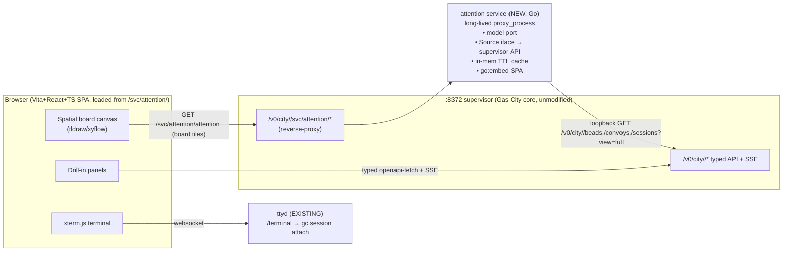

# feat: Attention Canvas — spatial operator dashboard

## Summary

Build a pack-local **web** operator console for Gas City: a single persistent, zoomable, spatial canvas that renders the `gc-attention` board so the operator holds many concurrent agent workstreams in flight and switches between them cheaply — each anchor has a durable place + color + imagery, so a glance reinstates a topic's context and only the state-delta is read. The surface is **pull, never interrupt**.

This plan details the **backend spine** — a long-lived Go `proxy_process` service that reimplements the `gc-attention` model and serves a typed board API — and carries the **frontend / drill-in / terminal-embed / deploy** phases at lighter detail, because those enter through a separate Claude Design exploration loop (running in parallel). The architecture (web over native; Vite+React+TS; the supervisor API as the data path; never raw Dolt) is **already decided and recorded on `tk-eemvf`**; this plan executes it, it does not re-open it.

**Execution posture:** every unit is dispatched as a **fresh bead** executed from this plan, not from the planning session's context. The plan must therefore stand on its own.

---

## Problem Frame

A single operator coordinates many autonomous agent workstreams across multiple rigs. Context-switching is their dominant cost. Today the only cross-rig "what needs me / what's in flight" view is `gc-attention.sh` — a bash PoC that renders a ranked board as a tmux/text table (precedent `tk-q4xaj`). It proved the *model*; it is not a surface the operator can live in.

The Attention Canvas is the GUI surface of that same model. It must let the operator, in one place: **(a)** see work in flight, **(b)** see status at a glance, **(c)** see what needs the human, and **(d)** dive in (live terminal) or read the latest output — with switching between topics nearly free because the canvas's spatial/perceptual grounding reinstates each topic's context.

**Why now / why a service:** the board is a real cross-rig aggregation (fan-out over per-rig stores + epic/convoy/liveness joins + ~15 derivations). It cannot be cheaply recomputed client-side on every poll, and the bash PoC must be retired. A long-lived service that computes + caches the board is the spine the canvas renders.

---

## Requirements

- **R1** — Render the `gc-attention` board model (ranked tiles across **five** anchor kinds: epics, owned convoys, **unowned/orphan convoys** — surfaced HIGH; the bash model never silently drops these — decisions, and flagged beads) as a spatial web canvas, not a list/table.
- **R2** — The board data is served by a long-lived, supervised service reachable through the existing supervisor origin (so the browser reaches it the same way it reaches `gc dashboard`).
- **R3** — **Data-access contract (hard):** all bead/Dolt access goes through beads or a Gas City interface/API — never raw Dolt SQL from pack code. (origin: tk-eemvf data-path comment)
- **R4** — Pack-local: no fork of gascity core (no new native `/v0` route, no edit to the stock `gc dashboard`). (origin: tk-eemvf — foundation "augment, don't fork core")
- **R5** — Retire `gc-attention.sh`: its model is reimplemented in Go; the production service does not shell the bash script.
- **R6** — Drill-in plane: from a tile, dive to live detail (bead/session state, live activity) and an embedded live terminal.
- **R7** — Honor the foundation philosophy: pull-not-interrupt; perceptual/spatial grounding is the "context trigger," not notifications. (origin: tk-eemvf; docs/foundation.md)
- **R8** — The board's JSON contract is **typed and additive-only**, and is the single contract the frontend mirrors.

---

## Key Technical Decisions

- **KTD1 — Web, not native; Vite + React + TS; mirror `gc dashboard`.** The stock dashboard is already a Vite/TS bundle, `go:embed`-served by a near-static Go handler, with the browser talking directly to the supervisor `:8372` (typed `openapi-fetch` client + SSE). We mirror that shape and add React for the canvas/terminal libs (tldraw/xyflow, xterm.js are React-first). *Rationale + alternatives:* see Alternatives. (probe: city:rigs/gascity/cmd/gc/dashboard/)
- **KTD2 — Board service = long-lived Go `proxy_process` workspace-service.** Verified long-lived (spawned once, Unix-socket reverse-proxied, health-checked, auto-restart on crash) — so it holds an in-memory cache across requests. Reached at `/v0/city/<cityName>/svc/attention/...`. (probe: internal/workspacesvc/proxy_process.go)
- **KTD3 — Data path v1 = the supervisor loopback HTTP API** (`http://127.0.0.1:<api-port>/v0/city/<cityName>/...`), behind an internal `Source` interface. The supervisor base URL is passed explicitly as a `--supervisor http://127.0.0.1:8372` command arg — **NOT auto-discovered** (`gc dashboard` actually requires `--api` / `cfg.API.Port`, a gascity-internal call the standalone module can't import; the `proxy_process` env carries no api port; `:8372` lives in the supervisor launch config, not `city.toml`, which has no `[api]` section). Probe-confirmed sufficient for the whole model. Honors R3 (the supervisor API is a Gas City API). The **only** contract-compliant escalation if perf ever bites is the in-process beads library API ("through beads") or a sanctioned new Gas City endpoint — **never raw Dolt SQL.** (probe: internal/api/huma_handlers_beads.go, _convoys.go, _sessions_query.go)
- **KTD4 — `[[service]]` must be declared at CITY scope, not in the rig-imported gc-toolkit pack.** `[[service]]` is forbidden in rig-imported packs; gc-toolkit is rig-imported. The Go binary lives in `city:rigs/gc-toolkit/`; the `[[service]]` stanza lives in the city root pack (`city:city.toml`), and **`command` resolves from the CITY ROOT** (`cmd.Dir` = `~/loomington`, NOT the gc-toolkit dir), so it must be city-root-relative: `command = ["rigs/gc-toolkit/services/attention/attention-svc", "--supervisor", "http://127.0.0.1:8372"]`. (probe: internal/config/pack.go:166,300; compose.go:261-271; proxy_process.go:349-354)
- **KTD5 — The service `go:embed`s the Vite build and serves the SPA at its mount root, plus the `/attention` API.** One artifact. Because the mount path (`/v0/city/<cityName>/svc/attention/`) contains a runtime city name, the SPA injects a **`<base href>` tag from the `GC_SERVICE_URL_PREFIX` env** (the supervisor provides it; mirrors the stock dashboard's `supervisor-url` injection) — more robust than Vite `base: "./"`, which 404s on a bare `…/svc/attention` URL with no trailing slash (assets resolve to `…/svc/assets/…`). Also 301-redirect the bare mount to the trailing-slash form. (The stock dashboard hardcodes root and cannot be sub-path-mounted — we deliberately diverge.)
- **KTD6 — Two contracts, two data origins for the frontend.** Board tiles come from *this service* (`/svc/attention/attention`), typed by a hand-written TS type mirroring the Go board struct (the `/svc/` surface is absent from the supervisor OpenAPI). Drill-in/live + terminal come from the *supervisor* `:8372` (free OpenAPI-typed client + SSE) and *ttyd* (`/terminal`) respectively.
- **KTD7 — Poll with server-side cache now; structure for event-push later.** The board is a poll snapshot with a short server-side TTL cache (replacing the bash 45s file cache). Leave a seam for supervisor SSE (`/v0/events/stream`) to invalidate the cache / push later.

---

## High-Level Technical Design

Three data planes, all behind the existing supervisor origin (tailscale → `:8372`):



Plane 1 (board tiles) is the new build. Plane 2 (drill-in/live) and Plane 3 (terminal) reuse existing Gas City surfaces.

---

## Output Structure

```
services/attention/
  go.mod                      # standalone module; NO gascity-internal imports (talks to the supervisor over HTTP)
  main.go                     # GC_SERVICE_SOCKET listener, health, route mount, SIGTERM
  internal/
    source/                   # Source interface + supervisorAPI implementation (loopback HTTP client)
    model/                    # ported gc-attention derivations (severity/rank/frontier/needs/…)
    board/                    # typed board contract (Go structs, additive-only) + JSON
    cache/                    # in-memory TTL cache
  web/                        # Vite + React + TS SPA (base: "./")
    src/
    dist/                     # built bundle, go:embed-ed by main.go
specs/tk-eemvf/design/        # Claude Design input bundle (this PR; parallel track)
city:city.toml                # [[service]] name="attention" kind="proxy_process" (city-scoped)
```

---

## Implementation Units

Units are grouped into phases. Backend phases (U1–U4) are detailed; frontend/drill-in/deploy (U5–U11) are lighter and **firm up after the Claude Design handoff** (R6/R7 visual decisions are the design loop's output, recorded on `tk-eemvf`). The Claude Design exploration is a **parallel track**, not a code unit; its handoff bundle is a prerequisite input to U6.

### Phase 1 — Spine (prove it end-to-end)

### U1. Backend-spine spike *(in flight — bead `tk-sy3vj`)*
- **Goal:** Prove the whole spine with a *minimal* real payload: a long-lived `proxy_process` Go sidecar that returns a minimal ranked board over the supervisor API with a server-side TTL cache, reachable on loopback AND through the tailscale origin; service auto-starts/health-green/survives-crash.
- **Requirements:** R2, R3, R4, R5 (partial), R8 (minimal).
- **Dependencies:** none.
- **Files:** `services/attention/main.go`, `services/attention/internal/source/`, `services/attention/internal/board/` (minimal), `city:city.toml` ([[service]] stanza, placement resolved first).
- **Approach:** Resolve the city-scoped `[[service]]` placement first (KTD4). Bind `GC_SERVICE_SOCKET` within 5s; `/healthz`→200; `/attention`→minimal board {generated_at,total,tiles[]} with per-tile {id,rig,kind,title,severity,live,n_closed,m_total,open,in_progress,frontier,needs,rank_score}. Source from the supervisor loopback API via the `--supervisor` arg (KTD3); `command` is city-root-relative (KTD4). In-mem TTL cache. **U1's `[[service]]` stanza IS the production one, carried forward (U10 finalizes it).**
- **Deploy is operator-gated (blast radius):** adding the `[[service]]` to `city.toml` drifts the CoreFingerprint → the reconciler drains drifted/detached sessions (incl. manual `*-thread` shadows), and the supervisor only loads the new service on `systemctl --user restart gascity-supervisor` (a whole-town bounce). The city.toml edit + restart is an explicit operator-approved step, not a spike side-effect.
- **Verification:** `curl …/svc/attention/attention` returns real ranked JSON; reachable via the tailscale origin AND admitted by the loopback private-service guard (handler_services.go 404s non-loopback requests lacking `X-GC-Request` — confirm the tailscale `/v0` route reaches the `/svc/` proxy from loopback); restart-on-crash observed.
- **Test scenarios:** model-subset derivations (severity/rank ordering); Source against mocked supervisor responses (happy + one rig-store partial); cache hit/expiry. *(Spike runs to completion; if superseded by U2–U4, discard — operator-approved.)*

### Phase 2 — Backend depth

### U2. `Source` interface + supervisor-API client (partial-aggregation aware)
- **Goal:** A clean, swappable data-access layer that sources all model inputs from the supervisor loopback API and degrades gracefully on partial cross-rig failures.
- **Requirements:** R3, R4.
- **Dependencies:** U1.
- **Files:** `services/attention/internal/source/source.go` (interface), `source/supervisor.go` (impl), `source/supervisor_test.go`.
- **Approach:** Define `Source` with methods for: open epics (`GET /beads?type=epic`), all-status child roll-up (`GET /beads/graph/{id}` — NOT `/deps`, which omits closed), owned convoys (`GET /convoys` + `GET /convoy/{id}` for dependents + Progress{Total,Closed}), `gc:wait` (`GET /beads?label=`), flagged (`GET /beads` then in-process `gc.attention=1` filter — no server-side metadata filter), session liveness (`GET /sessions?view=full` — the only source of live running/attached). Take the supervisor base URL from the `--supervisor` arg (KTD3) — there is no auto-discovery path. Treat `Partial`/`PartialErrors` as first-class (degrade the row, don't fail the board).
- **Patterns to follow:** the stock dashboard's typed client construction (city:rigs/gascity/cmd/gc/dashboard/web/src/api.ts) for endpoint shapes; loopback is always host-allowlisted.
- **Test scenarios:** each method against recorded supervisor JSON fixtures; a rig-store-unhealthy partial response degrades one tile and still returns the board; api-port discovery fallback path; the `Source` interface is satisfied by a mock for downstream tests.
- **Verification:** all model inputs obtainable through `Source`; no raw Dolt/SQL anywhere (R3 audit: grep the module for `sql.Open`/`mysql`/`dolt` → none); **supervisor-vs-bash anchor-set equivalence** confirmed on the same live store (the bash gathers via per-rig `gc bd list --db` and swaps the child-rollup to `/beads/graph` — verify the supervisor-sourced anchor set matches the bash set; golden parity alone can't catch a source divergence).

### U3. Port the `gc-attention` model to Go
- **Goal:** Reimplement the full board model (the bash PoC's derivations) in Go over `Source`.
- **Requirements:** R1, R5, R8.
- **Dependencies:** U2.
- **Files:** `services/attention/internal/model/model.go`, `model/derive.go`, `model/model_test.go`.
- **Approach:** Port from `assets/scripts/gc-attention.sh` (read it as the spec, then retire it): cross-rig gather (all **five** kinds incl. unowned/orphan convoys, which the bash never silently drops) → epic/convoy/liveness joins → derivations (severity banding, weight, rank_score, stranded/empty/complete, stale_days, cross_rig_refs scan, progress_mismatch, frontier + needs phrasing, takeaway plumbing) → dedup by id → rank desc. Liveness keyed by bead-id (strip pack-prefix from session alias).
- **Patterns to follow:** the bash script's field semantics (gather_anchors / cmd_board jq) are the reference contract; replicate behavior, not structure.
- **Test scenarios:** golden-file parity — feed fixtures through the model, assert the ranked output matches expected tiles; each derivation (e.g., stranded = m>0 & open>0 & in_progress==0 & cold) with boundary inputs; dedup keeps highest-ranked; empty-rig and all-closed-epic edge cases.
- **Execution note:** characterization-first, but **hermetic** — capture golden fixtures through the `GC_ATTENTION_FIXTURE` hook (not live Dolt), inject a fixed `now` into the Go model, and normalize/exclude wall-clock-derived fields (`stale_days`, the time component of `rank_score`, `generated_at`) in the parity assertion. Compare structure + severity banding + ordering, not raw bytes.
- **Verification:** Go board output matches the bash board on captured fixtures (modulo intentional improvements, documented).

### U4. Typed board contract (freeze + document)
- **Goal:** A typed Go board struct serialized to a stable, additive-only JSON contract — the single source the frontend mirrors.
- **Requirements:** R8.
- **Dependencies:** U3.
- **Files:** `services/attention/internal/board/contract.go`, `board/contract_test.go`, `docs/design/board-contract.md` (the documented schema).
- **Approach:** Promote U3's output to a named, versioned (additive-only) struct + JSON tags. Document each field. This doc is what U7's TS type mirrors.
- **Test scenarios:** JSON round-trips; field presence/stability (a contract test that fails if a field is removed/renamed); envelope shape {generated_at,total,tiles[]}.
- **Verification:** contract doc + struct agree; `GET /attention` emits exactly this shape.

### Phase 3 — Frontend (lighter; firms up post-design-handoff)

### U5. SPA scaffold (Vite + React + TS), mount-prefix-safe, go:embed-served
- **Goal:** A Vite+React+TS app the attention service embeds and serves at its `/svc/attention/` mount.
- **Requirements:** R1, R2, KTD5.
- **Dependencies:** U4 (contract); design handoff (visual direction).
- **Files:** `services/attention/web/` (Vite app, `base: "./"`), `services/attention/main.go` (add `go:embed web/dist` + static serve at mount root).
- **Approach:** Mirror city:rigs/gascity/cmd/gc/dashboard structure (embed + serve + one meta-injection if needed for the supervisor base URL). Relative asset base for sub-path mounting (KTD5).
- **Test scenarios:** build embeds; assets resolve under a `/svc/attention/`-style prefix (not just root). *(Visual behavior tested in U6.)*
- **Verification:** SPA loads through the tailscale origin at the service mount.

### U6. Board canvas (spatial render of the contract)
- **Goal:** Render the typed board as a zoomable spatial canvas (durable place + color + imagery per anchor; peek-at-rest).
- **Requirements:** R1, R7.
- **Dependencies:** U5, U7, **Claude Design handoff bundle** (the chosen visual direction — recorded on tk-eemvf).
- **Files:** `services/attention/web/src/` (canvas components).
- **Approach:** Per the design handoff — canvas lib (tldraw/xyflow), the severity/liveness→color/motion/size mapping, layout (clustered/freeform-with-memory), zoom semantics. Poll `/attention`; honor pull-not-interrupt.
- **Test scenarios:** firm up after handoff — at minimum: tiles render from a contract fixture; ranking/severity reflected; "needs the human" is visually distinct.
- **Verification:** operator's perceptual sign-off (the design loop's oracle), then functional render of live data.

### U7. TS board-contract type (mirror of U4)
- **Goal:** A hand-written TS type mirroring the board contract (the `/svc/` surface isn't in the supervisor OpenAPI).
- **Requirements:** R8.
- **Dependencies:** U4.
- **Files:** `services/attention/web/src/contract.ts`.
- **Test scenarios:** a fixture from U4 type-checks against the TS type; a removed/renamed field is caught (lightweight parity check).

### Phase 4 — Drill-in + terminal (lighter)

### U8. Drill-in plane (supervisor typed client + SSE)
- **Goal:** From a tile, open live detail (bead/session/activity) via the supervisor `:8372` typed client + SSE.
- **Requirements:** R6.
- **Dependencies:** U5.
- **Files:** `services/attention/web/src/drill/`.
- **Approach:** Reuse the stock dashboard's `openapi-fetch` + SSE pattern (api.ts/sse.ts) against `:8372`. Cross-origin is fine (stock dashboard does it).
- **Test scenarios:** firm up post-design — tile→detail fetch; SSE live update applies; cross-origin/allowed-hosts reachable through tailscale.

### U9. Terminal embed (xterm.js → existing ttyd)
- **Goal:** Embed a live terminal in a tile on focus (peek-snapshot at rest, live on focus).
- **Requirements:** R6, R7.
- **Dependencies:** U5.
- **Files:** `services/attention/web/src/terminal/`.
- **Approach:** xterm.js attached to the existing ttyd at `/terminal` (96-gc-terminal.sh) — reuse, don't rebuild the PTY. Confirm `/terminal` is reachable on the SPA's origin (the dashboard tailscale config routes only `/`, `/v0`, `/health`; ttyd is a separate tailscale-serve mapping). Generalize the ttyd target beyond the single mayor session if the design needs per-tile terminals (may require a ttyd/wiring change — flagged in Risks).
- **Test scenarios:** firm up post-design — terminal attaches/detaches; close = detach not kill.

### Phase 5 — Integration & deploy

### U10. City-scoped service declaration + build/deploy + tailscale
- **Goal:** Production wiring: the city-scoped `[[service]]` declaration, a build step for the Go binary + Vite bundle, and verified reachability through tailscale.
- **Requirements:** R2, R4, KTD4, KTD5.
- **Dependencies:** U4 (real service), U5 (embedded SPA).
- **Files:** `city:city.toml` ([[service]] final), a build wrapper (mirror `city:build-optimized.sh` patterns for a new artifact), `city:setup/` step if a systemd/tailscale change is needed.
- **Approach:** Finalize the city-root-relative `command` with `--supervisor` (KTD3/KTD4); `health_path=/healthz`. The city.toml edit + supervisor restart is **operator-gated** (CoreFingerprint drift drains sessions; whole-town bounce — see Risks). Verify `/svc/attention/` is covered by the existing `/v0` tailscale route AND admitted by the loopback private-service guard. Document the portability caveat (a city importing gc-toolkit must declare the service itself) and the redeploy mechanism (iterating the binary needs the service/supervisor restarted to pick it up).
- **Test scenarios:** service comes up under the supervisor; health green; reachable loopback + tailscale; survives supervisor restart.

### U11. End-to-end integration + retire the bash PoC
- **Goal:** The canvas renders live data end-to-end; `gc-attention.sh` is retired from the operator path.
- **Requirements:** R1, R5, R6.
- **Dependencies:** U6, U8, U9, U10.
- **Files:** integration test harness; remove/deprecate `assets/scripts/gc-attention.sh` (or leave as a thin dev tool, decided here).
- **Test scenarios:** load canvas via tailscale → tiles reflect live board → drill into one → live terminal attaches; partial-rig-failure degrades gracefully end-to-end.

---

## Alternatives Considered

- **Native (OSX/TUI) vs. web.** Rejected native: the app is a thin client over an existing JSON/SSE boundary; the two hard parts (zoomable canvas, embedded terminal) are mature only in the JS/React ecosystem; native collapses to "web, optionally wrapped (Wails/Tauri)" later if ever needed. (recorded on tk-eemvf)
- **Next.js vs. Vite SPA.** Rejected Next: zero SSR/RSC/SEO need (private, single-route, client-realtime); consistency is neutral (the operator runs both a Vite and a Next app), so use-case fit decides → Vite. (recorded on tk-eemvf)
- **Data path: direct Dolt SQL vs. in-process beads lib vs. supervisor API.** Direct-Dolt **excluded by R3** (operator contract) even though gascity-core uses it internally (convoy_sql.go). In-process beads lib reserved as the only compliant perf escalation (module/version coupling). Supervisor API chosen for v1 (decoupled, sufficient, and the only live source for running/attached). (recorded on tk-eemvf)
- **Shell the bash `gc-attention.sh` from the service vs. port the model.** Rejected shelling (R5): the PoC is retired; port the model to Go for a real cache, types, and maintainability.
- **Native typed `/v0` route (fork core) vs. `proxy_process` sidecar.** Rejected the native route — it requires editing gascity core (R4). The `proxy_process` `/svc/` seam is the sanctioned non-fork extension. (probe: internal/api supervisor route registration)

---

## Risks & Mitigations

- **City-scoped service placement (KTD4).** `[[service]]` can't live in the rig-imported gc-toolkit pack. *Mitigation:* U1's first task resolves the exact city-pack placement; ask gc-toolkit.mayor/keeper before forcing it. *Portability caveat:* the service won't auto-ride-along into other cities.
- **In-process metadata filter cost.** `gc.attention=1` isn't server-side-filterable → a broad cross-rig `/beads` fetch per recompute. *Mitigation:* open reads are memory-cached on the supervisor; the service's own TTL cache debounces; if it still bites, escalate to the in-process beads lib (R3-compliant), not raw Dolt.
- **Untyped `/svc/` surface.** No generated client for the board API. *Mitigation:* hand-written TS type (U7) + a contract test (U4) that fails on field drift.
- **Sub-path mounting.** SPA served under a runtime-city-named `/svc/attention/` path. *Mitigation:* Vite `base: "./"` (KTD5); test asset resolution under a prefix (U5).
- **New Go artifact build/deploy.** A standalone module + Vite build is a new build target in the town. *Mitigation:* mirror build-optimized.sh patterns; wire in U10; CI implications noted.
- **Per-tile terminals.** ttyd today targets a single mayor session; per-tile live terminals may need a ttyd/wiring change. *Mitigation:* flagged in U9; decide during the design handoff whether per-tile terminals are in scope.
- **Partial cross-rig failures.** A wedged rig store makes the supervisor return partial. *Mitigation:* `Source` treats partial as first-class (U2); degrade the row.
- **Supervisor reachability has no discovery path.** The api-port must be injected via `--supervisor` (KTD3); `:8372` comes from the supervisor launch config, not `city.toml`. *Mitigation:* explicit command arg; fail loud on an unreachable supervisor.
- **`command` path resolves from the city root, not gc-toolkit (KTD4).** A gc-toolkit-relative path silently won't spawn (wrong `cmd.Dir` → binary not found). *Mitigation:* city-root-relative (or absolute) command, verified to spawn in U1.
- **Town-wide blast radius on deploy.** This is the town's first `proxy_process` service; adding it to `city.toml` drifts the CoreFingerprint (drains drifted/detached sessions, incl. manual `*-thread` shadows) and only loads on a full `systemctl --user restart gascity-supervisor`. *Mitigation:* operator-gated deploy step (U1/U10); land at a quiet moment; expect a town bounce.
- **`/svc/` reachability via the loopback guard.** Non-loopback requests lacking `X-GC-Request` get 404 (handler_services.go); reachability hinges on the tailscale `/v0` route reaching the proxy from loopback — non-obvious and untested. *Mitigation:* verify end-to-end in U1/U10, not assumed.
- **Golden-file hermeticity.** Wall-clock-derived fields (`stale_days`, `rank_score`, `generated_at`) make naive byte-parity flaky. *Mitigation:* fixture hook + fixed `now` + normalized time fields (U3).

---

## Scope Boundaries

**In scope:** the backend attention service (model + contract + cache + city-scoped deploy), a frontend SPA scaffold + canvas render, drill-in + terminal embed (reusing existing surfaces), end-to-end integration.

### Deferred to Follow-Up Work
- Server-push (SSE-driven cache invalidation) — KTD7 leaves the seam; polling ships first.
- The full visual design system — owned by the Claude Design loop; its handoff bundle feeds U6, recorded on tk-eemvf.
- In-process beads-lib `Source` impl — only if the supervisor-API path's perf demands it.
- Native wrap (Wails/Tauri) — only if browser-reserved keybindings ever force it.
- Write verbs (flag/clear/takeaway) beyond read — the board is read-first; add mutation endpoints when the canvas needs them (mind CSRF: `X-GC-Request` + loopback-or-published).

**Out of scope / explicit non-goals:** evolving the stock `gc dashboard` (that's core; we augment, not fork) — R4.

---

## Test Strategy

- **Backend (U1–U4):** unit tests per derivation; `Source` against recorded supervisor JSON fixtures (happy + partial); **characterization golden-files** captured from the bash PoC before porting (U3) so the Go model is provably faithful; a contract test (U4) that fails on board-field drift.
- **Frontend (U5–U9):** firm up after the design handoff; minimum — contract-fixture render, mount-prefix asset resolution, SSE-apply, terminal attach/detach.
- **Integration (U11):** end-to-end through the tailscale origin incl. a partial-rig-failure path.
- **R3 audit:** a standing check that the service module contains no `sql.Open`/mysql/dolt imports.

---

## Acceptance Criteria (per phase)

- **Phase 1 (U1):** minimal real board served through tailscale; supervised lifecycle proven. *(`tk-sy3vj` done.)*
- **Phase 2 (U2–U4):** full model ported with golden-file parity; typed additive-only contract frozen + documented; no raw-Dolt access.
- **Phase 3 (U5–U7):** SPA loads at the service mount through tailscale; canvas renders the contract; operator perceptual sign-off on the chosen direction.
- **Phase 4 (U8–U9):** drill-in shows live detail; terminal attaches on focus.
- **Phase 5 (U10–U11):** production service wired city-scoped; end-to-end live render + drill + terminal; bash PoC retired.

---

## Sources & Research

Five code probes this session (gascity core unless noted; per the path convention, bare `internal/…`/`cmd/…` are relative to the gascity rig root):
1. **Dashboard arch** — cmd/gc/dashboard/ (go:embed Vite SPA on :8080; browser→:8372 typed client + SSE; root-path-only via Vite base).
2. **Supervisor extensibility** — internal/api supervisor route registration (typed `/v0` routes hardcoded = fork to add); `proxy_process` `/svc/` seam is the sanctioned non-fork extension (supervisor.go:176 → handler_services.go → workspacesvc/proxy_process.go; pack services merged compose.go:258-271).
3. **Attention data contract** — `assets/scripts/gc-attention.sh` (gc-toolkit-local; pure `gc`-CLI aggregation; fields; poll model + 45s file cache).
4. **proxy_process lifecycle** — internal/workspacesvc/proxy_process.go (long-lived; `GC_SERVICE_SOCKET`; 5s ready; health_path; auto-restart).
5. **Endpoint sufficiency** — internal/api/huma_handlers_beads.go/_convoys.go/_sessions_query.go (cross-rig union server-side; `/beads/graph` for all-status roll-up; no server-side metadata filter; `/sessions?view=full` = only live running/attached source; partial-aggregation semantics).

Foundation/philosophy: `docs/foundation.md`. Origin epic + recorded decisions: bead `tk-eemvf`. Precedent: bead `tk-q4xaj`. In-flight: bead `tk-sy3vj` (U1).
